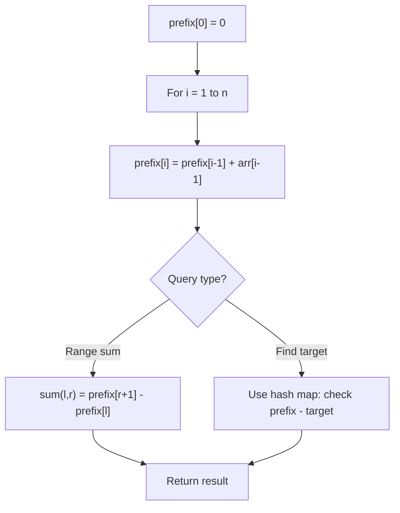

# Problem 1737: Change Minimum Characters to Satisfy One of Three Conditions

**Difficulty:** Medium  
**Tags:** Hash Table, String, Counting, Prefix Sum  
**Pattern:** Prefix Sum  
**Link:** [leetcode.com/problems/change-minimum-characters-to-satisfy-one-of-three-conditions](https://leetcode.com/problems/change-minimum-characters-to-satisfy-one-of-three-conditions/)

## Description

You are given two strings `a` and `b` that consist of lowercase letters. In one operation, you can change any character in `a` or `b` to **any lowercase letter**.

Your goal is to satisfy **one** of the following three conditions:

	- **Every** letter in `a` is **strictly less** than **every** letter in `b` in the alphabet.
	- **Every** letter in `b` is **strictly less** than **every** letter in `a` in the alphabet.
	- **Both** `a` and `b` consist of **only one** distinct letter.

Return *the **minimum** number of operations needed to achieve your goal.*

 

Example 1:

```

**Input:** a = "aba", b = "caa"
**Output:** 2
**Explanation:** Consider the best way to make each condition true:
1) Change b to "ccc" in 2 operations, then every letter in a is less than every letter in b.
2) Change a to "bbb" and b to "aaa" in 3 operations, then every letter in b is less than every letter in a.
3) Change a to "aaa" and b to "aaa" in 2 operations, then a and b consist of one distinct letter.
The best way was done in 2 operations (either condition 1 or condition 3).

```

Example 2:

```

**Input:** a = "dabadd", b = "cda"
**Output:** 3
**Explanation:** The best way is to make condition 1 true by changing b to "eee".

```

 

**Constraints:**

	- `1 <= a.length, b.length <= 10^5`
	- `a` and `b` consist only of lowercase letters.

## Approach: Prefix Sum

Build a prefix sum array where prefix[i] = sum of elements 0..i-1. Any subarray sum [l..r] = prefix[r+1] - prefix[l]. Combine with hash map for O(n) subarray sum queries.

## Pseudocode

```
1. Build prefix sum array: prefix[0]=0, prefix[i]=prefix[i-1]+arr[i-1]
2. Use prefix sums to answer queries:
   - Subarray sum [l..r] = prefix[r+1] - prefix[l]
   - Or use hash map to find prefix[j]-prefix[i] == target
3. Return result
```

## Algorithm Flow



## Complexity Analysis

- **Time:** O(n)
- **Space:** O(n)

## Solution (Python3)

```python
class Solution:
    def minCharacters(self, a: str, b: str) -> int:
        # Prefix sum approach - O(n) time, O(n) space
        prefix = {0: -1}
        curr_sum = 0
        result = 0
        target = b if isinstance(b, int) else 0
        for i, val in enumerate(a):
            curr_sum += val
            if curr_sum - target in prefix:
                result = max(result, i - prefix[curr_sum - target])
            if curr_sum not in prefix:
                prefix[curr_sum] = i
        return result
```

## Solution (C++)

```cpp
#include <algorithm>
#include <string>
#include <unordered_map>
#include <vector>
using namespace std;

class Solution {
public:
    int minCharacters(string& a, string& b) {
        // Prefix sum approach - O(n) time, O(n) space
        unordered_map<int, int> prefix;
        prefix[0] = -1;
        int curr_sum = 0, result = 0;
        int target = b;
        for (int i = 0; i < (int)a.size(); i++) {
            curr_sum += a[i];
            if (prefix.count(curr_sum - target)) {
                result = max(result, i - prefix[curr_sum - target]);
            }
            if (!prefix.count(curr_sum)) {
                prefix[curr_sum] = i;
            }
        }
        return result;
    }
};
```
