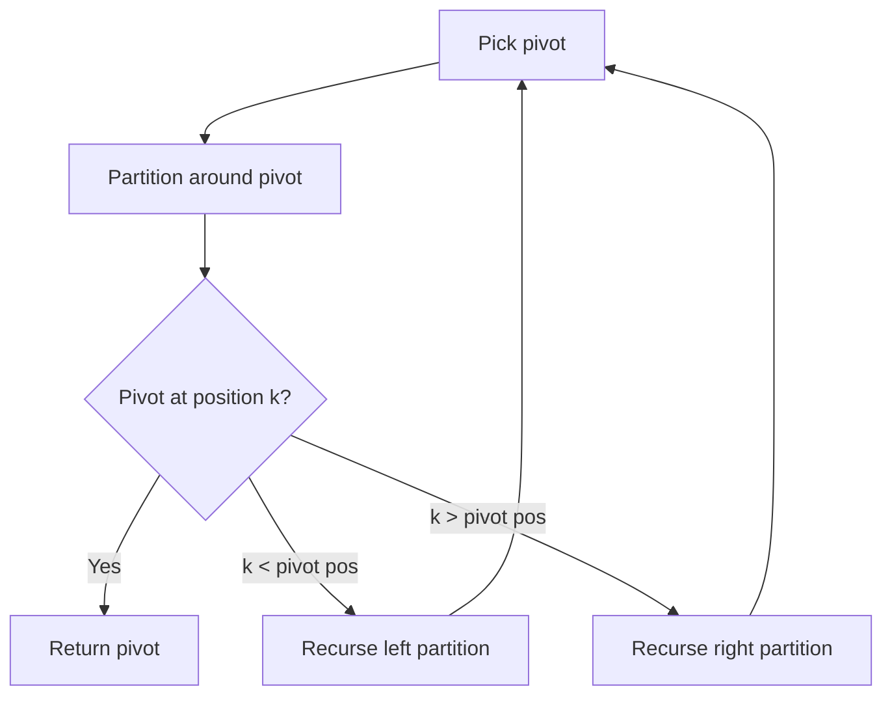

# Problem 1738: Find Kth Largest XOR Coordinate Value

**Difficulty:** Medium  
**Tags:** Array, Divide and Conquer, Bit Manipulation, Sorting, Heap (Priority Queue), Matrix, Prefix Sum, Quickselect  
**Pattern:** Quickselect  
**Link:** [leetcode.com/problems/find-kth-largest-xor-coordinate-value](https://leetcode.com/problems/find-kth-largest-xor-coordinate-value/)

## Description

You are given a 2D `matrix` of size `m x n`, consisting of non-negative integers. You are also given an integer `k`.

The **value** of coordinate `(a, b)` of the matrix is the XOR of all `matrix[i][j]` where `0 <= i <= a < m` and `0 <= j <= b < n` **(0-indexed)**.

Find the `k^th` largest value **(1-indexed)** of all the coordinates of `matrix`.

 

Example 1:

```

**Input:** matrix = [[5,2],[1,6]], k = 1
**Output:** 7
**Explanation:** The value of coordinate (0,1) is 5 XOR 2 = 7, which is the largest value.

```

Example 2:

```

**Input:** matrix = [[5,2],[1,6]], k = 2
**Output:** 5
**Explanation:** The value of coordinate (0,0) is 5 = 5, which is the 2nd largest value.

```

Example 3:

```

**Input:** matrix = [[5,2],[1,6]], k = 3
**Output:** 4
**Explanation:** The value of coordinate (1,0) is 5 XOR 1 = 4, which is the 3rd largest value.
```

 

**Constraints:**

	- `m == matrix.length`
	- `n == matrix[i].length`
	- `1 <= m, n <= 1000`
	- `0 <= matrix[i][j] <= 10^6`
	- `1 <= k <= m * n`

## Approach: Quickselect

Find the kth element by partitioning: pick a pivot, partition elements around it, then recurse only into the partition containing kth position.

## Pseudocode

```
1. Pick pivot element
2. Partition: elements < pivot | pivot | elements > pivot
3. If pivot is at position k: return pivot
4. If k < pivot position: recurse left
5. If k > pivot position: recurse right
```

## Algorithm Flow



## Complexity Analysis

- **Time:** O(n) average
- **Space:** O(1)

## Solution (Python3)

```python
class Solution:
    def kthLargestValue(self, matrix: List[List[int]], k: int) -> int:
        # Quickselect - O(n) average time
        import random
        def quickselect(arr, k):
            if len(arr) == 1:
                return arr[0]
            pivot = random.choice(arr)
            lows = [x for x in arr if x < pivot]
            highs = [x for x in arr if x > pivot]
            pivots = [x for x in arr if x == pivot]
            if k < len(lows):
                return quickselect(lows, k)
            elif k < len(lows) + len(pivots):
                return pivot
            else:
                return quickselect(highs, k - len(lows) - len(pivots))
        
        k = k if isinstance(k, int) else 1
        return quickselect(matrix, len(matrix) - k)
```

## Solution (C++)

```cpp
#include <algorithm>
#include <string>
#include <vector>
using namespace std;

class Solution {
public:
    int kthLargestValue(vector<vector<int>>& matrix, int k) {
        // Quickselect - O(n) average time
        int k = k;
        nth_element(matrix.begin(), matrix.begin() + matrix.size() - k, matrix.end());
        return matrix[matrix.size() - k];
    }
};
```
