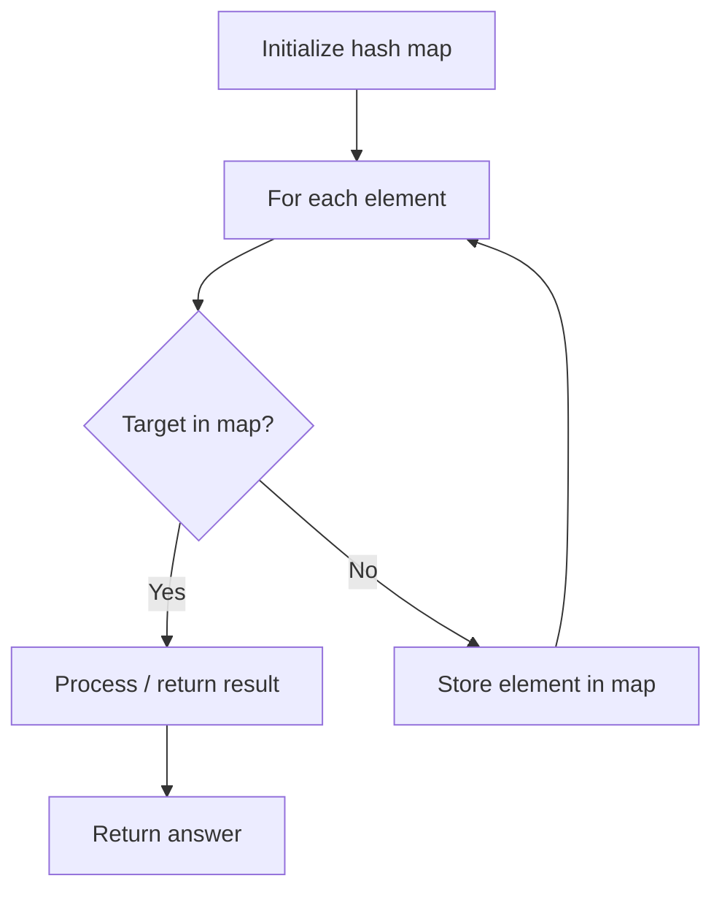

# Problem 1742: Maximum Number of Balls in a Box

**Difficulty:** Easy  
**Tags:** Hash Table, Math, Counting  
**Pattern:** Hash Map Lookup  
**Link:** [leetcode.com/problems/maximum-number-of-balls-in-a-box](https://leetcode.com/problems/maximum-number-of-balls-in-a-box/)

## Description

You are working in a ball factory where you have `n` balls numbered from `lowLimit` up to `highLimit` **inclusive** (i.e., `n == highLimit - lowLimit + 1`), and an infinite number of boxes numbered from `1` to `infinity`.

Your job at this factory is to put each ball in the box with a number equal to the sum of digits of the ball's number. For example, the ball number `321` will be put in the box number `3 + 2 + 1 = 6` and the ball number `10` will be put in the box number `1 + 0 = 1`.

Given two integers `lowLimit` and `highLimit`, return* the number of balls in the box with the most balls.*

 

Example 1:

```

**Input:** lowLimit = 1, highLimit = 10
**Output:** 2
**Explanation:**
Box Number:  1 2 3 4 5 6 7 8 9 10 11 ...
Ball Count:  2 1 1 1 1 1 1 1 1 0  0  ...
Box 1 has the most number of balls with 2 balls.
```

Example 2:

```

**Input:** lowLimit = 5, highLimit = 15
**Output:** 2
**Explanation:**
Box Number:  1 2 3 4 5 6 7 8 9 10 11 ...
Ball Count:  1 1 1 1 2 2 1 1 1 0  0  ...
Boxes 5 and 6 have the most number of balls with 2 balls in each.

```

Example 3:

```

**Input:** lowLimit = 19, highLimit = 28
**Output:** 2
**Explanation:**
Box Number:  1 2 3 4 5 6 7 8 9 10 11 12 ...
Ball Count:  0 1 1 1 1 1 1 1 1 2  0  0  ...
Box 10 has the most number of balls with 2 balls.

```

 

**Constraints:**

	- `1 <= lowLimit <= highLimit <= 10^5`

## Approach: Hash Map Lookup

Use a hash map (dictionary) to store elements for O(1) lookup. Iterate through the input, checking membership or counting frequencies in the map.

## Pseudocode

```
1. Initialize hash map
2. Iterate through elements:
   a. Check if target/complement exists in map
   b. If found: process result
   c. Otherwise: store element in map
3. Return result
```

## Algorithm Flow



## Complexity Analysis

- **Time:** O(n)
- **Space:** O(n)

## Solution (Python3)

```python
class Solution:
    def countBalls(self, lowLimit: int, highLimit: int) -> int:
        # Hash map approach - O(n) time, O(n) space
        seen = {}
        for i, val in enumerate(lowLimit):
            complement = highLimit - val
            if complement in seen:
                return [seen[complement], i]
            seen[val] = i
        return 0
```

## Solution (C++)

```cpp
#include <string>
#include <unordered_map>
#include <vector>
using namespace std;

class Solution {
public:
    int countBalls(int lowLimit, int highLimit) {
        // Hash map approach - O(n) time, O(n) space
        unordered_map<int, int> seen;
        for (int i = 0; i < lowLimit.size(); i++) {
            int complement = highLimit - lowLimit[i];
            if (seen.count(complement)) {
                return {seen[complement], i};
            }
            seen[lowLimit[i]] = i;
        }
        return 0;
    }
};
```
