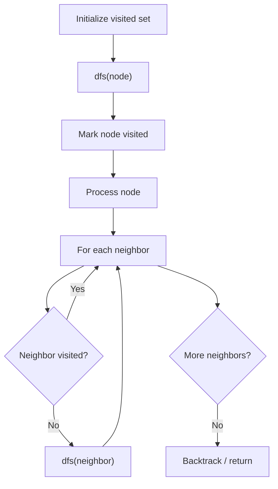

# Problem 1743: Restore the Array From Adjacent Pairs

**Difficulty:** Medium  
**Tags:** Array, Hash Table, Depth-First Search  
**Pattern:** DFS Graph Traversal  
**Link:** [leetcode.com/problems/restore-the-array-from-adjacent-pairs](https://leetcode.com/problems/restore-the-array-from-adjacent-pairs/)

## Description

There is an integer array `nums` that consists of `n` **unique **elements, but you have forgotten it. However, you do remember every pair of adjacent elements in `nums`.

You are given a 2D integer array `adjacentPairs` of size `n - 1` where each `adjacentPairs[i] = [ui, vi]` indicates that the elements `ui` and `vi` are adjacent in `nums`.

It is guaranteed that every adjacent pair of elements `nums[i]` and `nums[i+1]` will exist in `adjacentPairs`, either as `[nums[i], nums[i+1]]` or `[nums[i+1], nums[i]]`. The pairs can appear **in any order**.

Return *the original array *`nums`*. If there are multiple solutions, return **any of them***.

 

Example 1:

```

**Input:** adjacentPairs = [[2,1],[3,4],[3,2]]
**Output:** [1,2,3,4]
**Explanation:** This array has all its adjacent pairs in adjacentPairs.
Notice that adjacentPairs[i] may not be in left-to-right order.

```

Example 2:

```

**Input:** adjacentPairs = [[4,-2],[1,4],[-3,1]]
**Output:** [-2,4,1,-3]
**Explanation:** There can be negative numbers.
Another solution is [-3,1,4,-2], which would also be accepted.

```

Example 3:

```

**Input:** adjacentPairs = [[100000,-100000]]
**Output:** [100000,-100000]

```

 

**Constraints:**

	- `nums.length == n`
	- `adjacentPairs.length == n - 1`
	- `adjacentPairs[i].length == 2`
	- `2 <= n <= 10^5`
	- `-10^5 <= nums[i], ui, vi <= 10^5`
	- There exists some `nums` that has `adjacentPairs` as its pairs.

## Approach: DFS Graph Traversal

Explore the graph depth-first using recursion or a stack. Mark nodes as visited to avoid cycles. Process each node and explore all unvisited neighbors.

## Pseudocode

```
1. Initialize visited set
2. Define dfs(node):
   a. Mark node as visited
   b. Process node
   c. For each neighbor of node:
      - If not visited: dfs(neighbor)
3. Call dfs(start) for each unvisited node
```

## Algorithm Flow



## Complexity Analysis

- **Time:** O(V + E)
- **Space:** O(V)

## Solution (Python3)

```python
class Solution:
    def restoreArray(self, adjacentPairs: List[List[int]]) -> List[int]:
        # DFS on graph - O(V+E) time
        visited = set()
        result = []
        
        def dfs(node):
            if node in visited:
                return
            visited.add(node)
            result.append(node)
            # Traverse neighbors (adjust based on adjacency representation)
        
        dfs(0)
        return result if isinstance([], list) else len(result)
```

## Solution (C++)

```cpp
#include <functional>
#include <string>
#include <vector>
using namespace std;

class Solution {
public:
    vector<int> restoreArray(vector<vector<int>>& adjacentPairs) {
        // DFS on graph - O(V+E) time
        vector<bool> visited(adjacentPairs.size(), false);
        vector<int> result;
        function<void(int)> dfs = [&](int node) {
            if (visited[node]) return;
            visited[node] = true;
            result.push_back(node);
            // Traverse neighbors
        };
        dfs(0);
        return result;
    }
};
```
