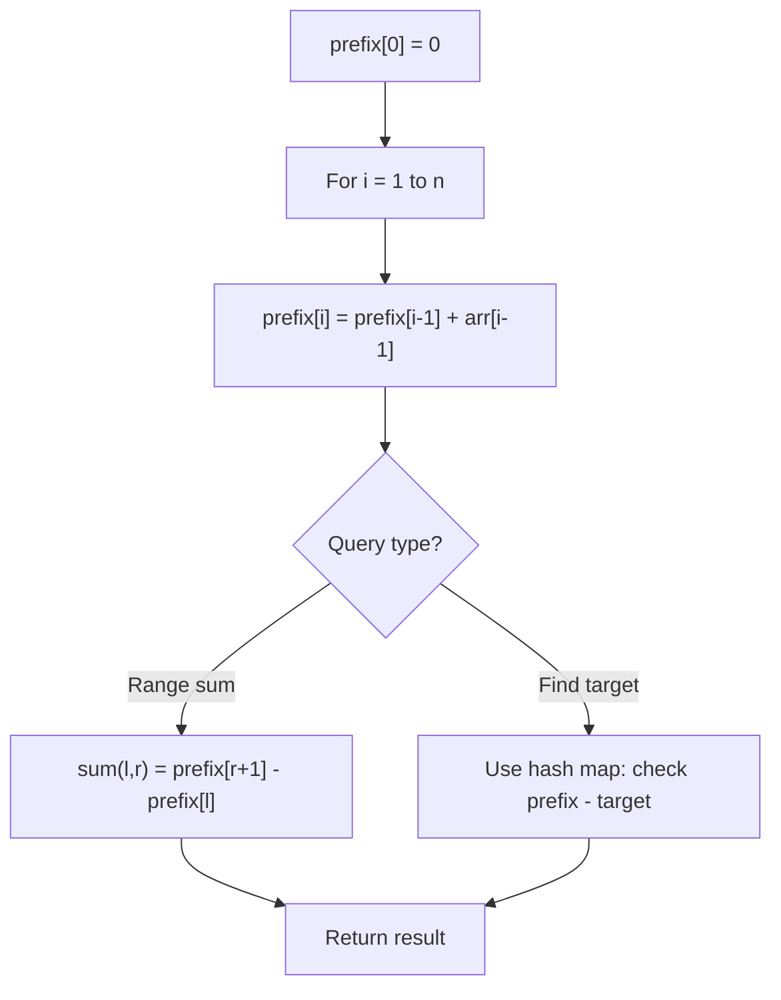

# Problem 1744: Can You Eat Your Favorite Candy on Your Favorite Day?

**Difficulty:** Medium  
**Tags:** Array, Prefix Sum  
**Pattern:** Prefix Sum  
**Link:** [leetcode.com/problems/can-you-eat-your-favorite-candy-on-your-favorite-day](https://leetcode.com/problems/can-you-eat-your-favorite-candy-on-your-favorite-day/)

## Description

You are given a **(0-indexed)** array of positive integers `candiesCount` where `candiesCount[i]` represents the number of candies of the `i^th` type you have. You are also given a 2D array `queries` where `queries[i] = [favoriteTypei, favoriteDayi, dailyCapi]`.

You play a game with the following rules:

	- You start eating candies on day `**0**`.
	- You **cannot** eat **any** candy of type `i` unless you have eaten **all** candies of type `i - 1`.
	- You must eat **at least** **one** candy per day until you have eaten all the candies.

Construct a boolean array `answer` such that `answer.length == queries.length` and `answer[i]` is `true` if you can eat a candy of type `favoriteTypei` on day `favoriteDayi` without eating **more than** `dailyCapi` candies on **any** day, and `false` otherwise. Note that you can eat different types of candy on the same day, provided that you follow rule 2.

Return *the constructed array *`answer`.

 

Example 1:

```

**Input:** candiesCount = [7,4,5,3,8], queries = [[0,2,2],[4,2,4],[2,13,1000000000]]
**Output:** [true,false,true]
**Explanation:**
1- If you eat 2 candies (type 0) on day 0 and 2 candies (type 0) on day 1, you will eat a candy of type 0 on day 2.
2- You can eat at most 4 candies each day.
   If you eat 4 candies every day, you will eat 4 candies (type 0) on day 0 and 4 candies (type 0 and type 1) on day 1.
   On day 2, you can only eat 4 candies (type 1 and type 2), so you cannot eat a candy of type 4 on day 2.
3- If you eat 1 candy each day, you will eat a candy of type 2 on day 13.

```

Example 2:

```

**Input:** candiesCount = [5,2,6,4,1], queries = [[3,1,2],[4,10,3],[3,10,100],[4,100,30],[1,3,1]]
**Output:** [false,true,true,false,false]

```

 

**Constraints:**

	- `1 <= candiesCount.length <= 10^5`
	- `1 <= candiesCount[i] <= 10^5`
	- `1 <= queries.length <= 10^5`
	- `queries[i].length == 3`
	- `0 <= favoriteTypei < candiesCount.length`
	- `0 <= favoriteDayi <= 10^9`
	- `1 <= dailyCapi <= 10^9`

## Approach: Prefix Sum

Build a prefix sum array where prefix[i] = sum of elements 0..i-1. Any subarray sum [l..r] = prefix[r+1] - prefix[l]. Combine with hash map for O(n) subarray sum queries.

## Pseudocode

```
1. Build prefix sum array: prefix[0]=0, prefix[i]=prefix[i-1]+arr[i-1]
2. Use prefix sums to answer queries:
   - Subarray sum [l..r] = prefix[r+1] - prefix[l]
   - Or use hash map to find prefix[j]-prefix[i] == target
3. Return result
```

## Algorithm Flow



## Complexity Analysis

- **Time:** O(n)
- **Space:** O(n)

## Solution (Python3)

```python
class Solution:
    def canEat(self, candiesCount: List[int], queries: List[List[int]]) -> List[bool]:
        # Prefix sum approach - O(n) time, O(n) space
        prefix = {0: -1}
        curr_sum = 0
        result = 0
        target = queries if isinstance(queries, int) else 0
        for i, val in enumerate(candiesCount):
            curr_sum += val
            if curr_sum - target in prefix:
                result = max(result, i - prefix[curr_sum - target])
            if curr_sum not in prefix:
                prefix[curr_sum] = i
        return result
```

## Solution (C++)

```cpp
#include <algorithm>
#include <string>
#include <unordered_map>
#include <vector>
using namespace std;

class Solution {
public:
    vector<bool> canEat(vector<int>& candiesCount, vector<vector<int>>& queries) {
        // Prefix sum approach - O(n) time, O(n) space
        unordered_map<int, int> prefix;
        prefix[0] = -1;
        int curr_sum = 0, result = 0;
        int target = queries;
        for (int i = 0; i < (int)candiesCount.size(); i++) {
            curr_sum += candiesCount[i];
            if (prefix.count(curr_sum - target)) {
                result = max(result, i - prefix[curr_sum - target]);
            }
            if (!prefix.count(curr_sum)) {
                prefix[curr_sum] = i;
            }
        }
        return result;
    }
};
```
