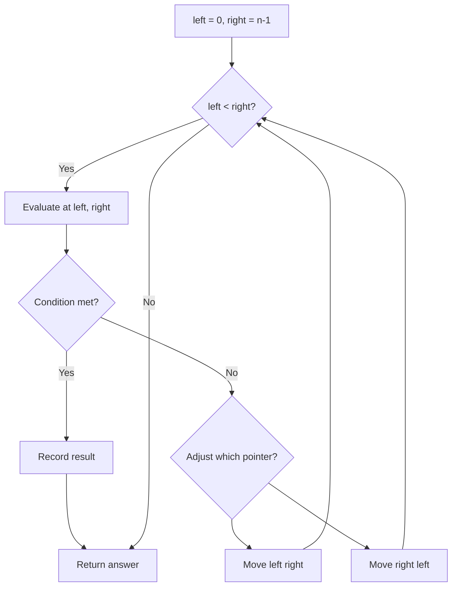
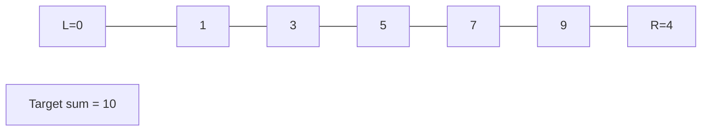
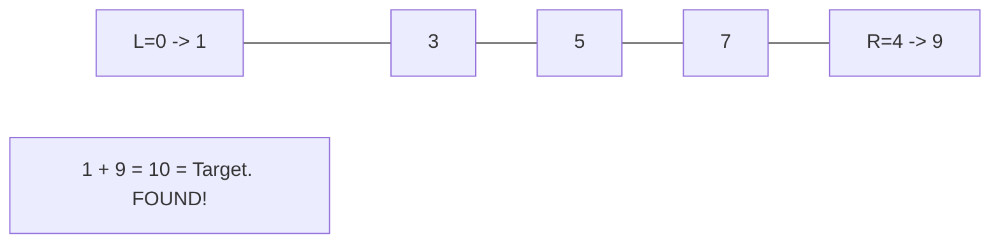

# Problem 1750: Minimum Length of String After Deleting Similar Ends

**Difficulty:** Medium  
**Tags:** Two Pointers, String  
**Pattern:** Two Pointers  
**Link:** [leetcode.com/problems/minimum-length-of-string-after-deleting-similar-ends](https://leetcode.com/problems/minimum-length-of-string-after-deleting-similar-ends/)

## Description

Given a string `s` consisting only of characters `'a'`, `'b'`, and `'c'`. You are asked to apply the following algorithm on the string any number of times:

	- Pick a **non-empty** prefix from the string `s` where all the characters in the prefix are equal.
	- Pick a **non-empty** suffix from the string `s` where all the characters in this suffix are equal.
	- The prefix and the suffix should not intersect at any index.
	- The characters from the prefix and suffix must be the same.
	- Delete both the prefix and the suffix.

Return *the **minimum length** of *`s` *after performing the above operation any number of times (possibly zero times)*.

 

Example 1:

```

**Input:** s = "ca"
**Output:** 2
**Explanation: **You can't remove any characters, so the string stays as is.

```

Example 2:

```

**Input:** s = "cabaabac"
**Output:** 0
**Explanation:** An optimal sequence of operations is:
- Take prefix = "c" and suffix = "c" and remove them, s = "abaaba".
- Take prefix = "a" and suffix = "a" and remove them, s = "baab".
- Take prefix = "b" and suffix = "b" and remove them, s = "aa".
- Take prefix = "a" and suffix = "a" and remove them, s = "".
```

Example 3:

```

**Input:** s = "aabccabba"
**Output:** 3
**Explanation:** An optimal sequence of operations is:
- Take prefix = "aa" and suffix = "a" and remove them, s = "bccabb".
- Take prefix = "b" and suffix = "bb" and remove them, s = "cca".

```

 

**Constraints:**

	- `1 <= s.length <= 10^5`
	- `s` only consists of characters `'a'`, `'b'`, and `'c'`.

## Approach: Two Pointers

Use two pointers moving through the data structure. Depending on the problem, pointers may move toward each other (converging), in the same direction (fast/slow), or independently.

## Pseudocode

```
1. Initialize left = 0, right = n-1 (or two independent pointers)
2. While pointers haven't crossed:
   a. Evaluate condition at pointer positions
   b. Move left pointer right or right pointer left
3. Return result
```

## Algorithm Flow



## Visual State Transitions

**Two Pointer Convergence:**

**Frame 1: Initialize pointers**


**Frame 2: Sum = 1+9 = 10, found!**



## Complexity Analysis

- **Time:** O(n)
- **Space:** O(1)

## Solution (Python3)

```python
class Solution:
    def minimumLength(self, s: str) -> int:
        # Two pointer approach - O(n) time, O(1) space
        left, right = 0, len(s) - 1
        while left < right:
            curr = s[left] + s[right]
            if curr == s:
                return [left, right]
            elif curr < s:
                left += 1
            else:
                right -= 1
        return 0
```

## Solution (C++)

```cpp
#include <string>
#include <vector>
using namespace std;

class Solution {
public:
    int minimumLength(string& s) {
        // Two pointer approach - O(n) time, O(1) space
        int left = 0, right = s.size() - 1;
        while (left < right) {
            int curr = s[left] + s[right];
            if (curr == s) {
                return {left, right};
            } else if (curr < s) {
                left++;
            } else {
                right--;
            }
        }
        return 0;
    }
};
```
