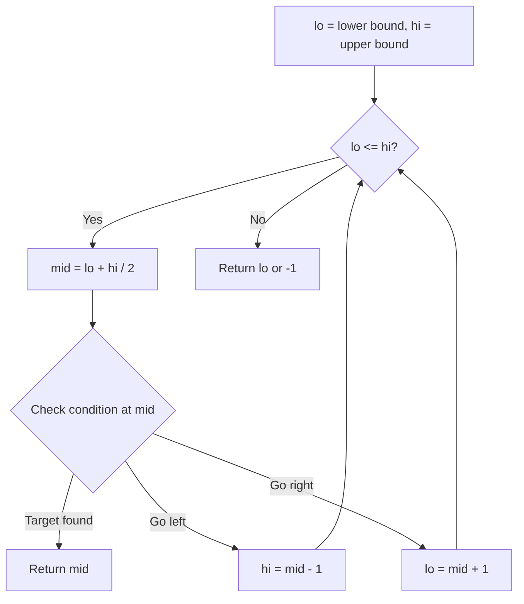
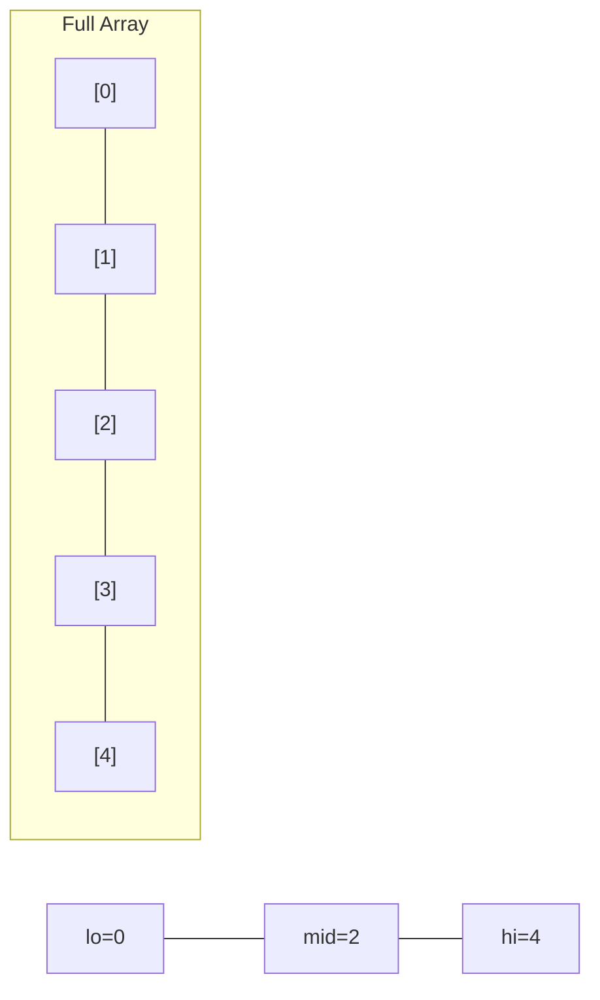
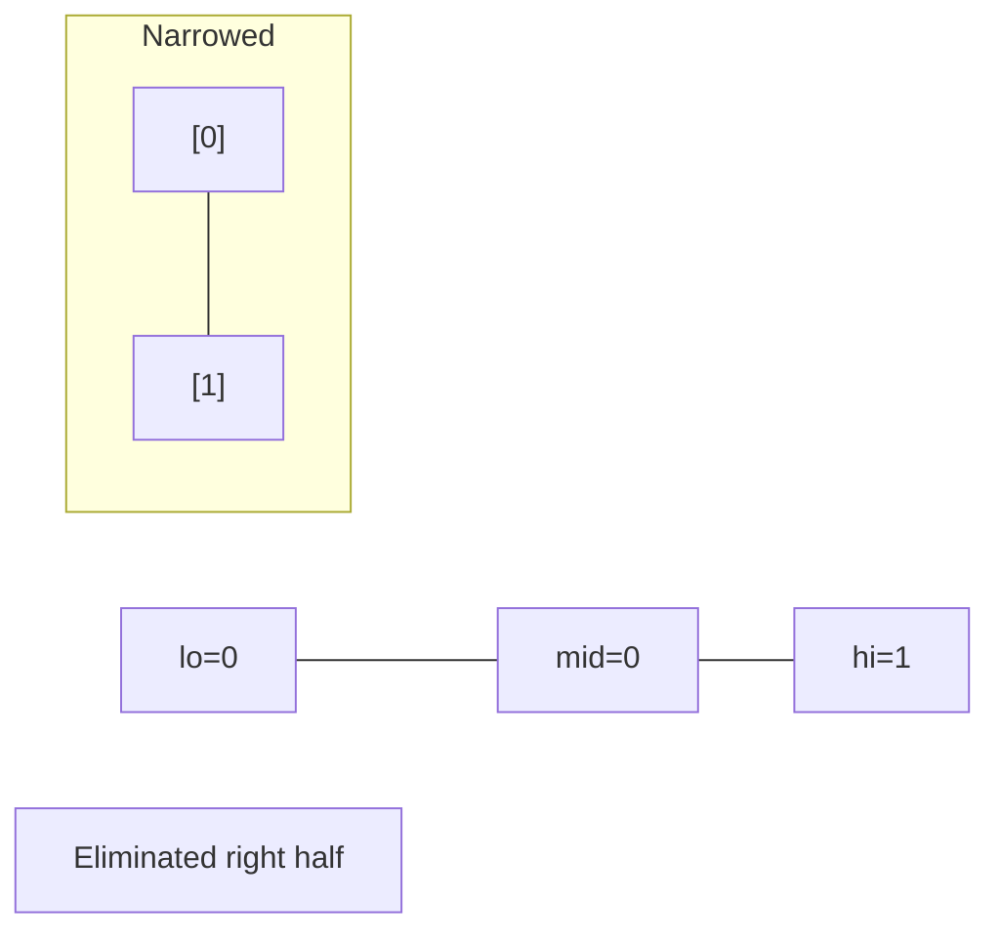
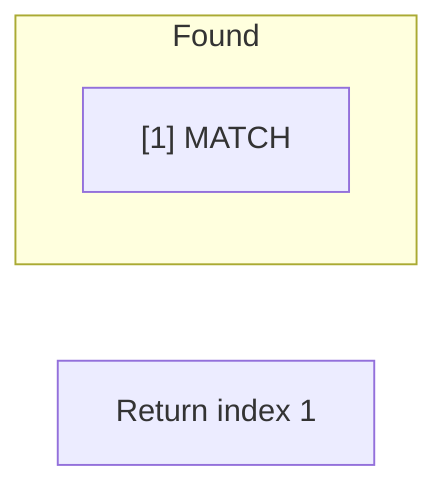

# Problem 1751: Maximum Number of Events That Can Be Attended II

**Difficulty:** Hard  
**Tags:** Array, Binary Search, Dynamic Programming, Sorting  
**Pattern:** Binary Search  
**Link:** [leetcode.com/problems/maximum-number-of-events-that-can-be-attended-ii](https://leetcode.com/problems/maximum-number-of-events-that-can-be-attended-ii/)

## Description

You are given an array of `events` where `events[i] = [startDayi, endDayi, valuei]`. The `i^th` event starts at `startDayi` and ends at `endDayi`, and if you attend this event, you will receive a value of `valuei`. You are also given an integer `k` which represents the maximum number of events you can attend.

You can only attend one event at a time. If you choose to attend an event, you must attend the **entire** event. Note that the end day is **inclusive**: that is, you cannot attend two events where one of them starts and the other ends on the same day.

Return *the **maximum sum** of values that you can receive by attending events.*

 

Example 1:

```

**Input:** events = [[1,2,4],[3,4,3],[2,3,1]], k = 2
**Output:** 7
**Explanation: **Choose the green events, 0 and 1 (0-indexed) for a total value of 4 + 3 = 7.
```

Example 2:

```

**Input:** events = [[1,2,4],[3,4,3],[2,3,10]], k = 2
**Output:** 10
**Explanation:** Choose event 2 for a total value of 10.
Notice that you cannot attend any other event as they overlap, and that you do **not** have to attend k events.
```

Example 3:

****

```

**Input:** events = [[1,1,1],[2,2,2],[3,3,3],[4,4,4]], k = 3
**Output:** 9
**Explanation:** Although the events do not overlap, you can only attend 3 events. Pick the highest valued three.
```

 

**Constraints:**

	- `1 <= k <= events.length`
	- `1 <= k * events.length <= 10^6`
	- `1 <= startDayi <= endDayi <= 10^9`
	- `1 <= valuei <= 10^6`

## Approach: Binary Search

Use binary search to halve the search space each iteration. Define the search range [lo, hi], compute mid, and decide which half to keep based on the problem's monotonic condition.

## Pseudocode

```
1. lo = lower_bound, hi = upper_bound
2. While lo <= hi (or lo < hi):
   a. mid = (lo + hi) // 2
   b. If condition(mid) is satisfied: record answer, search left half
   c. Else: search right half
3. Return answer
```

## Algorithm Flow



## Visual State Transitions

**Binary Search Step-by-Step:**

**Frame 1: Initial search space**


**Frame 2: Compare mid, narrow search**


**Frame 3: Found target**



## Complexity Analysis

- **Time:** O(log n)
- **Space:** O(1)

## Solution (Python3)

```python
class Solution:
    def maxValue(self, events: List[List[int]], k: int) -> int:
        # Binary search - O(log n) time, O(1) space
        lo, hi = 0, len(events) - 1
        while lo <= hi:
            mid = lo + (hi - lo) // 2
            if events[mid] == k:
                return mid
            elif events[mid] < k:
                lo = mid + 1
            else:
                hi = mid - 1
        return 0
```

## Solution (C++)

```cpp
#include <string>
#include <vector>
using namespace std;

class Solution {
public:
    int maxValue(vector<vector<int>>& events, int k) {
        // Binary search - O(log n) time, O(1) space
        int lo = 0, hi = events.size() - 1;
        while (lo <= hi) {
            int mid = lo + (hi - lo) / 2;
            if (events[mid] == k) {
                return mid;
            } else if (events[mid] < k) {
                lo = mid + 1;
            } else {
                hi = mid - 1;
            }
        }
        return 0;
    }
};
```
