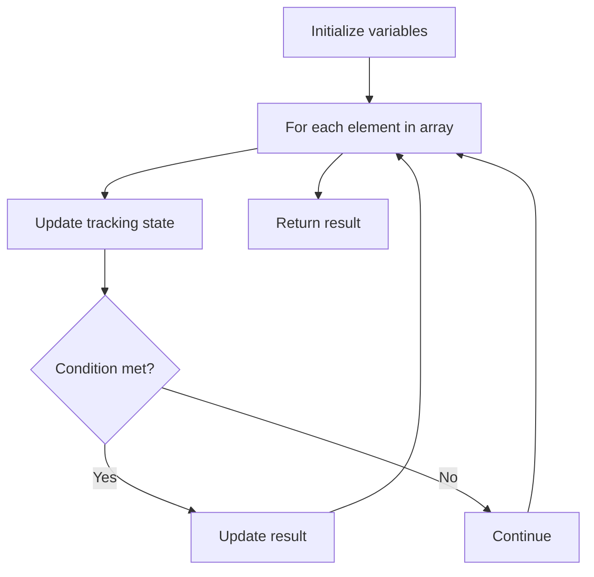

# Problem 1752: Check if Array Is Sorted and Rotated

**Difficulty:** Easy  
**Tags:** Array  
**Pattern:** Array Processing  
**Link:** [leetcode.com/problems/check-if-array-is-sorted-and-rotated](https://leetcode.com/problems/check-if-array-is-sorted-and-rotated/)

## Description

Given an array `nums`, return `true`* if the array was originally sorted in non-decreasing order, then rotated **some** number of positions (including zero)*. Otherwise, return `false`.

There may be **duplicates** in the original array.

**Note:** An array `A` rotated by `x` positions results in an array `B` of the same length such that `B[i] == A[(i+x) % A.length]` for every valid index `i`.

 

Example 1:

```

**Input:** nums = [3,4,5,1,2]
**Output:** true
**Explanation:** [1,2,3,4,5] is the original sorted array.
You can rotate the array by x = 2 positions to begin on the element of value 3: [3,4,5,1,2].

```

Example 2:

```

**Input:** nums = [2,1,3,4]
**Output:** false
**Explanation:** There is no sorted array once rotated that can make nums.

```

Example 3:

```

**Input:** nums = [1,2,3]
**Output:** true
**Explanation:** [1,2,3] is the original sorted array.
You can rotate the array by x = 0 positions (i.e. no rotation) to make nums.

```

 

**Constraints:**

	- `1 <= nums.length <= 100`
	- `1 <= nums[i] <= 100`

## Approach: Array Processing

Process the array with a linear scan, tracking state variables. Look for patterns: running maximum/minimum, counting, or transformations.

## Pseudocode

```
1. Initialize tracking variables
2. Iterate through array:
   a. Update tracking state
   b. Check conditions
   c. Update result
3. Return result
```

## Algorithm Flow



## Complexity Analysis

- **Time:** O(n)
- **Space:** O(1)

## Solution (Python3)

```python
class Solution:
    def check(self, nums: List[int]) -> bool:
        # Array processing - O(n) time
        result = False
        for i in range(len(nums)):
            # Process element
            pass
        return result
```

## Solution (C++)

```cpp
#include <string>
#include <vector>
using namespace std;

class Solution {
public:
    bool check(vector<int>& nums) {
        // Array processing - O(n) time
        for (int i = 0; i < (int)nums.size(); i++) {
            // Process element
        }
        return false;
    }
};
```
