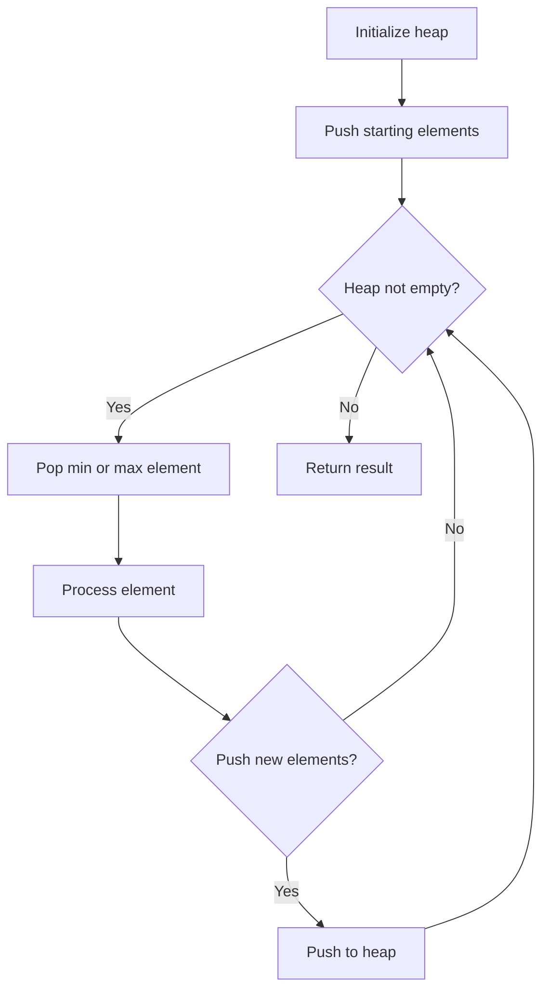
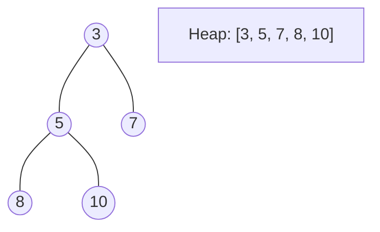
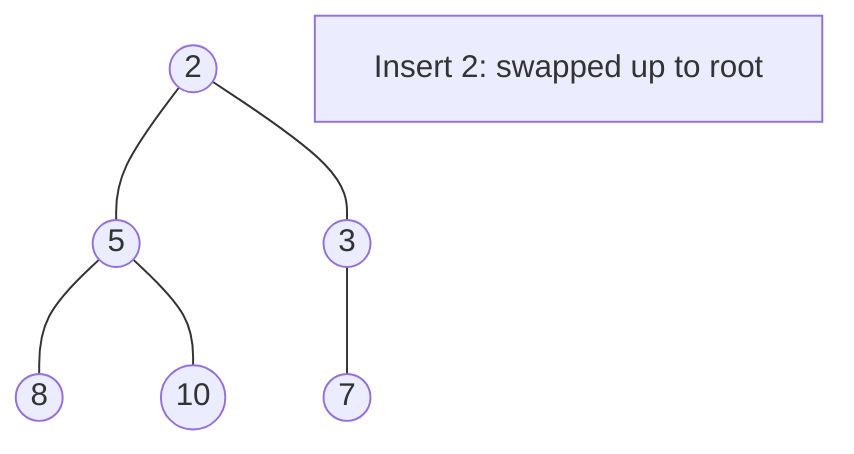
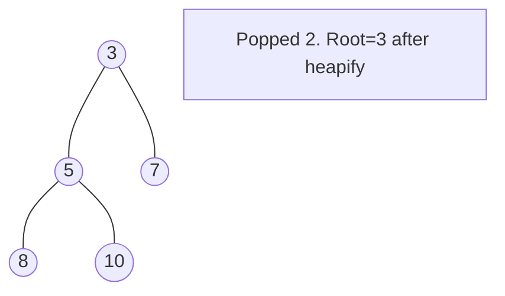

# Problem 1753: Maximum Score From Removing Stones

**Difficulty:** Medium  
**Tags:** Math, Greedy, Heap (Priority Queue)  
**Pattern:** Heap / Priority Queue  
**Link:** [leetcode.com/problems/maximum-score-from-removing-stones](https://leetcode.com/problems/maximum-score-from-removing-stones/)

## Description

You are playing a solitaire game with **three piles** of stones of sizes `a`​​​​​​, `b`,​​​​​​ and `c`​​​​​​ respectively. Each turn you choose two **different non-empty **piles, take one stone from each, and add `1` point to your score. The game stops when there are **fewer than two non-empty** piles (meaning there are no more available moves).

Given three integers `a`​​​​​, `b`,​​​​​ and `c`​​​​​, return *the* ***maximum* *****score** you can get.*

 

Example 1:

```

**Input:** a = 2, b = 4, c = 6
**Output:** 6
**Explanation:** The starting state is (2, 4, 6). One optimal set of moves is:
- Take from 1st and 3rd piles, state is now (1, 4, 5)
- Take from 1st and 3rd piles, state is now (0, 4, 4)
- Take from 2nd and 3rd piles, state is now (0, 3, 3)
- Take from 2nd and 3rd piles, state is now (0, 2, 2)
- Take from 2nd and 3rd piles, state is now (0, 1, 1)
- Take from 2nd and 3rd piles, state is now (0, 0, 0)
There are fewer than two non-empty piles, so the game ends. Total: 6 points.

```

Example 2:

```

**Input:** a = 4, b = 4, c = 6
**Output:** 7
**Explanation:** The starting state is (4, 4, 6). One optimal set of moves is:
- Take from 1st and 2nd piles, state is now (3, 3, 6)
- Take from 1st and 3rd piles, state is now (2, 3, 5)
- Take from 1st and 3rd piles, state is now (1, 3, 4)
- Take from 1st and 3rd piles, state is now (0, 3, 3)
- Take from 2nd and 3rd piles, state is now (0, 2, 2)
- Take from 2nd and 3rd piles, state is now (0, 1, 1)
- Take from 2nd and 3rd piles, state is now (0, 0, 0)
There are fewer than two non-empty piles, so the game ends. Total: 7 points.

```

Example 3:

```

**Input:** a = 1, b = 8, c = 8
**Output:** 8
**Explanation:** One optimal set of moves is to take from the 2nd and 3rd piles for 8 turns until they are empty.
After that, there are fewer than two non-empty piles, so the game ends.

```

 

**Constraints:**

	- `1 <= a, b, c <= 10^5`

## Approach: Heap / Priority Queue

Use a min-heap or max-heap to efficiently access the smallest/largest element. Push elements and pop the top to process in priority order.

## Pseudocode

```
1. Initialize heap (min or max)
2. Push initial elements onto heap
3. While heap not empty and condition:
   a. Pop top element (min or max)
   b. Process element
   c. Push new elements if needed
4. Return result
```

## Algorithm Flow



## Visual State Transitions

**Heap Operations (Min-Heap):**

**Frame 1: Initial heap**


**Frame 2: Insert 2 - bubble up**


**Frame 3: Pop minimum (2) - heapify down**



## Complexity Analysis

- **Time:** O(n log n)
- **Space:** O(n)

## Solution (Python3)

```python
class Solution:
    def maximumScore(self, a: int, b: int, c: int) -> int:
        # Heap/Priority Queue - O(n log k) time
        import heapq
        if not a:
            return 0
        # Min heap (negate for max heap)
        heap = []
        for val in a:
            heapq.heappush(heap, val)
            if len(heap) > (b if isinstance(b, int) else len(a)):
                heapq.heappop(heap)
        return heap[0] if heap else 0
```

## Solution (C++)

```cpp
#include <queue>
#include <string>
#include <vector>
using namespace std;

class Solution {
public:
    int maximumScore(int a, int b, int c) {
        // Heap/Priority Queue - O(n log k) time
        priority_queue<int, vector<int>, greater<int>> pq;
        for (int val : a) {
            pq.push(val);
            if ((int)pq.size() > b)
                pq.pop();
        }
        return pq.empty() ? 0 : pq.top();
    }
};
```
