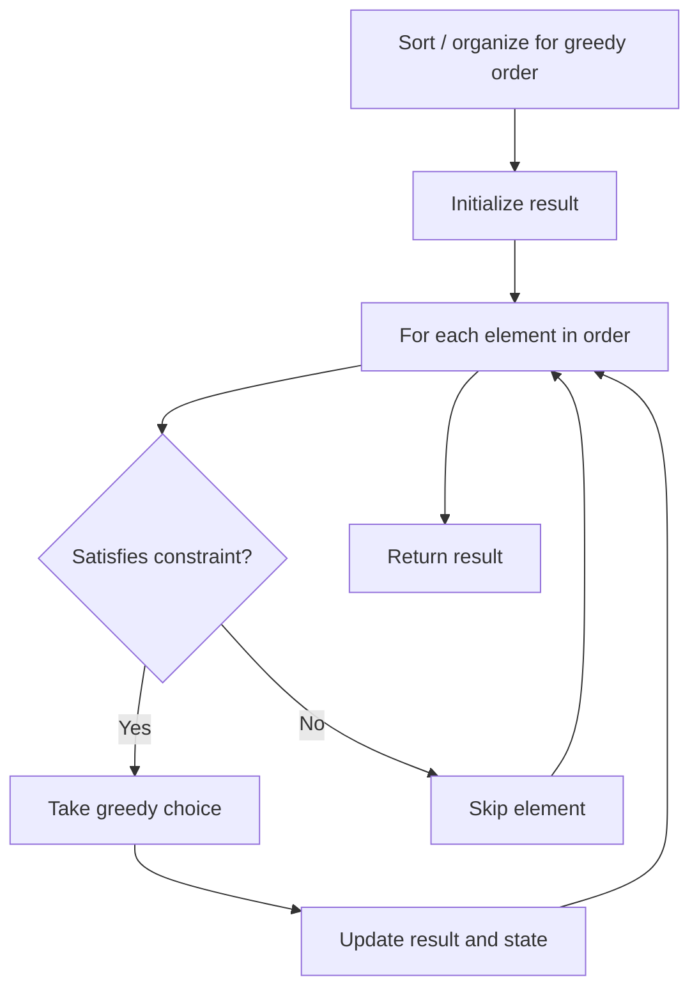

# Problem 1754: Largest Merge Of Two Strings

**Difficulty:** Medium  
**Tags:** Two Pointers, String, Greedy  
**Pattern:** Greedy  
**Link:** [leetcode.com/problems/largest-merge-of-two-strings](https://leetcode.com/problems/largest-merge-of-two-strings/)

## Description

You are given two strings `word1` and `word2`. You want to construct a string `merge` in the following way: while either `word1` or `word2` are non-empty, choose **one** of the following options:

	- If `word1` is non-empty, append the **first** character in `word1` to `merge` and delete it from `word1`.

	
		For example, if `word1 = "abc" `and `merge = "dv"`, then after choosing this operation, `word1 = "bc"` and `merge = "dva"`.
	
	
	- If `word2` is non-empty, append the **first** character in `word2` to `merge` and delete it from `word2`.
	
		For example, if `word2 = "abc" `and `merge = ""`, then after choosing this operation, `word2 = "bc"` and `merge = "a"`.
	
	

Return *the lexicographically **largest** *`merge`* you can construct*.

A string `a` is lexicographically larger than a string `b` (of the same length) if in the first position where `a` and `b` differ, `a` has a character strictly larger than the corresponding character in `b`. For example, `"abcd"` is lexicographically larger than `"abcc"` because the first position they differ is at the fourth character, and `d` is greater than `c`.

 

Example 1:

```

**Input:** word1 = "cabaa", word2 = "bcaaa"
**Output:** "cbcabaaaaa"
**Explanation:** One way to get the lexicographically largest merge is:
- Take from word1: merge = "c", word1 = "abaa", word2 = "bcaaa"
- Take from word2: merge = "cb", word1 = "abaa", word2 = "caaa"
- Take from word2: merge = "cbc", word1 = "abaa", word2 = "aaa"
- Take from word1: merge = "cbca", word1 = "baa", word2 = "aaa"
- Take from word1: merge = "cbcab", word1 = "aa", word2 = "aaa"
- Append the remaining 5 a's from word1 and word2 at the end of merge.

```

Example 2:

```

**Input:** word1 = "abcabc", word2 = "abdcaba"
**Output:** "abdcabcabcaba"

```

 

**Constraints:**

	- `1 <= word1.length, word2.length <= 3000`
	- `word1` and `word2` consist only of lowercase English letters.

## Approach: Greedy

Make the locally optimal choice at each step, trusting it leads to a global optimum. Greedy works when the problem has the greedy-choice property and optimal substructure.

## Pseudocode

```
1. Sort or organize data for greedy ordering
2. Initialize result
3. For each element in greedy order:
   a. If element satisfies constraint:
      - Take the greedy choice
      - Update result and state
4. Return result
```

## Algorithm Flow



## Complexity Analysis

- **Time:** O(n log n)
- **Space:** O(1)

## Solution (Python3)

```python
class Solution:
    def largestMerge(self, word1: str, word2: str) -> str:
        # Greedy approach - O(n) time
        result = 0
        curr_max = 0
        for i in range(len(word1)):
            if isinstance(word1[i], int):
                curr_max = max(curr_max, word1[i])
                result = max(result, curr_max)
            else:
                result += 1
        return result
```

## Solution (C++)

```cpp
#include <algorithm>
#include <string>
#include <vector>
using namespace std;

class Solution {
public:
    string largestMerge(string& word1, string& word2) {
        // Greedy approach - O(n) time
        int result = 0, curr_max = 0;
        for (int i = 0; i < (int)word1.size(); i++) {
            curr_max = max(curr_max, word1[i]);
            result = max(result, curr_max);
        }
        return result;
    }
};
```
