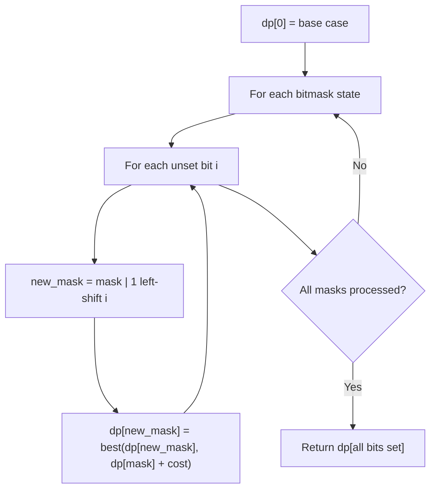

# Problem 1755: Closest Subsequence Sum

**Difficulty:** Hard  
**Tags:** Array, Two Pointers, Dynamic Programming, Bit Manipulation, Sorting, Bitmask  
**Pattern:** Dynamic Programming (Bitmask)  
**Link:** [leetcode.com/problems/closest-subsequence-sum](https://leetcode.com/problems/closest-subsequence-sum/)

## Description

You are given an integer array `nums` and an integer `goal`.

You want to choose a subsequence of `nums` such that the sum of its elements is the closest possible to `goal`. That is, if the sum of the subsequence's elements is `sum`, then you want to **minimize the absolute difference** `abs(sum - goal)`.

Return *the **minimum** possible value of* `abs(sum - goal)`.

Note that a subsequence of an array is an array formed by removing some elements **(possibly all or none)** of the original array.

 

Example 1:

```

**Input:** nums = [5,-7,3,5], goal = 6
**Output:** 0
**Explanation:** Choose the whole array as a subsequence, with a sum of 6.
This is equal to the goal, so the absolute difference is 0.

```

Example 2:

```

**Input:** nums = [7,-9,15,-2], goal = -5
**Output:** 1
**Explanation:** Choose the subsequence [7,-9,-2], with a sum of -4.
The absolute difference is abs(-4 - (-5)) = abs(1) = 1, which is the minimum.

```

Example 3:

```

**Input:** nums = [1,2,3], goal = -7
**Output:** 7

```

 

**Constraints:**

	- `1 <= nums.length <= 40`
	- `-10^7 <= nums[i] <= 10^7`
	- `-10^9 <= goal <= 10^9`

## Approach: Dynamic Programming (Bitmask)

Use bitmask to represent subsets of n elements. dp[mask] = optimal value when the selected subset is represented by mask. Iterate over all masks and transitions.

## Pseudocode

```
1. dp[0] = base case
2. For mask from 0 to 2^n - 1:
   a. For each bit i not set in mask:
      - new_mask = mask | (1 << i)
      - dp[new_mask] = best of dp[new_mask], dp[mask] + cost(i)
3. Return dp[(1 << n) - 1]
```

## Algorithm Flow



## Complexity Analysis

- **Time:** O(2^n * n)
- **Space:** O(2^n)

## Solution (Python3)

```python
class Solution:
    def minAbsDifference(self, nums: List[int], goal: int) -> int:
        # Bitmask DP - O(2^n * n) time
        n = len(nums)
        dp = [float('inf')] * (1 << n)
        dp[0] = 0
        for mask in range(1 << n):
            bits = bin(mask).count('1')
            for i in range(n):
                if mask & (1 << i):
                    continue
                new_mask = mask | (1 << i)
                dp[new_mask] = min(dp[new_mask], dp[mask] + 1)
        return dp[(1 << n) - 1]
```

## Solution (C++)

```cpp
#include <algorithm>
#include <climits>
#include <string>
#include <vector>
using namespace std;

class Solution {
public:
    int minAbsDifference(vector<int>& nums, int goal) {
        // Bitmask DP - O(2^n * n) time
        int n = nums.size();
        vector<int> dp(1 << n, INT_MAX);
        dp[0] = 0;
        for (int mask = 0; mask < (1 << n); mask++) {
            for (int i = 0; i < n; i++) {
                if (mask & (1 << i)) continue;
                int new_mask = mask | (1 << i);
                dp[new_mask] = min(dp[new_mask], dp[mask] + 1);
            }
        }
        return dp[(1 << n) - 1];
    }
};
```
