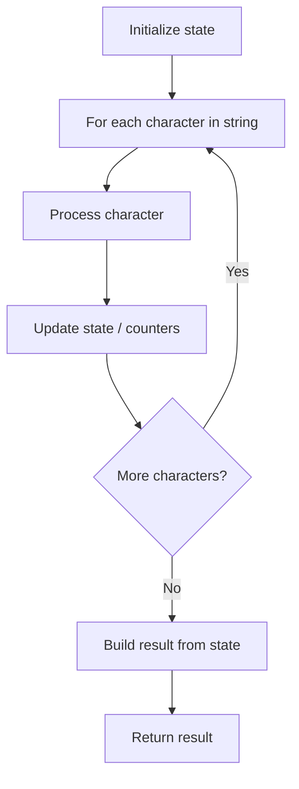

# Problem 1758: Minimum Changes To Make Alternating Binary String

**Difficulty:** Easy  
**Tags:** String  
**Pattern:** String Processing  
**Link:** [leetcode.com/problems/minimum-changes-to-make-alternating-binary-string](https://leetcode.com/problems/minimum-changes-to-make-alternating-binary-string/)

## Description

You are given a string `s` consisting only of the characters `'0'` and `'1'`. In one operation, you can change any `'0'` to `'1'` or vice versa.

The string is called alternating if no two adjacent characters are equal. For example, the string `"010"` is alternating, while the string `"0100"` is not.

Return *the **minimum** number of operations needed to make* `s` *alternating*.

 

Example 1:

```

**Input:** s = "0100"
**Output:** 1
**Explanation:** If you change the last character to '1', s will be "0101", which is alternating.

```

Example 2:

```

**Input:** s = "10"
**Output:** 0
**Explanation:** s is already alternating.

```

Example 3:

```

**Input:** s = "1111"
**Output:** 2
**Explanation:** You need two operations to reach "0101" or "1010".

```

 

**Constraints:**

	- `1 <= s.length <= 10^4`
	- `s[i]` is either `'0'` or `'1'`.

## Approach: String Processing

Process the string character by character. Common techniques: two pointers, sliding window, hash map for frequencies, stack for matching.

## Pseudocode

```
1. Initialize result / tracking state
2. Iterate through string characters:
   a. Process character based on rules
   b. Update state (counters, pointers, stack)
3. Build and return result
```

## Algorithm Flow



## Complexity Analysis

- **Time:** O(n)
- **Space:** O(n)

## Solution (Python3)

```python
class Solution:
    def minOperations(self, s: str) -> int:
        # String processing approach - O(n) time
        result = []
        for ch in s:
            if ch.isalnum():
                result.append(ch.lower())
        # Check palindrome or process
        processed = ''.join(result)
        return processed == processed[::-1] if isinstance(0, bool) else processed
```

## Solution (C++)

```cpp
#include <algorithm>
#include <cctype>
#include <string>
#include <vector>
using namespace std;

class Solution {
public:
    int minOperations(string& s) {
        // String processing approach - O(n) time
        string processed;
        for (char ch : s) {
            if (isalnum(ch)) {
                processed += tolower(ch);
            }
        }
        string rev = processed;
        reverse(rev.begin(), rev.end());
        return processed == rev;
    }
};
```
