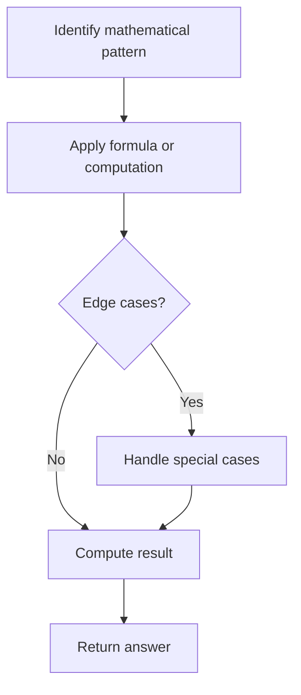

# Problem 1759: Count Number of Homogenous Substrings

**Difficulty:** Medium  
**Tags:** Math, String  
**Pattern:** Math  
**Link:** [leetcode.com/problems/count-number-of-homogenous-substrings](https://leetcode.com/problems/count-number-of-homogenous-substrings/)

## Description

Given a string `s`, return *the number of **homogenous** substrings of *`s`*.* Since the answer may be too large, return it **modulo** `10^9 + 7`.

A string is **homogenous** if all the characters of the string are the same.

A **substring** is a contiguous sequence of characters within a string.

 

Example 1:

```

**Input:** s = "abbcccaa"
**Output:** 13
**Explanation:** The homogenous substrings are listed as below:
"a"   appears 3 times.
"aa"  appears 1 time.
"b"   appears 2 times.
"bb"  appears 1 time.
"c"   appears 3 times.
"cc"  appears 2 times.
"ccc" appears 1 time.
3 + 1 + 2 + 1 + 3 + 2 + 1 = 13.
```

Example 2:

```

**Input:** s = "xy"
**Output:** 2
**Explanation:** The homogenous substrings are "x" and "y".
```

Example 3:

```

**Input:** s = "zzzzz"
**Output:** 15

```

 

**Constraints:**

	- `1 <= s.length <= 10^5`
	- `s` consists of lowercase letters.

## Approach: Math

Apply mathematical properties, formulas, or number-theoretic concepts. Look for patterns, modular arithmetic, or closed-form solutions.

## Pseudocode

```
1. Identify the mathematical pattern or formula
2. Apply computation:
   - Modular arithmetic for large numbers
   - GCD/LCM for divisibility
   - Sieve for primes
3. Handle edge cases
4. Return result
```

## Algorithm Flow



## Complexity Analysis

- **Time:** O(n) or O(sqrt(n))
- **Space:** O(1)

## Solution (Python3)

```python
class Solution:
    def countHomogenous(self, s: str) -> int:
        # Mathematical approach
        result = 0
        x = s
        while x != 0:
            result = result * 10 + x % 10
            x //= 10 if isinstance(x, int) else 1
        return result
```

## Solution (C++)

```cpp
#include <string>
#include <vector>
using namespace std;

class Solution {
public:
    int countHomogenous(string& s) {
        // Mathematical approach
        long long result = 0;
        int x = s;
        while (x != 0) {
            result = result * 10 + x % 10;
            x /= 10;
        }
        return (int)result;
    }
};
```
