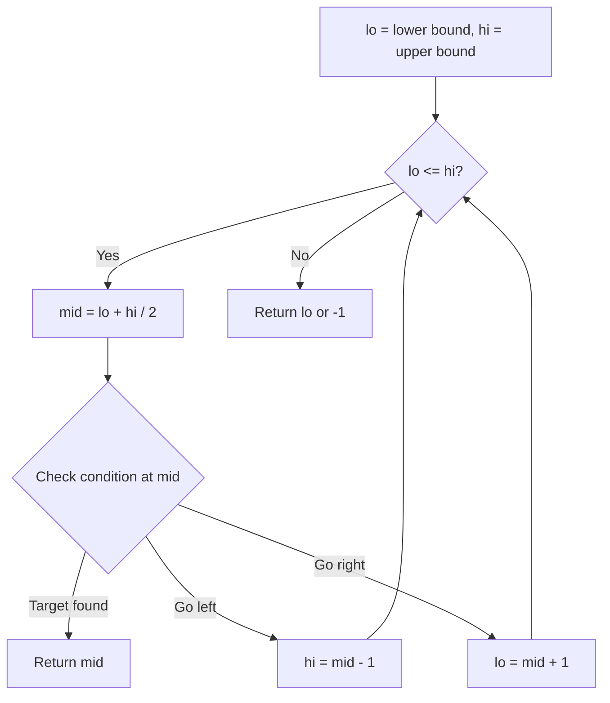
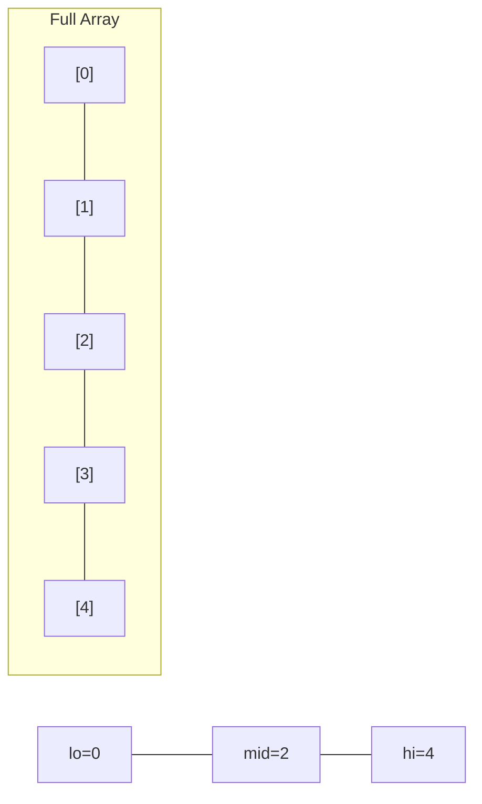
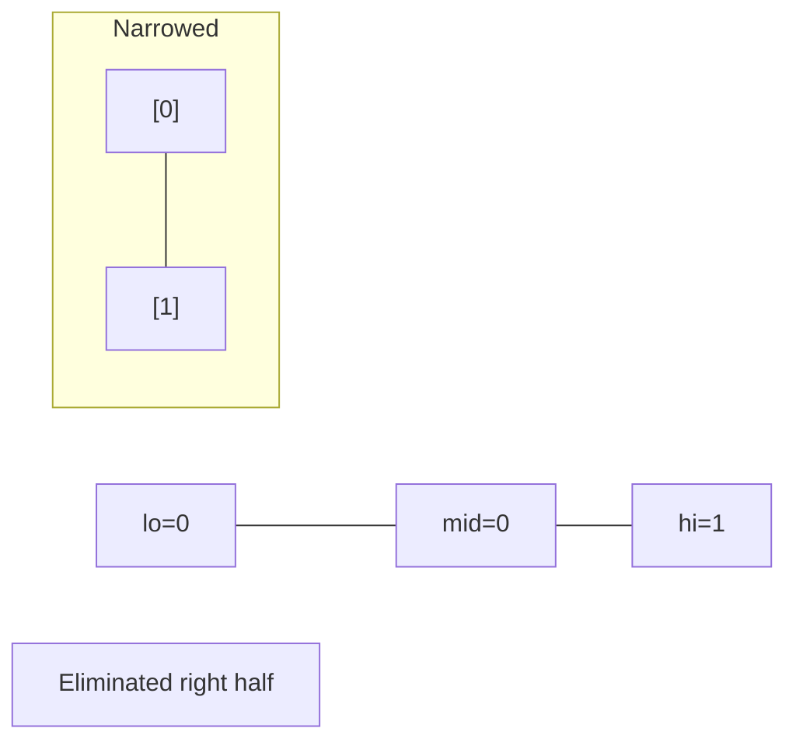
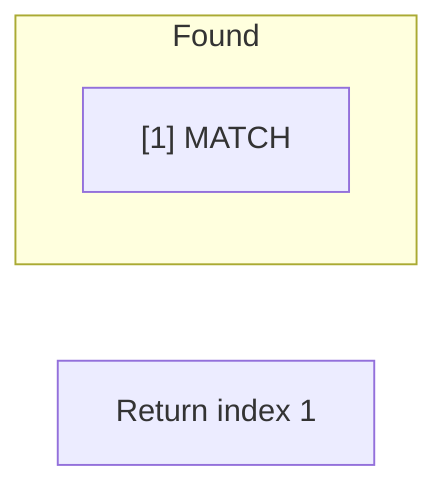

# Problem 1760: Minimum Limit of Balls in a Bag

**Difficulty:** Medium  
**Tags:** Array, Binary Search  
**Pattern:** Binary Search  
**Link:** [leetcode.com/problems/minimum-limit-of-balls-in-a-bag](https://leetcode.com/problems/minimum-limit-of-balls-in-a-bag/)

## Description

You are given an integer array `nums` where the `i^th` bag contains `nums[i]` balls. You are also given an integer `maxOperations`.

You can perform the following operation at most `maxOperations` times:

	- Take any bag of balls and divide it into two new bags with a **positive **number of balls.

	
		For example, a bag of `5` balls can become two new bags of `1` and `4` balls, or two new bags of `2` and `3` balls.
	
	

Your penalty is the **maximum** number of balls in a bag. You want to **minimize** your penalty after the operations.

Return *the minimum possible penalty after performing the operations*.

 

Example 1:

```

**Input:** nums = [9], maxOperations = 2
**Output:** 3
**Explanation:** 
- Divide the bag with 9 balls into two bags of sizes 6 and 3. [**9**] -> [6,3].
- Divide the bag with 6 balls into two bags of sizes 3 and 3. [**6**,3] -> [3,3,3].
The bag with the most number of balls has 3 balls, so your penalty is 3 and you should return 3.

```

Example 2:

```

**Input:** nums = [2,4,8,2], maxOperations = 4
**Output:** 2
**Explanation:**
- Divide the bag with 8 balls into two bags of sizes 4 and 4. [2,4,**8**,2] -> [2,4,4,4,2].
- Divide the bag with 4 balls into two bags of sizes 2 and 2. [2,**4**,4,4,2] -> [2,2,2,4,4,2].
- Divide the bag with 4 balls into two bags of sizes 2 and 2. [2,2,2,**4**,4,2] -> [2,2,2,2,2,4,2].
- Divide the bag with 4 balls into two bags of sizes 2 and 2. [2,2,2,2,2,**4**,2] -> [2,2,2,2,2,2,2,2].
The bag with the most number of balls has 2 balls, so your penalty is 2, and you should return 2.

```

 

**Constraints:**

	- `1 <= nums.length <= 10^5`
	- `1 <= maxOperations, nums[i] <= 10^9`

## Approach: Binary Search

Use binary search to halve the search space each iteration. Define the search range [lo, hi], compute mid, and decide which half to keep based on the problem's monotonic condition.

## Pseudocode

```
1. lo = lower_bound, hi = upper_bound
2. While lo <= hi (or lo < hi):
   a. mid = (lo + hi) // 2
   b. If condition(mid) is satisfied: record answer, search left half
   c. Else: search right half
3. Return answer
```

## Algorithm Flow



## Visual State Transitions

**Binary Search Step-by-Step:**

**Frame 1: Initial search space**


**Frame 2: Compare mid, narrow search**


**Frame 3: Found target**



## Complexity Analysis

- **Time:** O(log n)
- **Space:** O(1)

## Solution (Python3)

```python
class Solution:
    def minimumSize(self, nums: List[int], maxOperations: int) -> int:
        # Binary search - O(log n) time, O(1) space
        lo, hi = 0, len(nums) - 1
        while lo <= hi:
            mid = lo + (hi - lo) // 2
            if nums[mid] == maxOperations:
                return mid
            elif nums[mid] < maxOperations:
                lo = mid + 1
            else:
                hi = mid - 1
        return 0
```

## Solution (C++)

```cpp
#include <string>
#include <vector>
using namespace std;

class Solution {
public:
    int minimumSize(vector<int>& nums, int maxOperations) {
        // Binary search - O(log n) time, O(1) space
        int lo = 0, hi = nums.size() - 1;
        while (lo <= hi) {
            int mid = lo + (hi - lo) / 2;
            if (nums[mid] == maxOperations) {
                return mid;
            } else if (nums[mid] < maxOperations) {
                lo = mid + 1;
            } else {
                hi = mid - 1;
            }
        }
        return 0;
    }
};
```
