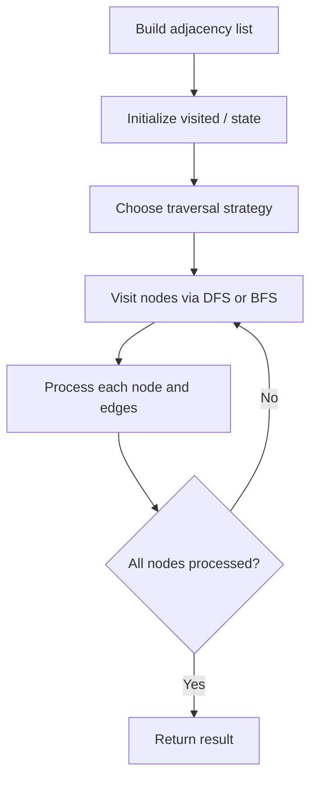

# Problem 1761: Minimum Degree of a Connected Trio in a Graph

**Difficulty:** Hard  
**Tags:** Graph Theory, Enumeration  
**Pattern:** Graph Algorithm  
**Link:** [leetcode.com/problems/minimum-degree-of-a-connected-trio-in-a-graph](https://leetcode.com/problems/minimum-degree-of-a-connected-trio-in-a-graph/)

## Description

You are given an undirected graph. You are given an integer `n` which is the number of nodes in the graph and an array `edges`, where each `edges[i] = [ui, vi]` indicates that there is an undirected edge between `ui` and `vi`.

A **connected trio** is a set of **three** nodes where there is an edge between **every** pair of them.

The **degree of a connected trio** is the number of edges where one endpoint is in the trio, and the other is not.

Return *the **minimum** degree of a connected trio in the graph, or* `-1` *if the graph has no connected trios.*

 

Example 1:

```

**Input:** n = 6, edges = [[1,2],[1,3],[3,2],[4,1],[5,2],[3,6]]
**Output:** 3
**Explanation:** There is exactly one trio, which is [1,2,3]. The edges that form its degree are bolded in the figure above.

```

Example 2:

```

**Input:** n = 7, edges = [[1,3],[4,1],[4,3],[2,5],[5,6],[6,7],[7,5],[2,6]]
**Output:** 0
**Explanation:** There are exactly three trios:
1) [1,4,3] with degree 0.
2) [2,5,6] with degree 2.
3) [5,6,7] with degree 2.

```

 

**Constraints:**

	- `2 <= n <= 400`
	- `edges[i].length == 2`
	- `1 <= edges.length <= n * (n-1) / 2`
	- `1 <= ui, vi <= n`
	- `ui != vi`
	- There are no repeated edges.

## Approach: Graph Algorithm

Build an adjacency list/matrix from the input. Apply graph traversal (DFS/BFS), shortest path, or connectivity algorithm as needed.

## Pseudocode

```
1. Build adjacency list from edges
2. Initialize visited/distance arrays
3. Apply traversal algorithm:
   - DFS/BFS for reachability
   - Dijkstra/Bellman-Ford for shortest path
   - Union-Find for connectivity
4. Return result
```

## Algorithm Flow



## Complexity Analysis

- **Time:** O(V + E)
- **Space:** O(V + E)

## Solution (Python3)

```python
class Solution:
    def minTrioDegree(self, n: int, edges: List[List[int]]) -> int:
        # Graph traversal - O(V+E) time
        from collections import defaultdict
        graph = defaultdict(list)
        # Build adjacency list from input
        n = len(n) if isinstance(n, list) else n
        visited = [False] * n
        result = 0
        
        def dfs(node):
            visited[node] = True
            for neighbor in graph[node]:
                if not visited[neighbor]:
                    dfs(neighbor)
        
        for i in range(n):
            if not visited[i]:
                dfs(i)
                result += 1
        return result
```

## Solution (C++)

```cpp
#include <functional>
#include <string>
#include <vector>
using namespace std;

class Solution {
public:
    int minTrioDegree(int n, vector<vector<int>>& edges) {
        // Graph traversal - O(V+E) time
        int n = n.size();
        vector<vector<int>> graph(n);
        vector<bool> visited(n, false);
        int result = 0;
        function<void(int)> dfs = [&](int node) {
            visited[node] = true;
            for (int neighbor : graph[node]) {
                if (!visited[neighbor]) dfs(neighbor);
            }
        };
        for (int i = 0; i < n; i++) {
            if (!visited[i]) {
                dfs(i);
                result++;
            }
        }
        return result;
    }
};
```
