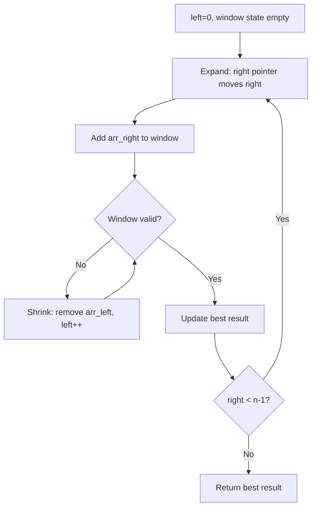
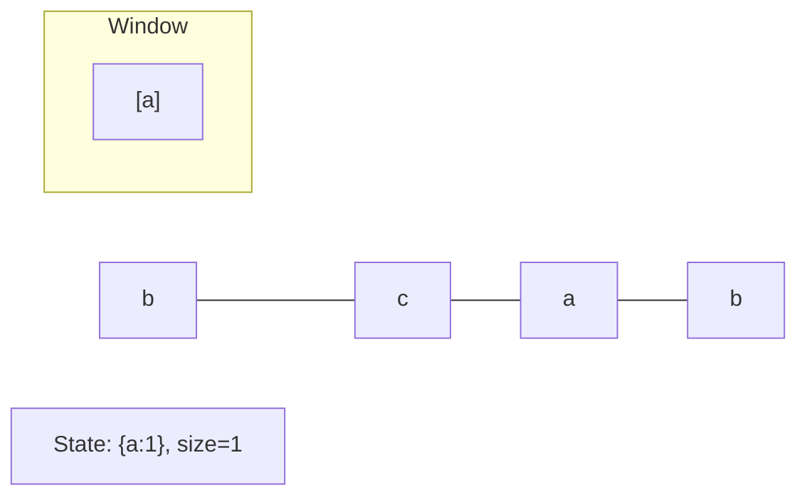
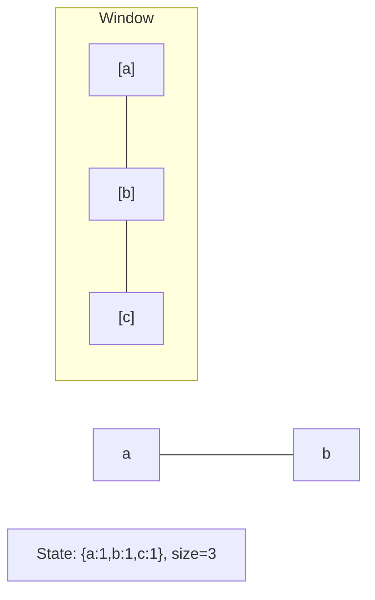
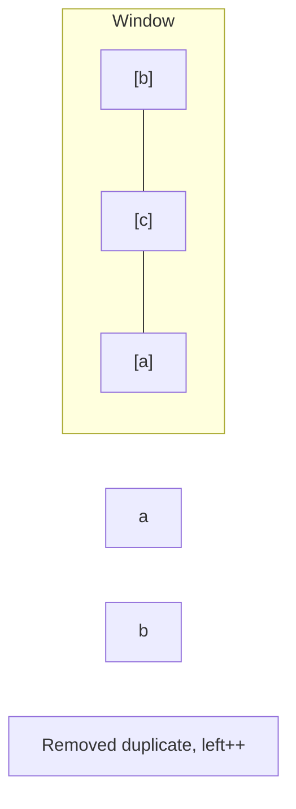
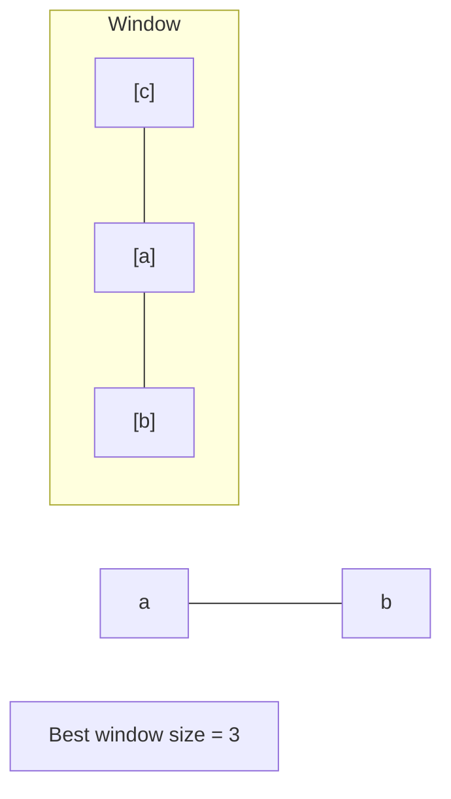

# Problem 1763: Longest Nice Substring

**Difficulty:** Easy  
**Tags:** Hash Table, String, Divide and Conquer, Bit Manipulation, Sliding Window  
**Pattern:** Sliding Window  
**Link:** [leetcode.com/problems/longest-nice-substring](https://leetcode.com/problems/longest-nice-substring/)

## Description

A string `s` is **nice** if, for every letter of the alphabet that `s` contains, it appears **both** in uppercase and lowercase. For example, `"abABB"` is nice because `'A'` and `'a'` appear, and `'B'` and `'b'` appear. However, `"abA"` is not because `'b'` appears, but `'B'` does not.

Given a string `s`, return *the longest **substring** of `s` that is **nice**. If there are multiple, return the substring of the **earliest** occurrence. If there are none, return an empty string*.

 

Example 1:

```

**Input:** s = "YazaAay"
**Output:** "aAa"
**Explanation: **"aAa" is a nice string because 'A/a' is the only letter of the alphabet in s, and both 'A' and 'a' appear.
"aAa" is the longest nice substring.

```

Example 2:

```

**Input:** s = "Bb"
**Output:** "Bb"
**Explanation:** "Bb" is a nice string because both 'B' and 'b' appear. The whole string is a substring.

```

Example 3:

```

**Input:** s = "c"
**Output:** ""
**Explanation:** There are no nice substrings.

```

 

**Constraints:**

	- `1 <= s.length <= 100`
	- `s` consists of uppercase and lowercase English letters.

## Approach: Sliding Window

Maintain a window over the data using two pointers. Expand the right boundary to include new elements, and shrink the left boundary when the window constraint is violated. Track the optimal window.

## Pseudocode

```
1. Initialize left = 0, result = initial_value
2. For right in range(n):
   a. Add element at right to window state
   b. While window is invalid:
      - Remove element at left from window state
      - left++
   c. Update result = best of (result, window size/value)
3. Return result
```

## Algorithm Flow



## Visual State Transitions

**Sliding Window Step-by-Step:**

**Frame 1: Initial window (left=0, right=0)**


**Frame 2: Expand right (right=2)**


**Frame 3: Violation - shrink left**


**Frame 4: Continue expanding**



## Complexity Analysis

- **Time:** O(n)
- **Space:** O(k)

## Solution (Python3)

```python
class Solution:
    def longestNiceSubstring(self, s: str) -> str:
        # Sliding window approach - O(n) time, O(k) space
        from collections import defaultdict
        window = defaultdict(int)
        left = 0
        result = 0
        for right in range(len(s)):
            window[s[right]] += 1
            while len(window) > (s if isinstance(s, int) else len(s)):
                window[s[left]] -= 1
                if window[s[left]] == 0:
                    del window[s[left]]
                left += 1
            result = max(result, right - left + 1)
        return result
```

## Solution (C++)

```cpp
#include <algorithm>
#include <string>
#include <unordered_map>
#include <vector>
using namespace std;

class Solution {
public:
    string longestNiceSubstring(string& s) {
        // Sliding window approach - O(n) time, O(k) space
        unordered_map<char, int> window;
        int left = 0, result = 0;
        for (int right = 0; right < s.size(); right++) {
            window[s[right]]++;
            while ((int)window.size() > s) {
                window[s[left]]--;
                if (window[s[left]] == 0)
                    window.erase(s[left]);
                left++;
            }
            result = max(result, right - left + 1);
        }
        return result;
    }
};
```
