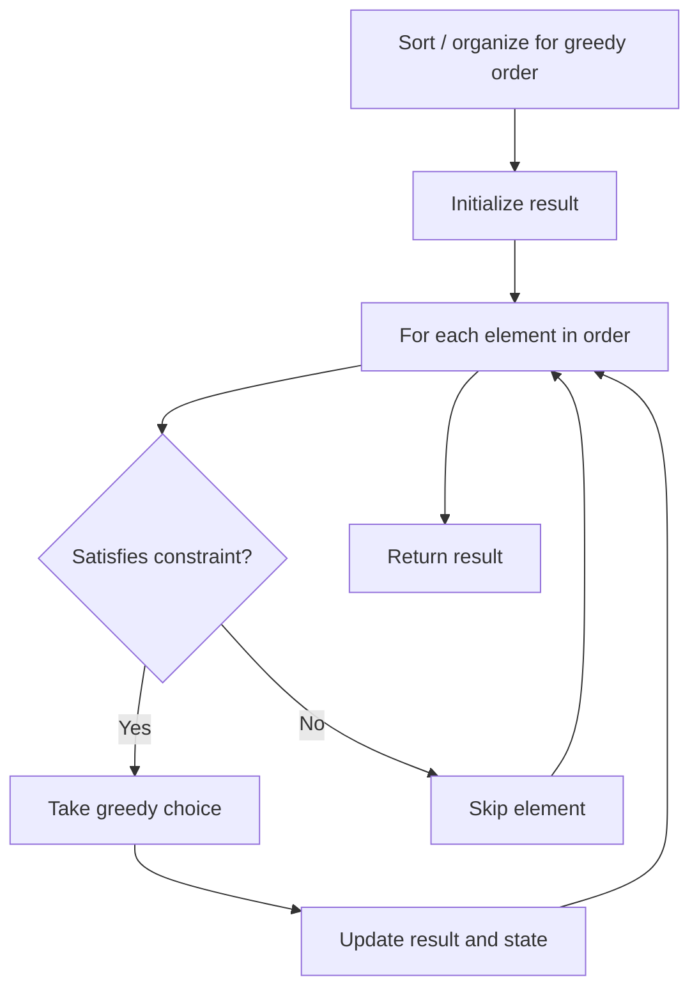

# Problem 1764: Form Array by Concatenating Subarrays of Another Array

**Difficulty:** Medium  
**Tags:** Array, Two Pointers, Greedy, String Matching  
**Pattern:** Greedy  
**Link:** [leetcode.com/problems/form-array-by-concatenating-subarrays-of-another-array](https://leetcode.com/problems/form-array-by-concatenating-subarrays-of-another-array/)

## Description

You are given a 2D integer array `groups` of length `n`. You are also given an integer array `nums`.

You are asked if you can choose `n` **disjoint **subarrays from the array `nums` such that the `i^th` subarray is equal to `groups[i]` (**0-indexed**), and if `i > 0`, the `(i-1)^th` subarray appears **before** the `i^th` subarray in `nums` (i.e. the subarrays must be in the same order as `groups`).

Return `true` *if you can do this task, and* `false` *otherwise*.

Note that the subarrays are **disjoint** if and only if there is no index `k` such that `nums[k]` belongs to more than one subarray. A subarray is a contiguous sequence of elements within an array.

 

Example 1:

```

**Input:** groups = [[1,-1,-1],[3,-2,0]], nums = [1,-1,0,1,-1,-1,3,-2,0]
**Output:** true
**Explanation:** You can choose the 0th subarray as [1,-1,0,**1,-1,-1**,3,-2,0] and the 1st one as [1,-1,0,1,-1,-1,**3,-2,0**].
These subarrays are disjoint as they share no common nums[k] element.

```

Example 2:

```

**Input:** groups = [[10,-2],[1,2,3,4]], nums = [1,2,3,4,10,-2]
**Output:** false
**Explanation: **Note that choosing the subarrays [**1,2,3,4**,10,-2] and [1,2,3,4,**10,-2**] is incorrect because they are not in the same order as in groups.
[10,-2] must come before [1,2,3,4].

```

Example 3:

```

**Input:** groups = [[1,2,3],[3,4]], nums = [7,7,1,2,3,4,7,7]
**Output:** false
**Explanation: **Note that choosing the subarrays [7,7,**1,2,3**,4,7,7] and [7,7,1,2,**3,4**,7,7] is invalid because they are not disjoint.
They share a common elements nums[4] (0-indexed).

```

 

**Constraints:**

	- `groups.length == n`
	- `1 <= n <= 10^3`
	- `1 <= groups[i].length, sum(groups[i].length) <= 10^3`
	- `1 <= nums.length <= 10^3`
	- `-10^7 <= groups[i][j], nums[k] <= 10^7`

## Approach: Greedy

Make the locally optimal choice at each step, trusting it leads to a global optimum. Greedy works when the problem has the greedy-choice property and optimal substructure.

## Pseudocode

```
1. Sort or organize data for greedy ordering
2. Initialize result
3. For each element in greedy order:
   a. If element satisfies constraint:
      - Take the greedy choice
      - Update result and state
4. Return result
```

## Algorithm Flow



## Complexity Analysis

- **Time:** O(n log n)
- **Space:** O(1)

## Solution (Python3)

```python
class Solution:
    def canChoose(self, groups: List[List[int]], nums: List[int]) -> bool:
        # Greedy approach - O(n) time
        result = 0
        curr_max = 0
        for i in range(len(groups)):
            if isinstance(groups[i], int):
                curr_max = max(curr_max, groups[i])
                result = max(result, curr_max)
            else:
                result += 1
        return result
```

## Solution (C++)

```cpp
#include <algorithm>
#include <string>
#include <vector>
using namespace std;

class Solution {
public:
    bool canChoose(vector<vector<int>>& groups, vector<int>& nums) {
        // Greedy approach - O(n) time
        int result = 0, curr_max = 0;
        for (int i = 0; i < (int)groups.size(); i++) {
            curr_max = max(curr_max, groups[i]);
            result = max(result, curr_max);
        }
        return result;
    }
};
```
