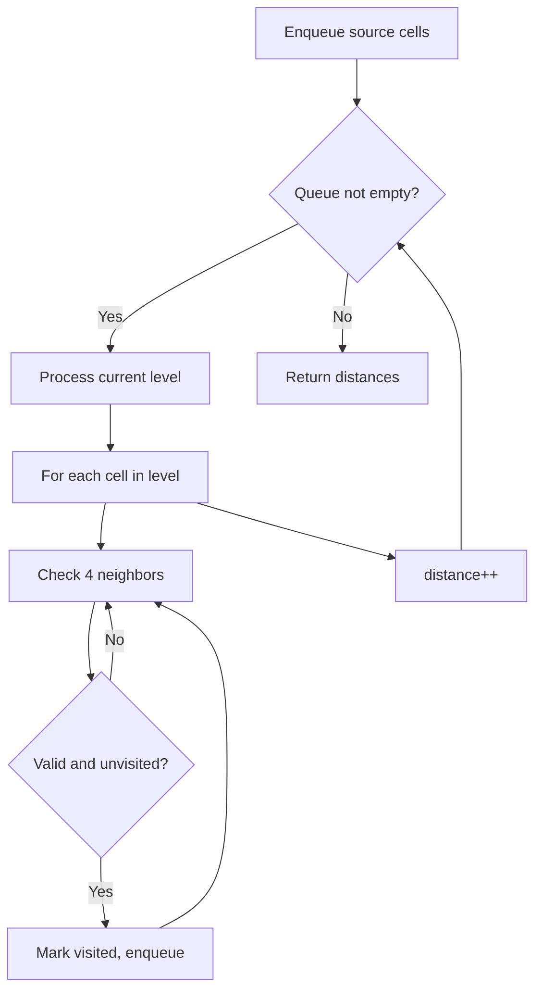
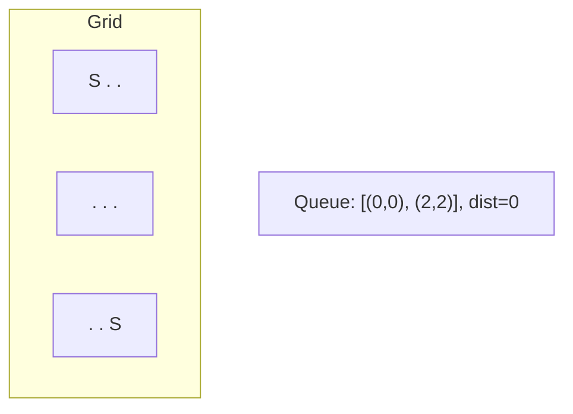
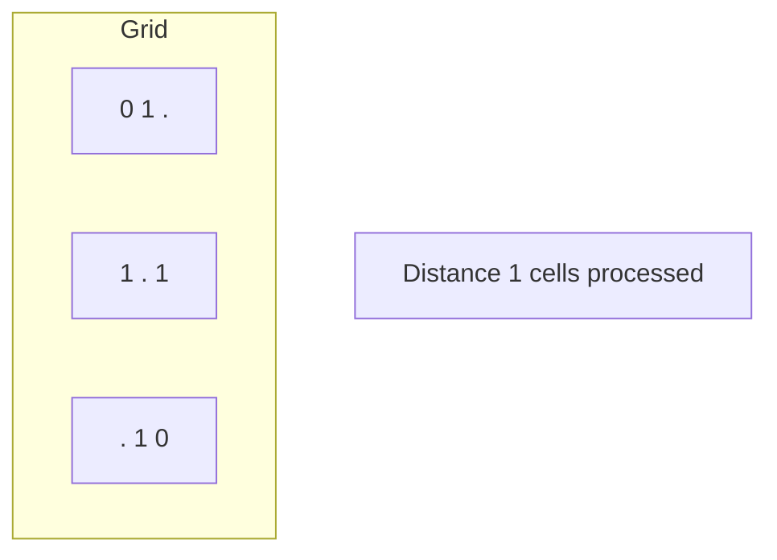
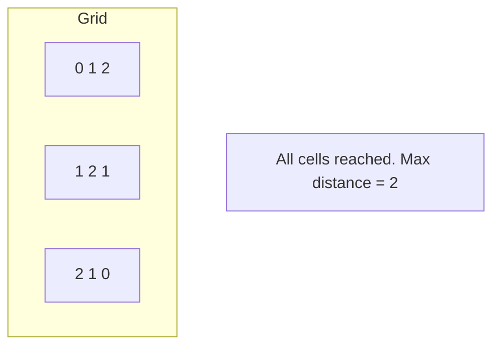

# Problem 1765: Map of Highest Peak

**Difficulty:** Medium  
**Tags:** Array, Breadth-First Search, Matrix  
**Pattern:** BFS on Matrix / Grid  
**Link:** [leetcode.com/problems/map-of-highest-peak](https://leetcode.com/problems/map-of-highest-peak/)

## Description

You are given an integer matrix `isWater` of size `m x n` that represents a map of **land** and **water** cells.

	- If `isWater[i][j] == 0`, cell `(i, j)` is a **land** cell.
	- If `isWater[i][j] == 1`, cell `(i, j)` is a **water** cell.

You must assign each cell a height in a way that follows these rules:

	- The height of each cell must be non-negative.
	- If the cell is a **water** cell, its height must be `0`.
	- Any two adjacent cells must have an absolute height difference of **at most** `1`. A cell is adjacent to another cell if the former is directly north, east, south, or west of the latter (i.e., their sides are touching).

Find an assignment of heights such that the maximum height in the matrix is **maximized**.

Return *an integer matrix *`height`* of size *`m x n`* where *`height[i][j]`* is cell *`(i, j)`*'s height. If there are multiple solutions, return **any** of them*.

 

Example 1:

****

```

**Input:** isWater = [[0,1],[0,0]]
**Output:** [[1,0],[2,1]]
**Explanation:** The image shows the assigned heights of each cell.
The blue cell is the water cell, and the green cells are the land cells.

```

Example 2:

****

```

**Input:** isWater = [[0,0,1],[1,0,0],[0,0,0]]
**Output:** [[1,1,0],[0,1,1],[1,2,2]]
**Explanation:** A height of 2 is the maximum possible height of any assignment.
Any height assignment that has a maximum height of 2 while still meeting the rules will also be accepted.

```

 

**Constraints:**

	- `m == isWater.length`
	- `n == isWater[i].length`
	- `1 <= m, n <= 1000`
	- `isWater[i][j]` is `0` or `1`.
	- There is at least **one** water cell.

 

**Note:** This question is the same as 542: https://leetcode.com/problems/01-matrix/

## Approach: BFS on Matrix / Grid

Breadth-first search on the grid. Enqueue all starting cells, then expand level by level. BFS on grids finds shortest distance from source(s).

## Pseudocode

```
1. Enqueue all source cells, mark visited
2. distance = 0
3. While queue not empty:
   a. Process all cells at current distance
   b. For each cell, enqueue unvisited neighbors
   c. distance++
4. Return result
```

## Algorithm Flow



## Visual State Transitions

**Multi-source BFS on Grid:**

**Frame 1: Enqueue all sources**


**Frame 2: Expand distance 1**


**Frame 3: Expand distance 2**



## Complexity Analysis

- **Time:** O(m * n)
- **Space:** O(m * n)

## Solution (Python3)

```python
class Solution:
    def highestPeak(self, isWater: List[List[int]]) -> List[List[int]]:
        # BFS on grid - O(m*n) time
        from collections import deque
        if not isWater:
            return []
        rows, cols = len(isWater), len(isWater[0])
        queue = deque()
        visited = set()
        # Initialize BFS sources
        for r in range(rows):
            for c in range(cols):
                if isWater[r][c] == 1 or isWater[r][c] == '1':
                    queue.append((r, c, 0))
                    visited.add((r, c))
        steps = 0
        while queue:
            r, c, d = queue.popleft()
            steps = max(steps, d)
            for dr, dc in [(1,0),(-1,0),(0,1),(0,-1)]:
                nr, nc = r+dr, c+dc
                if 0 <= nr < rows and 0 <= nc < cols and (nr,nc) not in visited:
                    visited.add((nr, nc))
                    queue.append((nr, nc, d+1))
        return steps
```

## Solution (C++)

```cpp
#include <algorithm>
#include <queue>
#include <string>
#include <tuple>
#include <vector>
using namespace std;

class Solution {
public:
    vector<vector<int>> highestPeak(vector<vector<int>>& isWater) {
        // BFS on grid - O(m*n) time
        if (isWater.empty()) return {};
        int rows = isWater.size(), cols = isWater[0].size();
        queue<tuple<int,int,int>> q;
        vector<vector<bool>> visited(rows, vector<bool>(cols, false));
        int dirs[4][2] = {{1,0},{-1,0},{0,1},{0,-1}};
        for (int r = 0; r < rows; r++)
            for (int c = 0; c < cols; c++)
                if (isWater[r][c] == 1) {
                    q.push({r, c, 0});
                    visited[r][c] = true;
                }
        int steps = 0;
        while (!q.empty()) {
            auto [r, c, d] = q.front(); q.pop();
            steps = max(steps, d);
            for (auto& dir : dirs) {
                int nr = r+dir[0], nc = c+dir[1];
                if (nr>=0 && nr<rows && nc>=0 && nc<cols && !visited[nr][nc]) {
                    visited[nr][nc] = true;
                    q.push({nr, nc, d+1});
                }
            }
        }
        return steps;
    }
};
```
