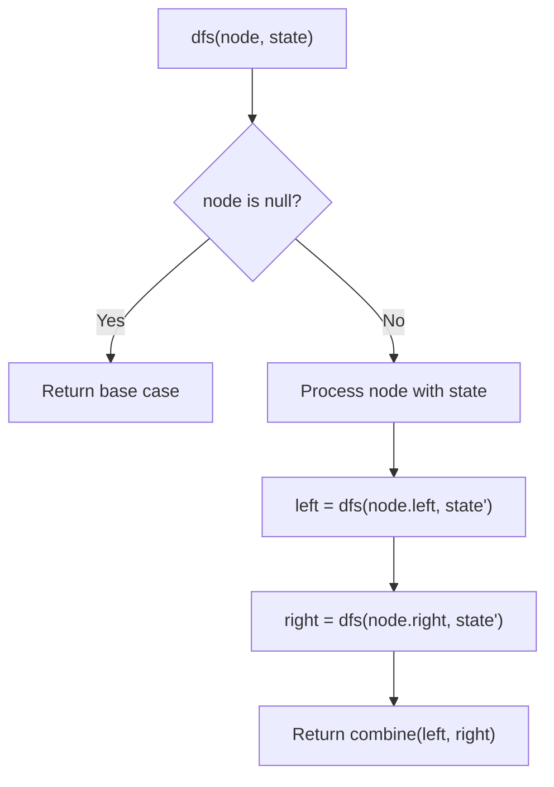
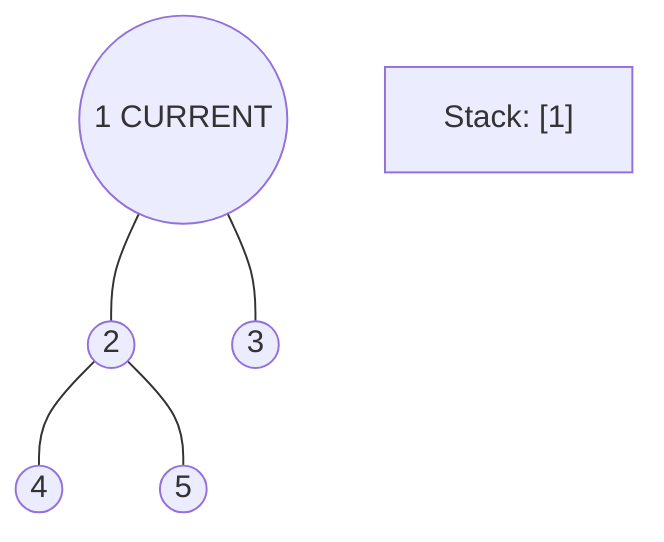
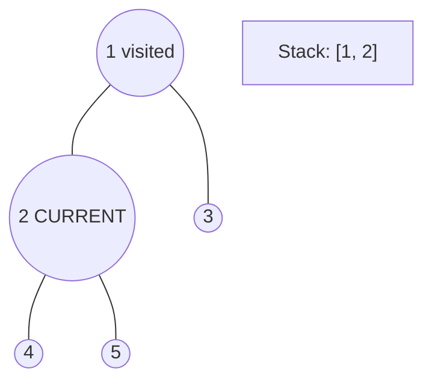
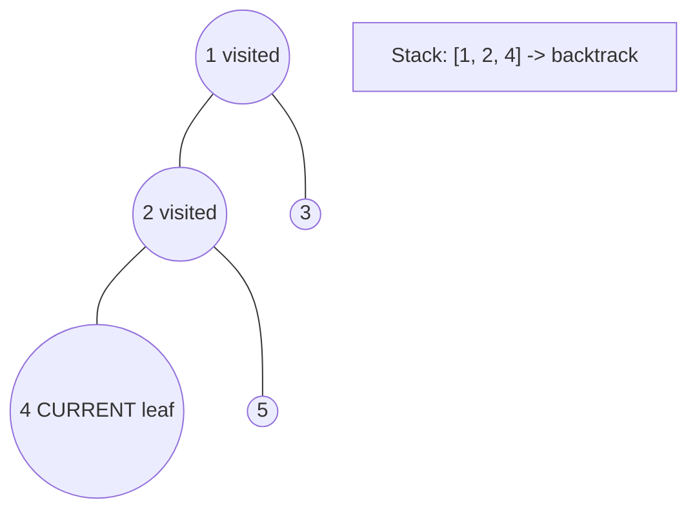
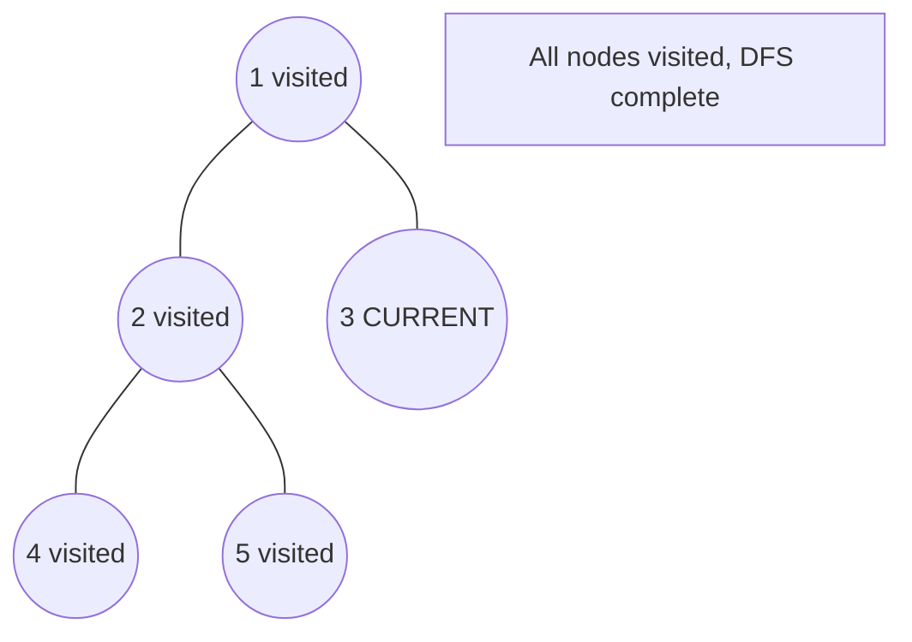

# Problem 1766: Tree of Coprimes

**Difficulty:** Hard  
**Tags:** Array, Math, Tree, Depth-First Search, Number Theory  
**Pattern:** DFS Tree Traversal  
**Link:** [leetcode.com/problems/tree-of-coprimes](https://leetcode.com/problems/tree-of-coprimes/)

## Description

There is a tree (i.e., a connected, undirected graph that has no cycles) consisting of `n` nodes numbered from `0` to `n - 1` and exactly `n - 1` edges. Each node has a value associated with it, and the **root** of the tree is node `0`.

To represent this tree, you are given an integer array `nums` and a 2D array `edges`. Each `nums[i]` represents the `i^th` node's value, and each `edges[j] = [uj, vj]` represents an edge between nodes `uj` and `vj` in the tree.

Two values `x` and `y` are **coprime** if `gcd(x, y) == 1` where `gcd(x, y)` is the **greatest common divisor** of `x` and `y`.

An ancestor of a node `i` is any other node on the shortest path from node `i` to the **root**. A node is **not **considered an ancestor of itself.

Return *an array *`ans`* of size *`n`, *where *`ans[i]`* is the closest ancestor to node *`i`* such that *`nums[i]` *and *`nums[ans[i]]` are **coprime**, or `-1`* if there is no such ancestor*.

 

Example 1:

****

```

**Input:** nums = [2,3,3,2], edges = [[0,1],[1,2],[1,3]]
**Output:** [-1,0,0,1]
**Explanation:** In the above figure, each node's value is in parentheses.
- Node 0 has no coprime ancestors.
- Node 1 has only one ancestor, node 0. Their values are coprime (gcd(2,3) == 1).
- Node 2 has two ancestors, nodes 1 and 0. Node 1's value is not coprime (gcd(3,3) == 3), but node 0's
  value is (gcd(2,3) == 1), so node 0 is the closest valid ancestor.
- Node 3 has two ancestors, nodes 1 and 0. It is coprime with node 1 (gcd(3,2) == 1), so node 1 is its
  closest valid ancestor.

```

Example 2:

```

**Input:** nums = [5,6,10,2,3,6,15], edges = [[0,1],[0,2],[1,3],[1,4],[2,5],[2,6]]
**Output:** [-1,0,-1,0,0,0,-1]

```

 

**Constraints:**

	- `nums.length == n`
	- `1 <= nums[i] <= 50`
	- `1 <= n <= 10^5`
	- `edges.length == n - 1`
	- `edges[j].length == 2`
	- `0 <= uj, vj < n`
	- `uj != vj`

## Approach: DFS Tree Traversal

Perform depth-first search on the tree. Recurse on left and right subtrees, combining results bottom-up. Track state (path, depth, sum) during traversal.

## Pseudocode

```
1. Define dfs(node, state):
   a. Base case: if null, return default
   b. Process node with current state
   c. left_result = dfs(node.left, updated_state)
   d. right_result = dfs(node.right, updated_state)
   e. Return combine(left_result, right_result)
2. Return dfs(root, initial_state)
```

## Algorithm Flow



## Visual State Transitions

**DFS Tree Traversal Step-by-Step:**

**Frame 1: Start at root**


**Frame 2: Go left - visit node 2**


**Frame 3: Go left - visit node 4 (leaf)**


**Frame 4: Backtrack, visit node 5, then node 3**



## Complexity Analysis

- **Time:** O(n)
- **Space:** O(h)

## Solution (Python3)

```python
class Solution:
    def getCoprimes(self, nums: List[int], edges: List[List[int]]) -> List[int]:
        # DFS on binary tree - O(n) time, O(h) space
        def dfs(node):
            if not node:
                return 0
            left = dfs(node.left)
            right = dfs(node.right)
            return 1 + max(left, right)
        
        result = dfs(nums)
        return result
```

## Solution (C++)

```cpp
#include <algorithm>
#include <functional>
#include <string>
#include <vector>
using namespace std;

class Solution {
public:
    vector<int> getCoprimes(vector<int>& nums, vector<vector<int>>& edges) {
        // DFS on binary tree - O(n) time, O(h) space
        function<int(TreeNode*)> dfs = [&](TreeNode* node) -> int {
            if (!node) return 0;
            int left = dfs(node->left);
            int right = dfs(node->right);
            return 1 + max(left, right);
        };
        return dfs(nums);
    }
};
```
