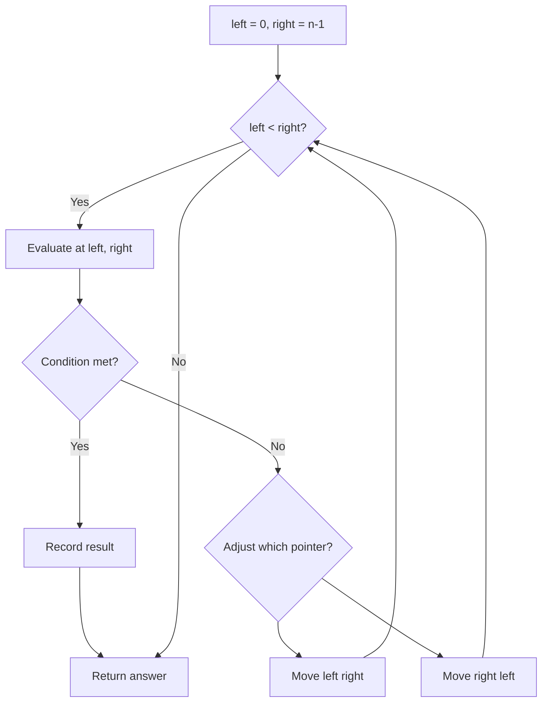
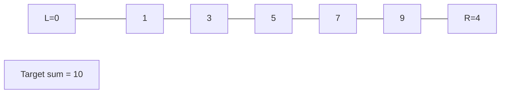
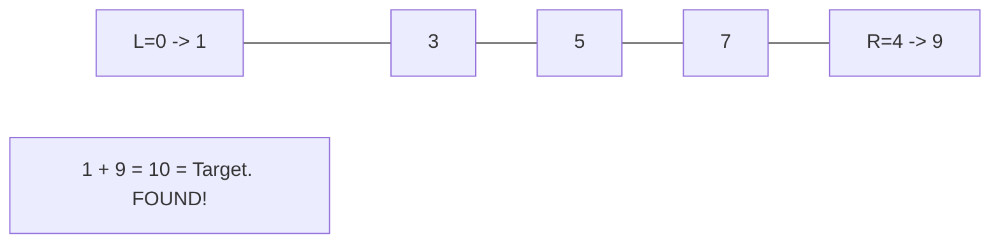

# Problem 1768: Merge Strings Alternately

**Difficulty:** Easy  
**Tags:** Two Pointers, String  
**Pattern:** Two Pointers / String  
**Link:** [leetcode.com/problems/merge-strings-alternately](https://leetcode.com/problems/merge-strings-alternately/)

## Description

You are given two strings `word1` and `word2`. Merge the strings by adding letters in alternating order, starting with `word1`. If a string is longer than the other, append the additional letters onto the end of the merged string.


Return *the merged string.*


 

Example 1:


```

**Input:** word1 = "abc", word2 = "pqr"
**Output:** "apbqcr"
**Explanation:** The merged string will be merged as so:
word1:  a   b   c
word2:    p   q   r
merged: a p b q c r

```


Example 2:


```

**Input:** word1 = "ab", word2 = "pqrs"
**Output:** "apbqrs"
**Explanation:** Notice that as word2 is longer, "rs" is appended to the end.
word1:  a   b 
word2:    p   q   r   s
merged: a p b q   r   s

```


Example 3:


```

**Input:** word1 = "abcd", word2 = "pq"
**Output:** "apbqcd"
**Explanation:** Notice that as word1 is longer, "cd" is appended to the end.
word1:  a   b   c   d
word2:    p   q 
merged: a p b q c   d

```


 

**Constraints:**


	- `1 <= word1.length, word2.length <= 100`
	- `word1` and `word2` consist of lowercase English letters.

## Approach: Two Pointers / String

Alternate characters from both strings using a single index.

## Pseudocode

```
1. Initialize left = 0, right = n-1 (or two independent pointers)
2. While pointers haven't crossed:
   a. Evaluate condition at pointer positions
   b. Move left pointer right or right pointer left
3. Return result
```

## Algorithm Flow



## Visual State Transitions

**Two Pointer Convergence:**

**Frame 1: Initialize pointers**


**Frame 2: Sum = 1+9 = 10, found!**



## Complexity Analysis

- **Time:** O(n+m)
- **Space:** O(n+m)

## Solution (Python3)

```python
class Solution:
    def mergeAlternately(self, word1: str, word2: str) -> str:
        result = []
        i = 0
        while i < len(word1) or i < len(word2):
            if i < len(word1):
                result.append(word1[i])
            if i < len(word2):
                result.append(word2[i])
            i += 1
        return ''.join(result)
```

## Solution (C++)

```cpp
#include <string>
#include <vector>
using namespace std;

class Solution {
public:
    string mergeAlternately(string& word1, string& word2) {
        // Two pointer approach - O(n) time, O(1) space
        int left = 0, right = word1.size() - 1;
        while (left < right) {
            int curr = word1[left] + word1[right];
            if (curr == word2) {
                return {left, right};
            } else if (curr < word2) {
                left++;
            } else {
                right--;
            }
        }
        return "";
    }
};
```
