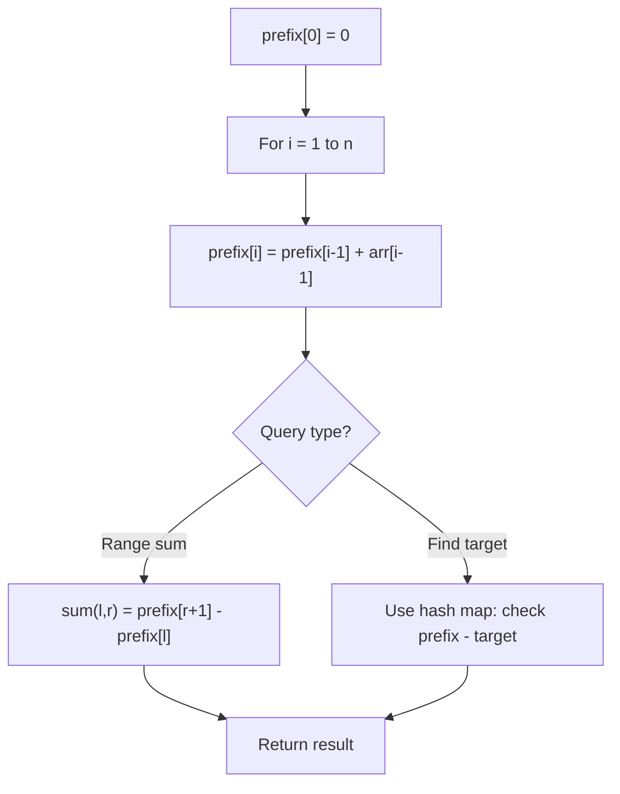

# Problem 1769: Minimum Number of Operations to Move All Balls to Each Box

**Difficulty:** Medium  
**Tags:** Array, String, Prefix Sum  
**Pattern:** Prefix Sum  
**Link:** [leetcode.com/problems/minimum-number-of-operations-to-move-all-balls-to-each-box](https://leetcode.com/problems/minimum-number-of-operations-to-move-all-balls-to-each-box/)

## Description

You have `n` boxes. You are given a binary string `boxes` of length `n`, where `boxes[i]` is `'0'` if the `i^th` box is **empty**, and `'1'` if it contains **one** ball.

In one operation, you can move **one** ball from a box to an adjacent box. Box `i` is adjacent to box `j` if `abs(i - j) == 1`. Note that after doing so, there may be more than one ball in some boxes.

Return an array `answer` of size `n`, where `answer[i]` is the **minimum** number of operations needed to move all the balls to the `i^th` box.

Each `answer[i]` is calculated considering the **initial** state of the boxes.

 

Example 1:

```

**Input:** boxes = "110"
**Output:** [1,1,3]
**Explanation:** The answer for each box is as follows:
1) First box: you will have to move one ball from the second box to the first box in one operation.
2) Second box: you will have to move one ball from the first box to the second box in one operation.
3) Third box: you will have to move one ball from the first box to the third box in two operations, and move one ball from the second box to the third box in one operation.

```

Example 2:

```

**Input:** boxes = "001011"
**Output:** [11,8,5,4,3,4]
```

 

**Constraints:**

	- `n == boxes.length`
	- `1 <= n <= 2000`
	- `boxes[i]` is either `'0'` or `'1'`.

## Approach: Prefix Sum

Build a prefix sum array where prefix[i] = sum of elements 0..i-1. Any subarray sum [l..r] = prefix[r+1] - prefix[l]. Combine with hash map for O(n) subarray sum queries.

## Pseudocode

```
1. Build prefix sum array: prefix[0]=0, prefix[i]=prefix[i-1]+arr[i-1]
2. Use prefix sums to answer queries:
   - Subarray sum [l..r] = prefix[r+1] - prefix[l]
   - Or use hash map to find prefix[j]-prefix[i] == target
3. Return result
```

## Algorithm Flow



## Complexity Analysis

- **Time:** O(n)
- **Space:** O(n)

## Solution (Python3)

```python
class Solution:
    def minOperations(self, boxes: str) -> List[int]:
        # Prefix sum approach - O(n) time, O(n) space
        prefix = {0: -1}
        curr_sum = 0
        result = 0
        target = boxes if isinstance(boxes, int) else 0
        for i, val in enumerate(boxes):
            curr_sum += val
            if curr_sum - target in prefix:
                result = max(result, i - prefix[curr_sum - target])
            if curr_sum not in prefix:
                prefix[curr_sum] = i
        return result
```

## Solution (C++)

```cpp
#include <algorithm>
#include <string>
#include <unordered_map>
#include <vector>
using namespace std;

class Solution {
public:
    vector<int> minOperations(string& boxes) {
        // Prefix sum approach - O(n) time, O(n) space
        unordered_map<int, int> prefix;
        prefix[0] = -1;
        int curr_sum = 0, result = 0;
        int target = boxes;
        for (int i = 0; i < (int)boxes.size(); i++) {
            curr_sum += boxes[i];
            if (prefix.count(curr_sum - target)) {
                result = max(result, i - prefix[curr_sum - target]);
            }
            if (!prefix.count(curr_sum)) {
                prefix[curr_sum] = i;
            }
        }
        return result;
    }
};
```
