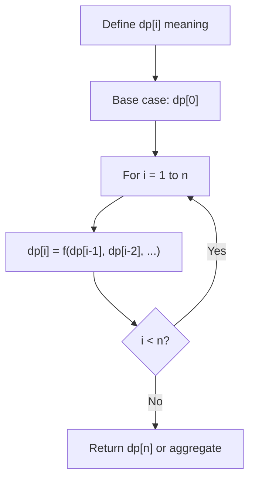
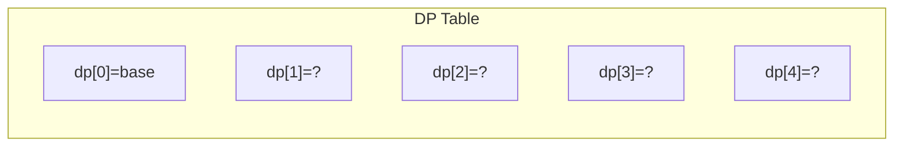
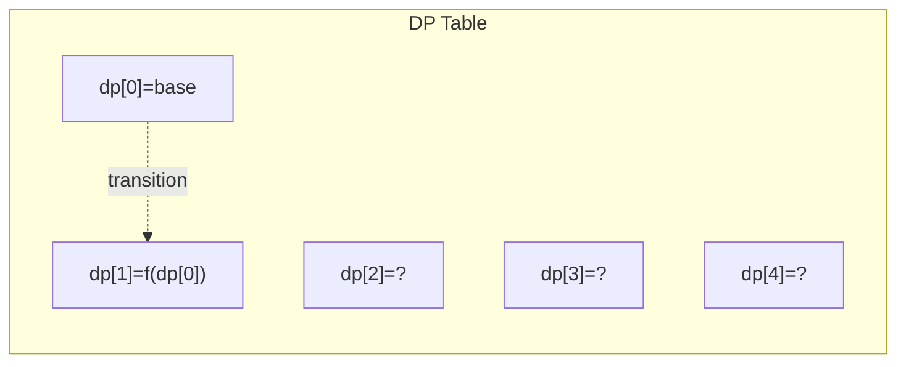
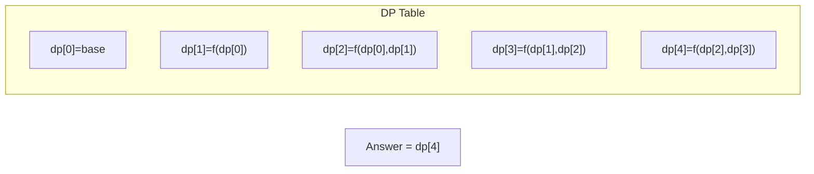

# Problem 1770: Maximum Score from Performing Multiplication Operations

**Difficulty:** Hard  
**Tags:** Array, Dynamic Programming  
**Pattern:** Dynamic Programming (1D)  
**Link:** [leetcode.com/problems/maximum-score-from-performing-multiplication-operations](https://leetcode.com/problems/maximum-score-from-performing-multiplication-operations/)

## Description

You are given two **0-indexed** integer arrays `nums` and `multipliers`** **of size `n` and `m` respectively, where `n >= m`.

You begin with a score of `0`. You want to perform **exactly** `m` operations. On the `i^th` operation (**0-indexed**) you will:

    - Choose one integer `x` from **either the start or the end **of the array `nums`.
    - Add `multipliers[i] * x` to your score.
    
        Note that `multipliers[0]` corresponds to the first operation, `multipliers[1]` to the second operation, and so on.
    
    
    - Remove `x` from `nums`.

Return *the **maximum** score after performing *`m` *operations.*

 

Example 1:

```

**Input:** nums = [1,2,3], multipliers = [3,2,1]
**Output:** 14
**Explanation:** An optimal solution is as follows:
- Choose from the end, [1,2,**3**], adding 3 * 3 = 9 to the score.
- Choose from the end, [1,**2**], adding 2 * 2 = 4 to the score.
- Choose from the end, [**1**], adding 1 * 1 = 1 to the score.
The total score is 9 + 4 + 1 = 14.
```

Example 2:

```

**Input:** nums = [-5,-3,-3,-2,7,1], multipliers = [-10,-5,3,4,6]
**Output:** 102
**Explanation: **An optimal solution is as follows:
- Choose from the start, [**-5**,-3,-3,-2,7,1], adding -5 * -10 = 50 to the score.
- Choose from the start, [**-3**,-3,-2,7,1], adding -3 * -5 = 15 to the score.
- Choose from the start, [**-3**,-2,7,1], adding -3 * 3 = -9 to the score.
- Choose from the end, [-2,7,**1**], adding 1 * 4 = 4 to the score.
- Choose from the end, [-2,**7**], adding 7 * 6 = 42 to the score. 
The total score is 50 + 15 - 9 + 4 + 42 = 102.

```

 

**Constraints:**

	- `n == nums.length`
	- `m == multipliers.length`
	- `1 <= m <= 300`
	- `m <= n <= 10^5`` `
	- `-1000 <= nums[i], multipliers[i] <= 1000`

## Approach: Dynamic Programming (1D)

Break the problem into overlapping subproblems. Define dp[i] as the optimal value for the subproblem ending at or considering index i. Build the solution bottom-up, using previously computed dp values.

## Pseudocode

```
1. Define dp[i] = optimal value for subproblem i
2. Base case: dp[0] = initial value
3. For i from 1 to n:
   a. dp[i] = recurrence(dp[i-1], dp[i-2], ...)
4. Return dp[n] or max/min of dp
```

## Algorithm Flow



## Visual State Transitions

**1D Dynamic Programming Table Build:**

**Frame 1: Initialize base cases**


**Frame 2: Fill dp[1] from dp[0]**


**Frame 3: Fill remaining cells**



## Complexity Analysis

- **Time:** O(n)
- **Space:** O(n)

## Solution (Python3)

```python
class Solution:
    def maximumScore(self, nums: List[int], multipliers: List[int]) -> int:
        # Dynamic programming (1D) - O(n) time, O(n) space
        if not nums:
            return 0
        n = len(nums) if isinstance(nums, list) else nums
        dp = [0] * (n + 1)
        dp[0] = 1  # base case
        for i in range(1, n + 1):
            dp[i] = dp[i-1]  # transition (customize per problem)
            if i >= 2:
                dp[i] += dp[i-2]
        return dp[n]
```

## Solution (C++)

```cpp
#include <string>
#include <vector>
using namespace std;

class Solution {
public:
    int maximumScore(vector<int>& nums, vector<int>& multipliers) {
        // Dynamic programming (1D) - O(n) time, O(n) space
        int n = nums;
        if (n <= 0) return 0;
        vector<int> dp(n + 1, 0);
        dp[0] = 1;
        for (int i = 1; i <= n; i++) {
            dp[i] = dp[i-1];
            if (i >= 2) dp[i] += dp[i-2];
        }
        return dp[n];
    }
};
```
