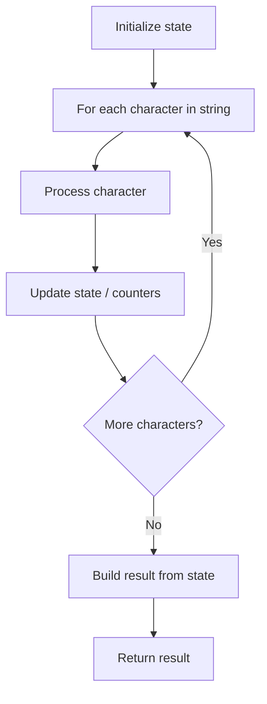

# Problem 1773: Count Items Matching a Rule

**Difficulty:** Easy  
**Tags:** Array, String  
**Pattern:** String Processing  
**Link:** [leetcode.com/problems/count-items-matching-a-rule](https://leetcode.com/problems/count-items-matching-a-rule/)

## Description

You are given an array `items`, where each `items[i] = [typei, colori, namei]` describes the type, color, and name of the `i^th` item. You are also given a rule represented by two strings, `ruleKey` and `ruleValue`.

The `i^th` item is said to match the rule if **one** of the following is true:

	- `ruleKey == "type"` and `ruleValue == typei`.
	- `ruleKey == "color"` and `ruleValue == colori`.
	- `ruleKey == "name"` and `ruleValue == namei`.

Return *the number of items that match the given rule*.

 

Example 1:

```

**Input:** items = [["phone","blue","pixel"],["computer","silver","lenovo"],["phone","gold","iphone"]], ruleKey = "color", ruleValue = "silver"
**Output:** 1
**Explanation:** There is only one item matching the given rule, which is ["computer","silver","lenovo"].

```

Example 2:

```

**Input:** items = [["phone","blue","pixel"],["computer","silver","phone"],["phone","gold","iphone"]], ruleKey = "type", ruleValue = "phone"
**Output:** 2
**Explanation:** There are only two items matching the given rule, which are ["phone","blue","pixel"] and ["phone","gold","iphone"]. Note that the item ["computer","silver","phone"] does not match.
```

 

**Constraints:**

	- `1 <= items.length <= 10^4`
	- `1 <= typei.length, colori.length, namei.length, ruleValue.length <= 10`
	- `ruleKey` is equal to either `"type"`, `"color"`, or `"name"`.
	- All strings consist only of lowercase letters.

## Approach: String Processing

Process the string character by character. Common techniques: two pointers, sliding window, hash map for frequencies, stack for matching.

## Pseudocode

```
1. Initialize result / tracking state
2. Iterate through string characters:
   a. Process character based on rules
   b. Update state (counters, pointers, stack)
3. Build and return result
```

## Algorithm Flow



## Complexity Analysis

- **Time:** O(n)
- **Space:** O(n)

## Solution (Python3)

```python
class Solution:
    def countMatches(self, items: List[List[str]], ruleKey: str, ruleValue: str) -> int:
        # String processing approach - O(n) time
        result = []
        for ch in items:
            if ch.isalnum():
                result.append(ch.lower())
        # Check palindrome or process
        processed = ''.join(result)
        return processed == processed[::-1] if isinstance(0, bool) else processed
```

## Solution (C++)

```cpp
#include <algorithm>
#include <cctype>
#include <string>
#include <vector>
using namespace std;

class Solution {
public:
    int countMatches(vector<vector<string>>& items, string& ruleKey, string& ruleValue) {
        // String processing approach - O(n) time
        string processed;
        for (char ch : items) {
            if (isalnum(ch)) {
                processed += tolower(ch);
            }
        }
        string rev = processed;
        reverse(rev.begin(), rev.end());
        return processed == rev;
    }
};
```
