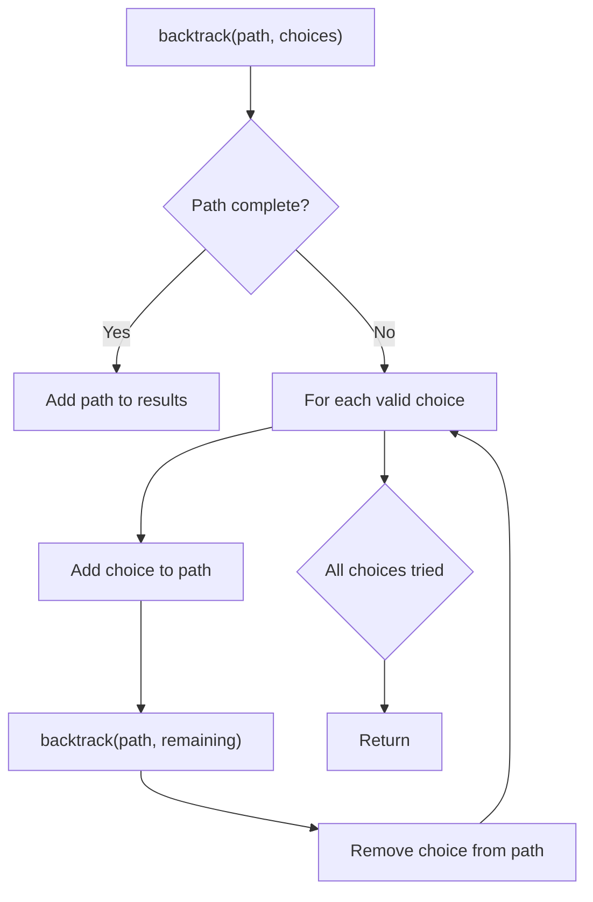
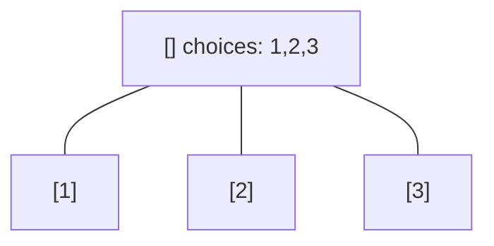
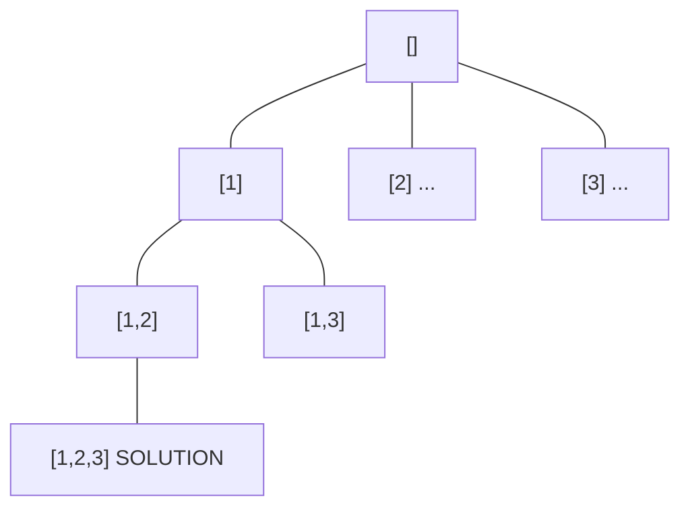
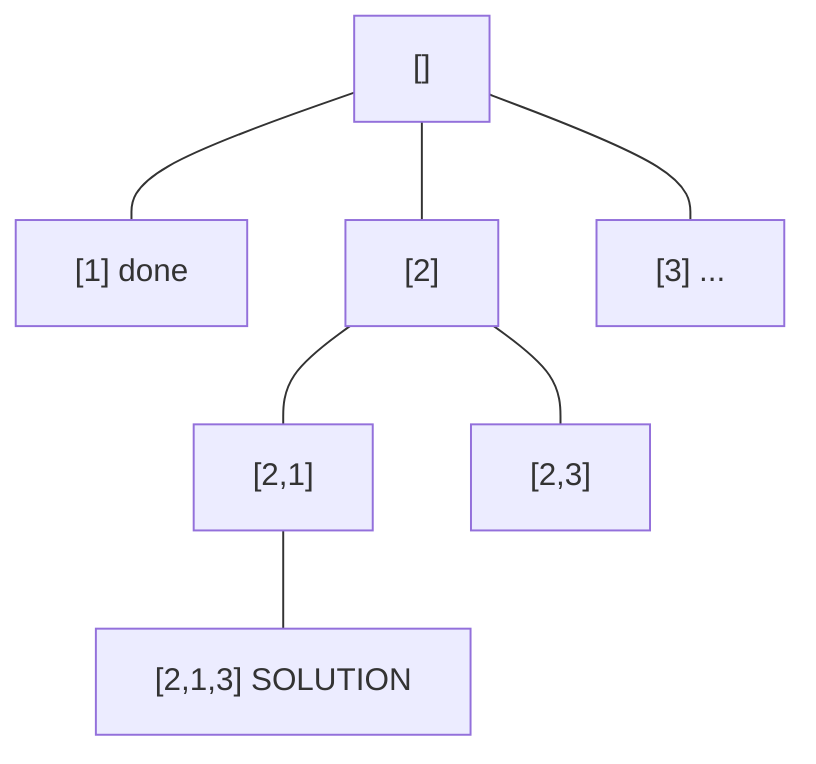
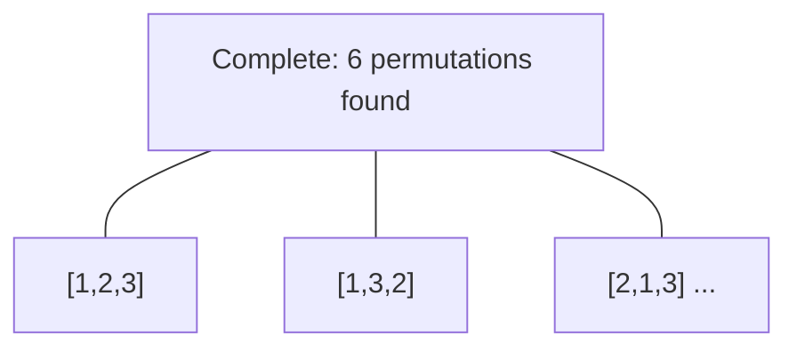

# Problem 1774: Closest Dessert Cost

**Difficulty:** Medium  
**Tags:** Array, Dynamic Programming, Backtracking  
**Pattern:** Backtracking  
**Link:** [leetcode.com/problems/closest-dessert-cost](https://leetcode.com/problems/closest-dessert-cost/)

## Description

You would like to make dessert and are preparing to buy the ingredients. You have `n` ice cream base flavors and `m` types of toppings to choose from. You must follow these rules when making your dessert:

	- There must be **exactly one** ice cream base.
	- You can add **one or more** types of topping or have no toppings at all.
	- There are **at most two** of **each type** of topping.

You are given three inputs:

	- `baseCosts`, an integer array of length `n`, where each `baseCosts[i]` represents the price of the `i^th` ice cream base flavor.
	- `toppingCosts`, an integer array of length `m`, where each `toppingCosts[i]` is the price of **one** of the `i^th` topping.
	- `target`, an integer representing your target price for dessert.

You want to make a dessert with a total cost as close to `target` as possible.

Return *the closest possible cost of the dessert to *`target`. If there are multiple, return *the **lower** one.*

 

Example 1:

```

**Input:** baseCosts = [1,7], toppingCosts = [3,4], target = 10
**Output:** 10
**Explanation:** Consider the following combination (all 0-indexed):
- Choose base 1: cost 7
- Take 1 of topping 0: cost 1 x 3 = 3
- Take 0 of topping 1: cost 0 x 4 = 0
Total: 7 + 3 + 0 = 10.

```

Example 2:

```

**Input:** baseCosts = [2,3], toppingCosts = [4,5,100], target = 18
**Output:** 17
**Explanation:** Consider the following combination (all 0-indexed):
- Choose base 1: cost 3
- Take 1 of topping 0: cost 1 x 4 = 4
- Take 2 of topping 1: cost 2 x 5 = 10
- Take 0 of topping 2: cost 0 x 100 = 0
Total: 3 + 4 + 10 + 0 = 17. You cannot make a dessert with a total cost of 18.

```

Example 3:

```

**Input:** baseCosts = [3,10], toppingCosts = [2,5], target = 9
**Output:** 8
**Explanation:** It is possible to make desserts with cost 8 and 10. Return 8 as it is the lower cost.

```

 

**Constraints:**

	- `n == baseCosts.length`
	- `m == toppingCosts.length`
	- `1 <= n, m <= 10`
	- `1 <= baseCosts[i], toppingCosts[i] <= 10^4`
	- `1 <= target <= 10^4`

## Approach: Backtracking

Explore all possible solutions by building candidates incrementally. At each step, make a choice and recurse. If the choice leads to a dead end, undo the choice (backtrack) and try the next option.

## Pseudocode

```
1. Define backtrack(path, choices):
   a. If path is a complete solution: add to results
   b. For each choice in choices:
      - If choice is valid:
        * Add choice to path
        * backtrack(path, remaining_choices)
        * Remove choice from path (backtrack)
2. Call backtrack([], all_choices)
```

## Algorithm Flow



## Visual State Transitions

**Backtracking Decision Tree:**

**Frame 1: Root - start with empty path**


**Frame 2: Explore branch [1]**


**Frame 3: Backtrack, explore [2]**


**Frame 4: All solutions found**



## Complexity Analysis

- **Time:** O(k^n) or O(n!)
- **Space:** O(n)

## Solution (Python3)

```python
class Solution:
    def closestCost(self, baseCosts: List[int], toppingCosts: List[int], target: int) -> int:
        # Backtracking - O(2^n) or O(n!) time
        result = []
        
        def backtrack(path, start):
            result.append(path[:])
            for i in range(start, len(baseCosts)):
                path.append(baseCosts[i])
                backtrack(path, i + 1)
                path.pop()
        
        backtrack([], 0)
        return result
```

## Solution (C++)

```cpp
#include <functional>
#include <string>
#include <vector>
using namespace std;

class Solution {
public:
    int closestCost(vector<int>& baseCosts, vector<int>& toppingCosts, int target) {
        // Backtracking - O(2^n) or O(n!) time
        vector<vector<int>> result;
        vector<int> path;
        function<void(int)> backtrack = [&](int start) {
            result.push_back(path);
            for (int i = start; i < (int)baseCosts.size(); i++) {
                path.push_back(baseCosts[i]);
                backtrack(i + 1);
                path.pop_back();
            }
        };
        backtrack(0);
        return result;
    }
};
```
