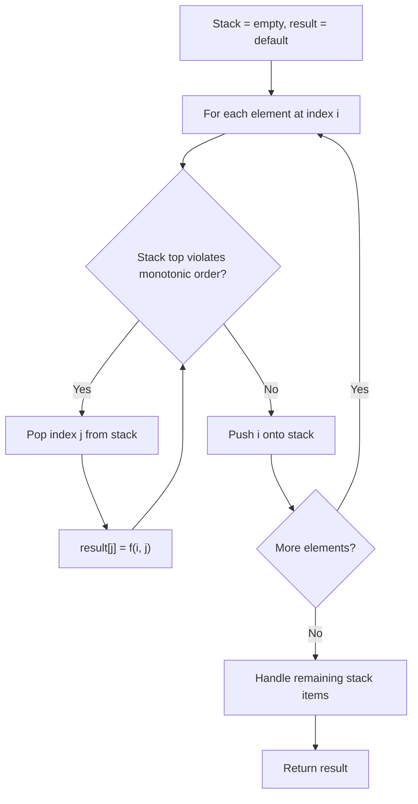
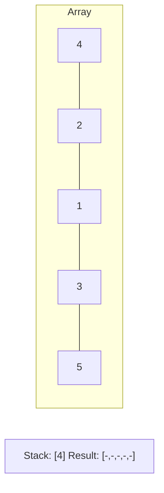
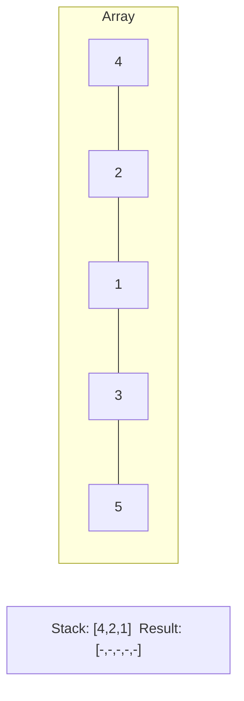
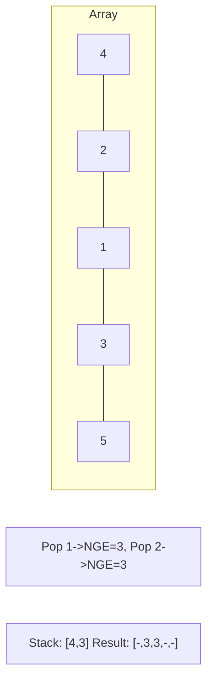
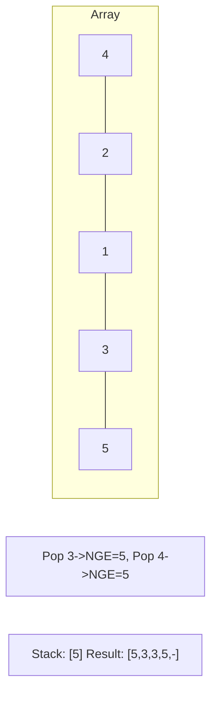

# Problem 1776: Car Fleet II

**Difficulty:** Hard  
**Tags:** Array, Math, Stack, Heap (Priority Queue), Monotonic Stack  
**Pattern:** Monotonic Stack  
**Link:** [leetcode.com/problems/car-fleet-ii](https://leetcode.com/problems/car-fleet-ii/)

## Description

There are `n` cars traveling at different speeds in the same direction along a one-lane road. You are given an array `cars` of length `n`, where `cars[i] = [positioni, speedi]` represents:

	- `positioni` is the distance between the `i^th` car and the beginning of the road in meters. It is guaranteed that `positioni < positioni+1`.
	- `speedi` is the initial speed of the `i^th` car in meters per second.

For simplicity, cars can be considered as points moving along the number line. Two cars collide when they occupy the same position. Once a car collides with another car, they unite and form a single car fleet. The cars in the formed fleet will have the same position and the same speed, which is the initial speed of the **slowest** car in the fleet.

Return an array `answer`, where `answer[i]` is the time, in seconds, at which the `i^th` car collides with the next car, or `-1` if the car does not collide with the next car. Answers within `10^-5` of the actual answers are accepted.

 

Example 1:

```

**Input:** cars = [[1,2],[2,1],[4,3],[7,2]]
**Output:** [1.00000,-1.00000,3.00000,-1.00000]
**Explanation:** After exactly one second, the first car will collide with the second car, and form a car fleet with speed 1 m/s. After exactly 3 seconds, the third car will collide with the fourth car, and form a car fleet with speed 2 m/s.

```

Example 2:

```

**Input:** cars = [[3,4],[5,4],[6,3],[9,1]]
**Output:** [2.00000,1.00000,1.50000,-1.00000]

```

 

**Constraints:**

	- `1 <= cars.length <= 10^5`
	- `1 <= positioni, speedi <= 10^6`
	- `positioni < positioni+1`

## Approach: Monotonic Stack

Maintain a stack where elements are always in monotonic order (increasing or decreasing). When a new element violates the monotonic property, pop elements and compute results (e.g., next greater/smaller element, spans, areas).

## Pseudocode

```
1. Initialize empty stack, result array
2. For each element (index i):
   a. While stack not empty and arr[i] breaks monotonic order:
      - Pop index j from stack
      - result[j] = compute(i, j)
   b. Push i onto stack
3. Handle remaining elements in stack
4. Return result
```

## Algorithm Flow



## Visual State Transitions

**Monotonic Stack (Next Greater Element):**

**Frame 1: Process first elements**


**Frame 2: Push smaller elements**


**Frame 3: Element 3 pops 1 and 2**


**Frame 4: Element 5 pops all**



## Complexity Analysis

- **Time:** O(n)
- **Space:** O(n)

## Solution (Python3)

```python
class Solution:
    def getCollisionTimes(self, cars: List[List[int]]) -> List[float]:
        # Monotonic stack - O(n) time, O(n) space
        n = len(cars)
        result = [0] * n
        stack = []  # indices
        for i in range(n):
            while stack and cars[i] > cars[stack[-1]]:
                idx = stack.pop()
                result[idx] = i - idx
            stack.append(i)
        return result
```

## Solution (C++)

```cpp
#include <stack>
#include <string>
#include <vector>
using namespace std;

class Solution {
public:
    vector<double> getCollisionTimes(vector<vector<int>>& cars) {
        // Monotonic stack - O(n) time, O(n) space
        int n = cars.size();
        vector<int> result(n, 0);
        stack<int> st;
        for (int i = 0; i < n; i++) {
            while (!st.empty() && cars[i] > cars[st.top()]) {
                int idx = st.top(); st.pop();
                result[idx] = i - idx;
            }
            st.push(i);
        }
        return result;
    }
};
```
