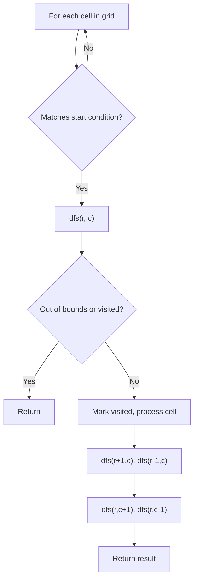
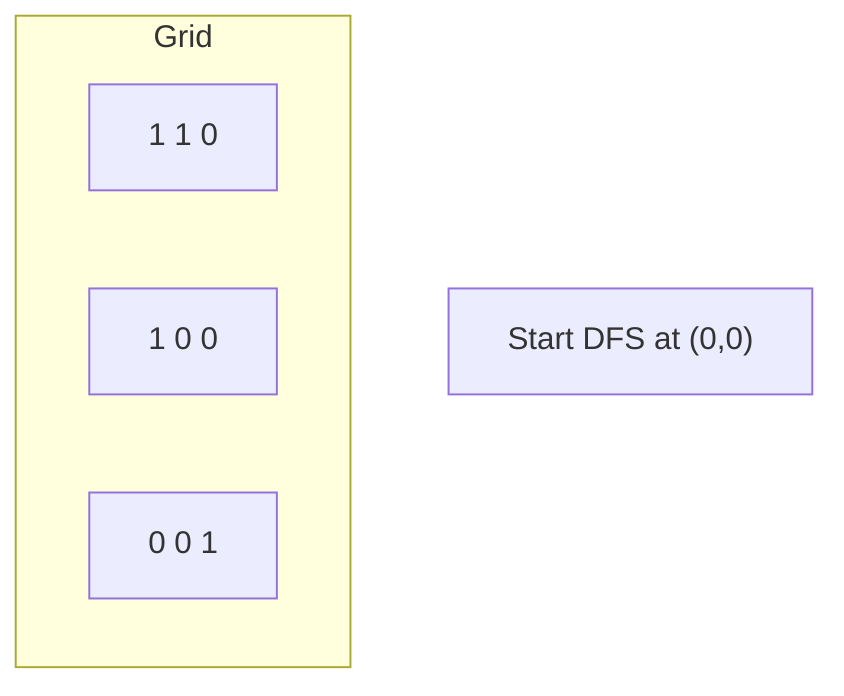
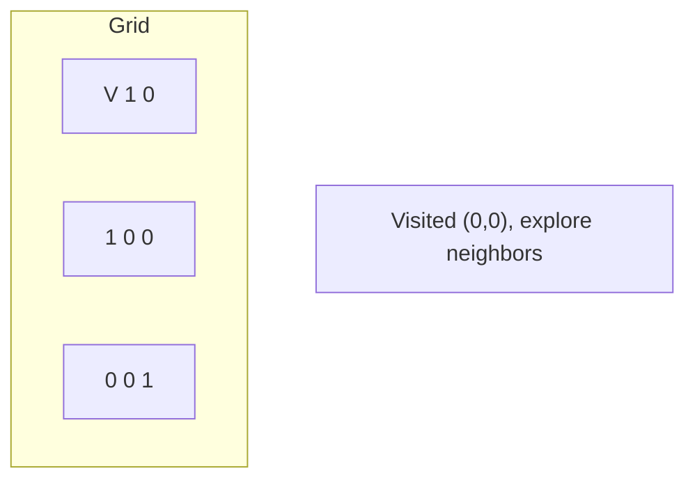
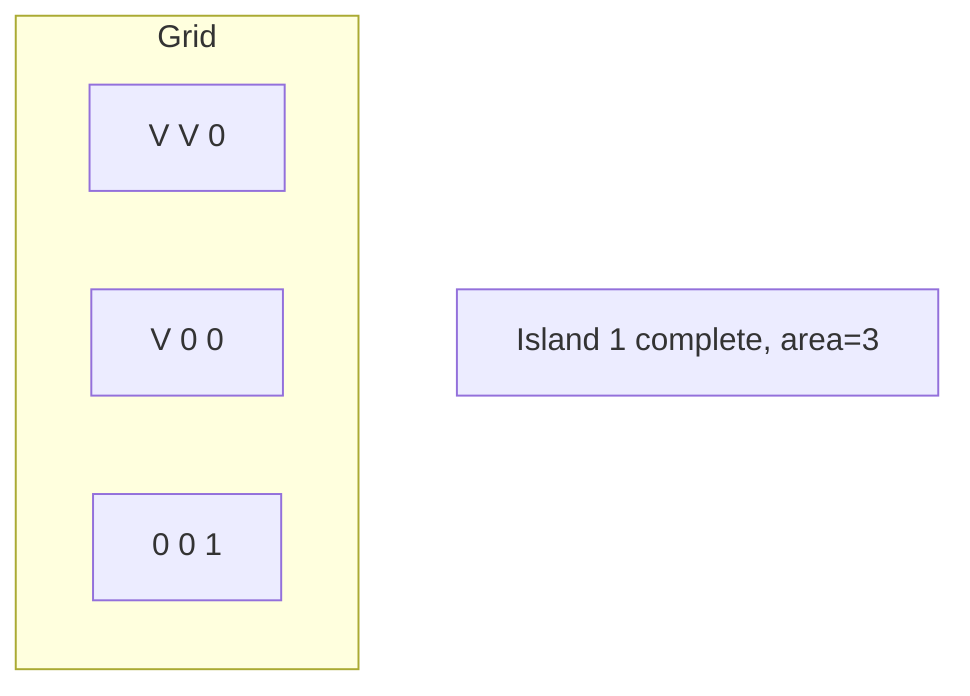
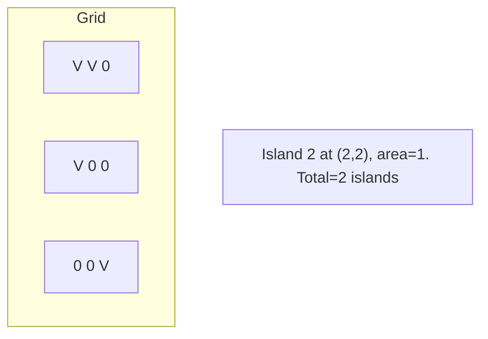

# Problem 1778: Shortest Path in a Hidden Grid

**Difficulty:** Medium  
**Tags:** Array, Depth-First Search, Breadth-First Search, Matrix, Interactive  
**Pattern:** DFS on Matrix / Grid  
**Link:** [leetcode.com/problems/shortest-path-in-a-hidden-grid](https://leetcode.com/problems/shortest-path-in-a-hidden-grid/)

## Description

*(Premium problem -- description requires LeetCode subscription)*

## Approach: DFS on Matrix / Grid

Treat the grid as a graph where each cell connects to its 4 (or 8) neighbors. DFS from target cells, marking visited to avoid revisiting.

## Pseudocode

```
1. For each cell (r, c) in grid:
   a. If cell meets start condition:
      - Call dfs(r, c)
2. dfs(r, c):
   a. If out of bounds or visited or invalid: return
   b. Mark cell visited
   c. Recurse on 4 neighbors: up, down, left, right
3. Return result
```

## Algorithm Flow



## Visual State Transitions

**DFS on Grid (Island/Flood Fill):**

**Frame 1: Find first land cell**


**Frame 2: DFS explores connected cells**


**Frame 3: Mark entire island**


**Frame 4: Find second island**



## Complexity Analysis

- **Time:** O(m * n)
- **Space:** O(m * n)

## Solution (Python3)

```python
class Solution:
    pass
```

## Solution (C++)

```cpp
class Solution {
public:
    // Design problem stub
};
```
