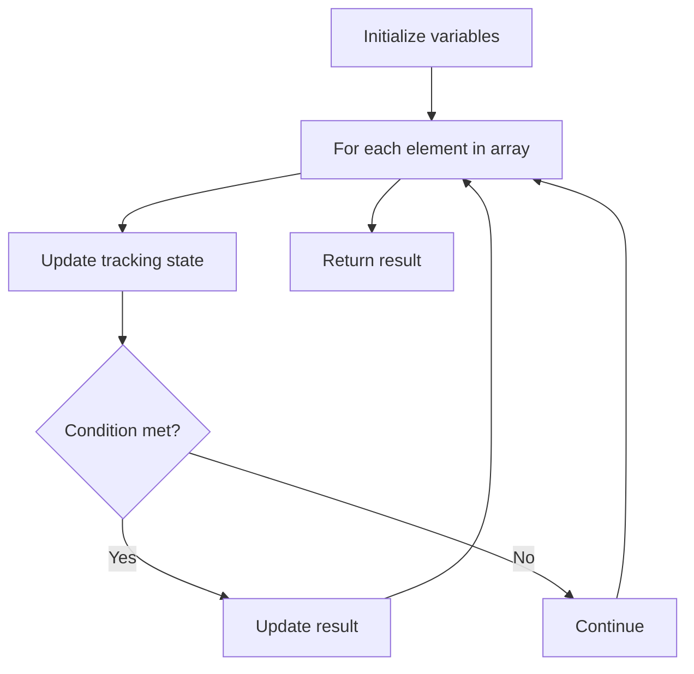

# Problem 1779: Find Nearest Point That Has the Same X or Y Coordinate

**Difficulty:** Easy  
**Tags:** Array  
**Pattern:** Array Processing  
**Link:** [leetcode.com/problems/find-nearest-point-that-has-the-same-x-or-y-coordinate](https://leetcode.com/problems/find-nearest-point-that-has-the-same-x-or-y-coordinate/)

## Description

You are given two integers, `x` and `y`, which represent your current location on a Cartesian grid: `(x, y)`. You are also given an array `points` where each `points[i] = [ai, bi]` represents that a point exists at `(ai, bi)`. A point is **valid** if it shares the same x-coordinate or the same y-coordinate as your location.

Return *the index **(0-indexed)** of the **valid** point with the smallest **Manhattan distance** from your current location*. If there are multiple, return *the valid point with the **smallest** index*. If there are no valid points, return `-1`.

The **Manhattan distance** between two points `(x1, y1)` and `(x2, y2)` is `abs(x1 - x2) + abs(y1 - y2)`.

 

Example 1:

```

**Input:** x = 3, y = 4, points = [[1,2],[3,1],[2,4],[2,3],[4,4]]
**Output:** 2
**Explanation:** Of all the points, only [3,1], [2,4] and [4,4] are valid. Of the valid points, [2,4] and [4,4] have the smallest Manhattan distance from your current location, with a distance of 1. [2,4] has the smallest index, so return 2.
```

Example 2:

```

**Input:** x = 3, y = 4, points = [[3,4]]
**Output:** 0
**Explanation:** The answer is allowed to be on the same location as your current location.
```

Example 3:

```

**Input:** x = 3, y = 4, points = [[2,3]]
**Output:** -1
**Explanation:** There are no valid points.
```

 

**Constraints:**

	- `1 <= points.length <= 10^4`
	- `points[i].length == 2`
	- `1 <= x, y, ai, bi <= 10^4`

## Approach: Array Processing

Process the array with a linear scan, tracking state variables. Look for patterns: running maximum/minimum, counting, or transformations.

## Pseudocode

```
1. Initialize tracking variables
2. Iterate through array:
   a. Update tracking state
   b. Check conditions
   c. Update result
3. Return result
```

## Algorithm Flow



## Complexity Analysis

- **Time:** O(n)
- **Space:** O(1)

## Solution (Python3)

```python
class Solution:
    def nearestValidPoint(self, x: int, y: int, points: List[List[int]]) -> int:
        # Array processing - O(n) time
        result = 0
        for i in range(len(x)):
            # Process element
            pass
        return result
```

## Solution (C++)

```cpp
#include <string>
#include <vector>
using namespace std;

class Solution {
public:
    int nearestValidPoint(int x, int y, vector<vector<int>>& points) {
        // Array processing - O(n) time
        for (int i = 0; i < (int)x.size(); i++) {
            // Process element
        }
        return 0;
    }
};
```
