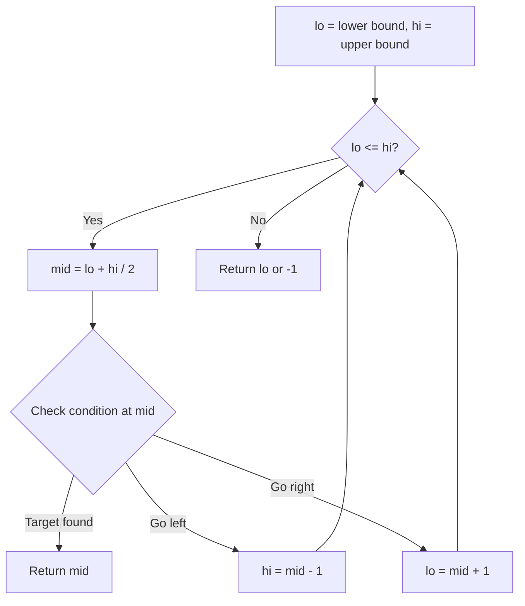
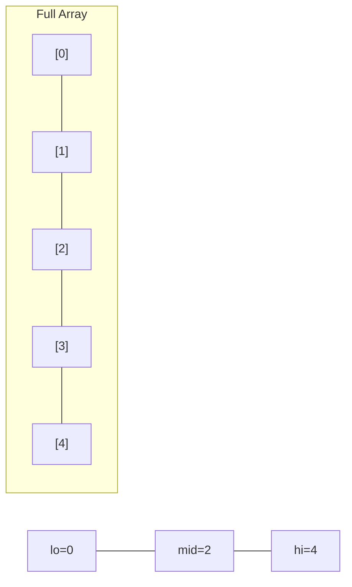
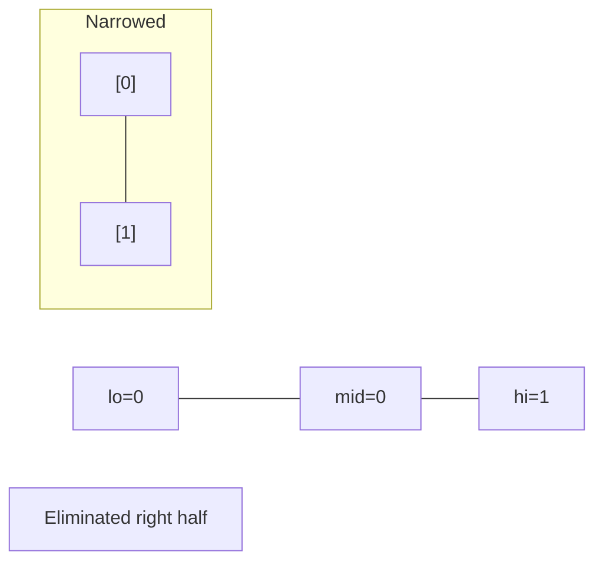
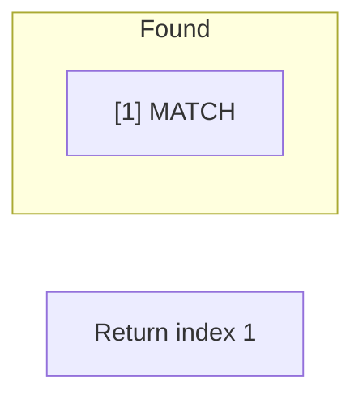

# Problem 1782: Count Pairs Of Nodes

**Difficulty:** Hard  
**Tags:** Array, Hash Table, Two Pointers, Binary Search, Graph Theory, Sorting, Counting  
**Pattern:** Binary Search  
**Link:** [leetcode.com/problems/count-pairs-of-nodes](https://leetcode.com/problems/count-pairs-of-nodes/)

## Description

You are given an undirected graph defined by an integer `n`, the number of nodes, and a 2D integer array `edges`, the edges in the graph, where `edges[i] = [ui, vi]` indicates that there is an **undirected** edge between `ui` and `vi`. You are also given an integer array `queries`.

Let `incident(a, b)` be defined as the **number of edges** that are connected to **either** node `a` or `b`.

The answer to the `j^th` query is the **number of pairs** of nodes `(a, b)` that satisfy **both** of the following conditions:

	- `a < b`
	- `incident(a, b) > queries[j]`

Return *an array *`answers`* such that *`answers.length == queries.length`* and *`answers[j]`* is the answer of the *`j^th`* query*.

Note that there can be **multiple edges** between the same two nodes.

 

Example 1:

```

**Input:** n = 4, edges = [[1,2],[2,4],[1,3],[2,3],[2,1]], queries = [2,3]
**Output:** [6,5]
**Explanation:** The calculations for incident(a, b) are shown in the table above.
The answers for each of the queries are as follows:
- answers[0] = 6. All the pairs have an incident(a, b) value greater than 2.
- answers[1] = 5. All the pairs except (3, 4) have an incident(a, b) value greater than 3.

```

Example 2:

```

**Input:** n = 5, edges = [[1,5],[1,5],[3,4],[2,5],[1,3],[5,1],[2,3],[2,5]], queries = [1,2,3,4,5]
**Output:** [10,10,9,8,6]

```

 

**Constraints:**

	- `2 <= n <= 2 * 10^4`
	- `1 <= edges.length <= 10^5`
	- `1 <= ui, vi <= n`
	- `ui != vi`
	- `1 <= queries.length <= 20`
	- `0 <= queries[j] < edges.length`

## Approach: Binary Search

Use binary search to halve the search space each iteration. Define the search range [lo, hi], compute mid, and decide which half to keep based on the problem's monotonic condition.

## Pseudocode

```
1. lo = lower_bound, hi = upper_bound
2. While lo <= hi (or lo < hi):
   a. mid = (lo + hi) // 2
   b. If condition(mid) is satisfied: record answer, search left half
   c. Else: search right half
3. Return answer
```

## Algorithm Flow



## Visual State Transitions

**Binary Search Step-by-Step:**

**Frame 1: Initial search space**


**Frame 2: Compare mid, narrow search**


**Frame 3: Found target**



## Complexity Analysis

- **Time:** O(log n)
- **Space:** O(1)

## Solution (Python3)

```python
class Solution:
    def countPairs(self, n: int, edges: List[List[int]], queries: List[int]) -> List[int]:
        # Binary search - O(log n) time, O(1) space
        lo, hi = 0, len(n) - 1
        while lo <= hi:
            mid = lo + (hi - lo) // 2
            if n[mid] == edges:
                return mid
            elif n[mid] < edges:
                lo = mid + 1
            else:
                hi = mid - 1
        return []
```

## Solution (C++)

```cpp
#include <string>
#include <vector>
using namespace std;

class Solution {
public:
    vector<int> countPairs(int n, vector<vector<int>>& edges, vector<int>& queries) {
        // Binary search - O(log n) time, O(1) space
        int lo = 0, hi = n.size() - 1;
        while (lo <= hi) {
            int mid = lo + (hi - lo) / 2;
            if (n[mid] == edges) {
                return mid;
            } else if (n[mid] < edges) {
                lo = mid + 1;
            } else {
                hi = mid - 1;
            }
        }
        return {};
    }
};
```
