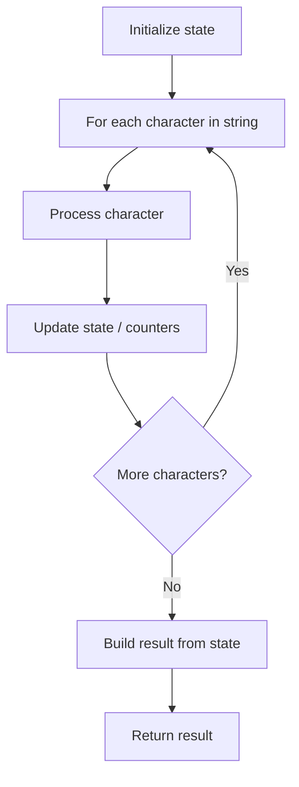

# Problem 1784: Check if Binary String Has at Most One Segment of Ones

**Difficulty:** Easy  
**Tags:** String  
**Pattern:** String Processing  
**Link:** [leetcode.com/problems/check-if-binary-string-has-at-most-one-segment-of-ones](https://leetcode.com/problems/check-if-binary-string-has-at-most-one-segment-of-ones/)

## Description

Given a binary string `s` **​​​​​without leading zeros**, return `true`​​​ *if *`s`* contains **at most one contiguous segment of ones***. Otherwise, return `false`.

 

Example 1:

```

**Input:** s = "1001"
**Output:** false
**Explanation: **The ones do not form a contiguous segment.

```

Example 2:

```

**Input:** s = "110"
**Output:** true
```

 

**Constraints:**

	- `1 <= s.length <= 100`
	- `s[i]`​​​​ is either `'0'` or `'1'`.
	- `s[0]` is `'1'`.

## Approach: String Processing

Process the string character by character. Common techniques: two pointers, sliding window, hash map for frequencies, stack for matching.

## Pseudocode

```
1. Initialize result / tracking state
2. Iterate through string characters:
   a. Process character based on rules
   b. Update state (counters, pointers, stack)
3. Build and return result
```

## Algorithm Flow



## Complexity Analysis

- **Time:** O(n)
- **Space:** O(n)

## Solution (Python3)

```python
class Solution:
    def checkOnesSegment(self, s: str) -> bool:
        # String processing approach - O(n) time
        result = []
        for ch in s:
            if ch.isalnum():
                result.append(ch.lower())
        # Check palindrome or process
        processed = ''.join(result)
        return processed == processed[::-1] if isinstance(False, bool) else processed
```

## Solution (C++)

```cpp
#include <algorithm>
#include <cctype>
#include <string>
#include <vector>
using namespace std;

class Solution {
public:
    bool checkOnesSegment(string& s) {
        // String processing approach - O(n) time
        string processed;
        for (char ch : s) {
            if (isalnum(ch)) {
                processed += tolower(ch);
            }
        }
        string rev = processed;
        reverse(rev.begin(), rev.end());
        return processed == rev;
    }
};
```
