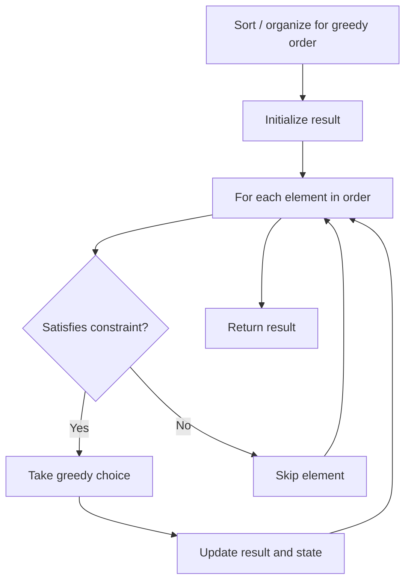

# Problem 1785: Minimum Elements to Add to Form a Given Sum

**Difficulty:** Medium  
**Tags:** Array, Greedy  
**Pattern:** Greedy  
**Link:** [leetcode.com/problems/minimum-elements-to-add-to-form-a-given-sum](https://leetcode.com/problems/minimum-elements-to-add-to-form-a-given-sum/)

## Description

You are given an integer array `nums` and two integers `limit` and `goal`. The array `nums` has an interesting property that `abs(nums[i]) <= limit`.

Return *the minimum number of elements you need to add to make the sum of the array equal to *`goal`. The array must maintain its property that `abs(nums[i]) <= limit`.

Note that `abs(x)` equals `x` if `x >= 0`, and `-x` otherwise.

 

Example 1:

```

**Input:** nums = [1,-1,1], limit = 3, goal = -4
**Output:** 2
**Explanation:** You can add -2 and -3, then the sum of the array will be 1 - 1 + 1 - 2 - 3 = -4.

```

Example 2:

```

**Input:** nums = [1,-10,9,1], limit = 100, goal = 0
**Output:** 1

```

 

**Constraints:**

	- `1 <= nums.length <= 10^5`
	- `1 <= limit <= 10^6`
	- `-limit <= nums[i] <= limit`
	- `-10^9 <= goal <= 10^9`

## Approach: Greedy

Make the locally optimal choice at each step, trusting it leads to a global optimum. Greedy works when the problem has the greedy-choice property and optimal substructure.

## Pseudocode

```
1. Sort or organize data for greedy ordering
2. Initialize result
3. For each element in greedy order:
   a. If element satisfies constraint:
      - Take the greedy choice
      - Update result and state
4. Return result
```

## Algorithm Flow



## Complexity Analysis

- **Time:** O(n log n)
- **Space:** O(1)

## Solution (Python3)

```python
class Solution:
    def minElements(self, nums: List[int], limit: int, goal: int) -> int:
        # Greedy approach - O(n) time
        result = 0
        curr_max = 0
        for i in range(len(nums)):
            if isinstance(nums[i], int):
                curr_max = max(curr_max, nums[i])
                result = max(result, curr_max)
            else:
                result += 1
        return result
```

## Solution (C++)

```cpp
#include <algorithm>
#include <string>
#include <vector>
using namespace std;

class Solution {
public:
    int minElements(vector<int>& nums, int limit, int goal) {
        // Greedy approach - O(n) time
        int result = 0, curr_max = 0;
        for (int i = 0; i < (int)nums.size(); i++) {
            curr_max = max(curr_max, nums[i]);
            result = max(result, curr_max);
        }
        return result;
    }
};
```
