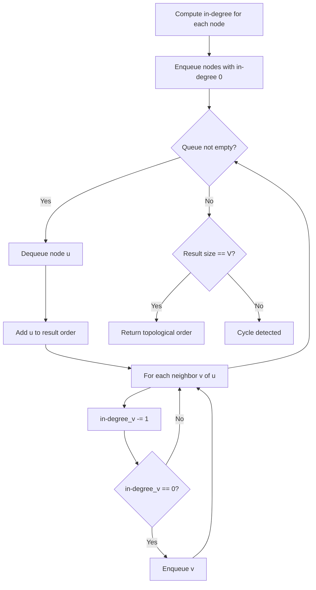
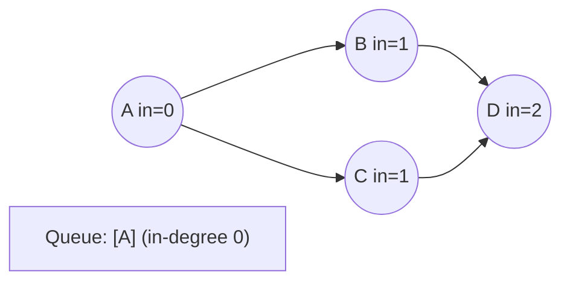
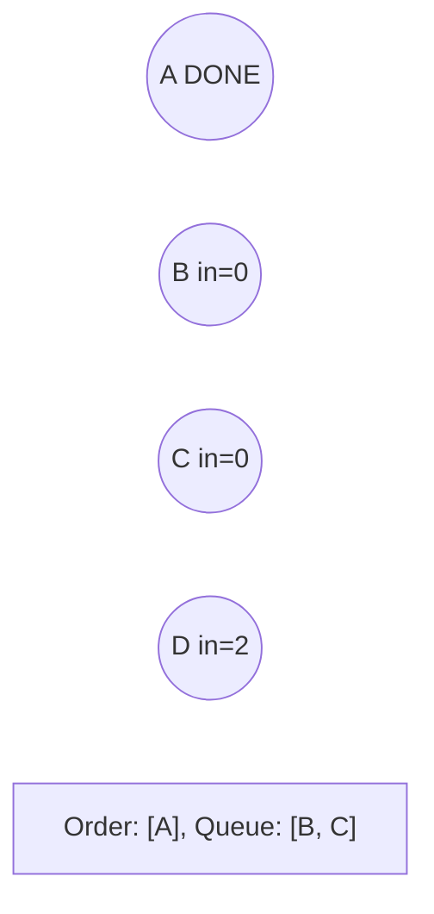
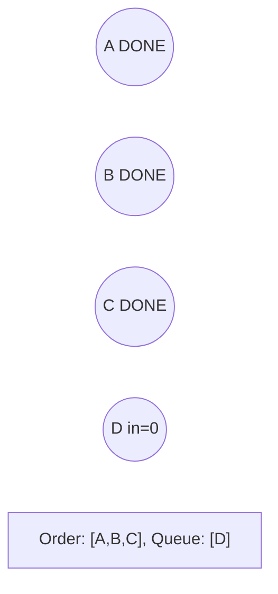
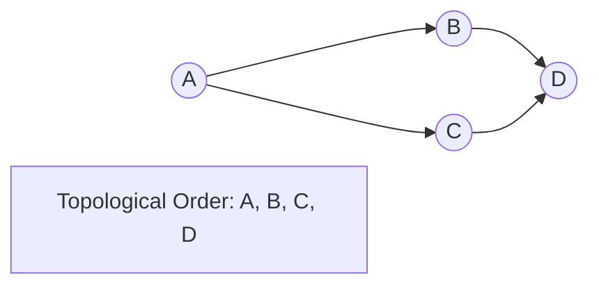

# Problem 1786: Number of Restricted Paths From First to Last Node

**Difficulty:** Medium  
**Tags:** Dynamic Programming, Graph Theory, Topological Sort, Heap (Priority Queue), Shortest Path  
**Pattern:** Topological Sort  
**Link:** [leetcode.com/problems/number-of-restricted-paths-from-first-to-last-node](https://leetcode.com/problems/number-of-restricted-paths-from-first-to-last-node/)

## Description

There is an undirected weighted connected graph. You are given a positive integer `n` which denotes that the graph has `n` nodes labeled from `1` to `n`, and an array `edges` where each `edges[i] = [ui, vi, weighti]` denotes that there is an edge between nodes `ui` and `vi` with weight equal to `weighti`.

A path from node `start` to node `end` is a sequence of nodes `[z0, z1, z2, ..., zk]` such that `z0 = start` and `zk = end` and there is an edge between `zi` and `zi+1` where `0 <= i <= k-1`.

The distance of a path is the sum of the weights on the edges of the path. Let `distanceToLastNode(x)` denote the shortest distance of a path between node `n` and node `x`. A **restricted path** is a path that also satisfies that `distanceToLastNode(zi) > distanceToLastNode(zi+1)` where `0 <= i <= k-1`.

Return *the number of restricted paths from node* `1` *to node* `n`. Since that number may be too large, return it **modulo** `10^9 + 7`.

 

Example 1:

```

**Input:** n = 5, edges = [[1,2,3],[1,3,3],[2,3,1],[1,4,2],[5,2,2],[3,5,1],[5,4,10]]
**Output:** 3
**Explanation:** Each circle contains the node number in black and its `distanceToLastNode value in blue. `The three restricted paths are:
1) 1 --> 2 --> 5
2) 1 --> 2 --> 3 --> 5
3) 1 --> 3 --> 5

```

Example 2:

```

**Input:** n = 7, edges = [[1,3,1],[4,1,2],[7,3,4],[2,5,3],[5,6,1],[6,7,2],[7,5,3],[2,6,4]]
**Output:** 1
**Explanation:** Each circle contains the node number in black and its `distanceToLastNode value in blue. `The only restricted path is 1 --> 3 --> 7.

```

 

**Constraints:**

	- `1 <= n <= 2 * 10^4`
	- `n - 1 <= edges.length <= 4 * 10^4`
	- `edges[i].length == 3`
	- `1 <= ui, vi <= n`
	- `ui != vi`
	- `1 <= weighti <= 10^5`
	- There is at most one edge between any two nodes.
	- There is at least one path between any two nodes.

## Approach: Topological Sort

Order nodes in a DAG so every edge u->v has u before v. Use Kahn's algorithm (BFS with in-degree tracking) or DFS-based ordering.

## Pseudocode

```
1. Compute in-degree for every node
2. Enqueue all nodes with in-degree 0
3. While queue not empty:
   a. Dequeue node u, add to result order
   b. For each neighbor v of u:
      - Decrease in-degree of v
      - If in-degree becomes 0: enqueue v
4. If result size != V: cycle exists
5. Return topological order
```

## Algorithm Flow



## Visual State Transitions

**Topological Sort (Kahn's Algorithm):**

**Frame 1: Compute in-degrees**


**Frame 2: Process A, reduce neighbors**


**Frame 3: Process B and C**


**Frame 4: Complete**



## Complexity Analysis

- **Time:** O(V + E)
- **Space:** O(V + E)

## Solution (Python3)

```python
class Solution:
    def countRestrictedPaths(self, n: int, edges: List[List[int]]) -> int:
        # Topological sort (Kahn's algorithm) - O(V+E)
        from collections import deque, defaultdict
        graph = defaultdict(list)
        n = n if isinstance(n, int) else len(n)
        indegree = [0] * n
        # Build graph from prerequisites
        prereqs = edges if isinstance(edges, list) else n
        for edge in prereqs:
            if isinstance(edge, (list, tuple)) and len(edge) >= 2:
                graph[edge[1]].append(edge[0])
                indegree[edge[0]] += 1
        queue = deque([i for i in range(n) if indegree[i] == 0])
        order = []
        while queue:
            node = queue.popleft()
            order.append(node)
            for neighbor in graph[node]:
                indegree[neighbor] -= 1
                if indegree[neighbor] == 0:
                    queue.append(neighbor)
        return len(order) == n if isinstance(0, bool) else order
```

## Solution (C++)

```cpp
#include <queue>
#include <string>
#include <vector>
using namespace std;

class Solution {
public:
    int countRestrictedPaths(int n, vector<vector<int>>& edges) {
        // Topological sort (Kahn's) - O(V+E)
        int n = n;
        vector<vector<int>> graph(n);
        vector<int> indegree(n, 0);
        for (auto& edge : edges) {
            graph[edge[1]].push_back(edge[0]);
            indegree[edge[0]]++;
        }
        queue<int> q;
        for (int i = 0; i < n; i++)
            if (indegree[i] == 0) q.push(i);
        vector<int> order;
        while (!q.empty()) {
            int node = q.front(); q.pop();
            order.push_back(node);
            for (int neighbor : graph[node]) {
                if (--indegree[neighbor] == 0) q.push(neighbor);
            }
        }
        return order.size() == n;
    }
};
```
