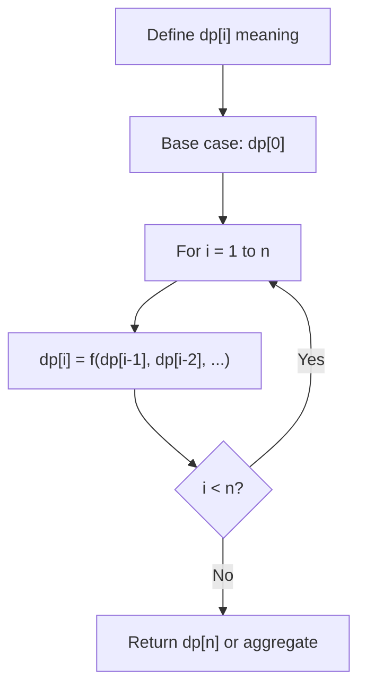
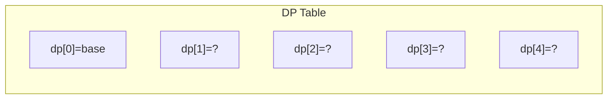
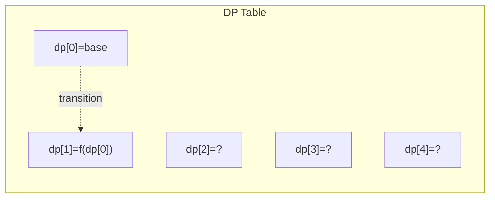
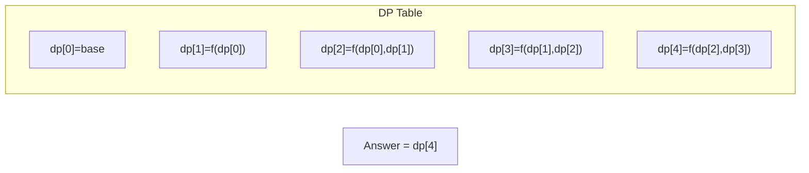

# Problem 1787: Make the XOR of All Segments Equal to Zero

**Difficulty:** Hard  
**Tags:** Array, Hash Table, Dynamic Programming, Bit Manipulation, Counting  
**Pattern:** Dynamic Programming (1D)  
**Link:** [leetcode.com/problems/make-the-xor-of-all-segments-equal-to-zero](https://leetcode.com/problems/make-the-xor-of-all-segments-equal-to-zero/)

## Description

You are given an array `nums`​​​ and an integer `k`​​​​​. The XOR of a segment `[left, right]` where `left <= right` is the `XOR` of all the elements with indices between `left` and `right`, inclusive: `nums[left] XOR nums[left+1] XOR ... XOR nums[right]`.

Return *the minimum number of elements to change in the array *such that the `XOR` of all segments of size `k`​​​​​​ is equal to zero.

 

Example 1:

```

**Input:** nums = [1,2,0,3,0], k = 1
**Output:** 3
**Explanation: **Modify the array from [**1**,**2**,0,**3**,0] to from [**0**,**0**,0,**0**,0].

```

Example 2:

```

**Input:** nums = [3,4,5,2,1,7,3,4,7], k = 3
**Output:** 3
**Explanation: **Modify the array from [3,4,**5**,**2**,**1**,7,3,4,7] to [3,4,**7**,**3**,**4**,7,3,4,7].

```

Example 3:

```

**Input:** nums = [1,2,4,1,2,5,1,2,6], k = 3
**Output:** 3
**Explanation: **Modify the array from [1,2,**4,**1,2,**5**,1,2,**6**] to [1,2,**3**,1,2,**3**,1,2,**3**].
```

 

**Constraints:**

	- `1 <= k <= nums.length <= 2000`
	- `​​​​​​0 <= nums[i] < 2^10`

## Approach: Dynamic Programming (1D)

Break the problem into overlapping subproblems. Define dp[i] as the optimal value for the subproblem ending at or considering index i. Build the solution bottom-up, using previously computed dp values.

## Pseudocode

```
1. Define dp[i] = optimal value for subproblem i
2. Base case: dp[0] = initial value
3. For i from 1 to n:
   a. dp[i] = recurrence(dp[i-1], dp[i-2], ...)
4. Return dp[n] or max/min of dp
```

## Algorithm Flow



## Visual State Transitions

**1D Dynamic Programming Table Build:**

**Frame 1: Initialize base cases**


**Frame 2: Fill dp[1] from dp[0]**


**Frame 3: Fill remaining cells**



## Complexity Analysis

- **Time:** O(n)
- **Space:** O(n)

## Solution (Python3)

```python
class Solution:
    def minChanges(self, nums: List[int], k: int) -> int:
        # Dynamic programming (1D) - O(n) time, O(n) space
        if not nums:
            return 0
        n = len(nums) if isinstance(nums, list) else nums
        dp = [0] * (n + 1)
        dp[0] = 1  # base case
        for i in range(1, n + 1):
            dp[i] = dp[i-1]  # transition (customize per problem)
            if i >= 2:
                dp[i] += dp[i-2]
        return dp[n]
```

## Solution (C++)

```cpp
#include <string>
#include <vector>
using namespace std;

class Solution {
public:
    int minChanges(vector<int>& nums, int k) {
        // Dynamic programming (1D) - O(n) time, O(n) space
        int n = nums;
        if (n <= 0) return 0;
        vector<int> dp(n + 1, 0);
        dp[0] = 1;
        for (int i = 1; i <= n; i++) {
            dp[i] = dp[i-1];
            if (i >= 2) dp[i] += dp[i-2];
        }
        return dp[n];
    }
};
```
