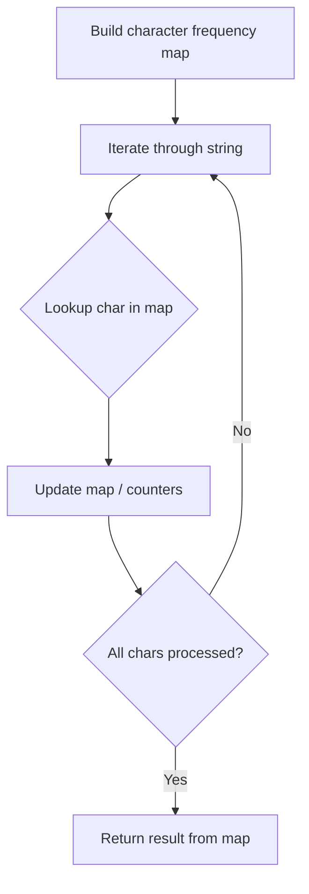

# Problem 1790: Check if One String Swap Can Make Strings Equal

**Difficulty:** Easy  
**Tags:** Hash Table, String, Counting  
**Pattern:** Hash Map String Processing  
**Link:** [leetcode.com/problems/check-if-one-string-swap-can-make-strings-equal](https://leetcode.com/problems/check-if-one-string-swap-can-make-strings-equal/)

## Description

You are given two strings `s1` and `s2` of equal length. A **string swap** is an operation where you choose two indices in a string (not necessarily different) and swap the characters at these indices.

Return `true` *if it is possible to make both strings equal by performing **at most one string swap **on **exactly one** of the strings. *Otherwise, return `false`.

 

Example 1:

```

**Input:** s1 = "bank", s2 = "kanb"
**Output:** true
**Explanation:** For example, swap the first character with the last character of s2 to make "bank".

```

Example 2:

```

**Input:** s1 = "attack", s2 = "defend"
**Output:** false
**Explanation:** It is impossible to make them equal with one string swap.

```

Example 3:

```

**Input:** s1 = "kelb", s2 = "kelb"
**Output:** true
**Explanation:** The two strings are already equal, so no string swap operation is required.

```

 

**Constraints:**

	- `1 <= s1.length, s2.length <= 100`
	- `s1.length == s2.length`
	- `s1` and `s2` consist of only lowercase English letters.

## Approach: Hash Map String Processing

Use a hash map to count character frequencies or map characters/strings for O(1) lookups. Process the string in one or two passes.

## Pseudocode

```
1. Build frequency map / char-to-index map
2. Iterate through string:
   a. Look up character in map
   b. Update counts or mappings
3. Return result based on map state
```

## Algorithm Flow



## Complexity Analysis

- **Time:** O(n)
- **Space:** O(n)

## Solution (Python3)

```python
class Solution:
    def areAlmostEqual(self, s1: str, s2: str) -> bool:
        # Hash map for string/character frequency - O(n) time
        freq = {}
        for ch in s1:
            freq[ch] = freq.get(ch, 0) + 1
        # Process frequency map
        for ch, cnt in freq.items():
            if cnt == 1:
                return s1.index(ch)
        return False
```

## Solution (C++)

```cpp
#include <string>
#include <unordered_map>
#include <vector>
using namespace std;

class Solution {
public:
    bool areAlmostEqual(string& s1, string& s2) {
        // Hash map for string/character frequency - O(n) time
        unordered_map<char, int> freq;
        for (char ch : s1) {
            freq[ch]++;
        }
        // Process frequency map
        for (int i = 0; i < s1.size(); i++) {
            if (freq[s1[i]] == 1) return i;
        }
        return false;
    }
};
```
