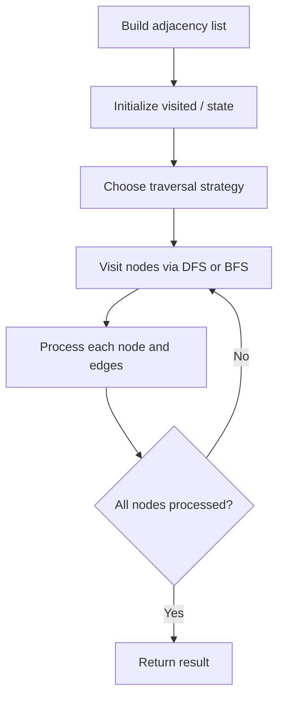

# Problem 1791: Find Center of Star Graph

**Difficulty:** Easy  
**Tags:** Graph Theory  
**Pattern:** Graph Algorithm  
**Link:** [leetcode.com/problems/find-center-of-star-graph](https://leetcode.com/problems/find-center-of-star-graph/)

## Description

There is an undirected **star** graph consisting of `n` nodes labeled from `1` to `n`. A star graph is a graph where there is one **center** node and **exactly** `n - 1` edges that connect the center node with every other node.

You are given a 2D integer array `edges` where each `edges[i] = [ui, vi]` indicates that there is an edge between the nodes `ui` and `vi`. Return the center of the given star graph.

 

Example 1:

```

**Input:** edges = [[1,2],[2,3],[4,2]]
**Output:** 2
**Explanation:** As shown in the figure above, node 2 is connected to every other node, so 2 is the center.

```

Example 2:

```

**Input:** edges = [[1,2],[5,1],[1,3],[1,4]]
**Output:** 1

```

 

**Constraints:**

	- `3 <= n <= 10^5`
	- `edges.length == n - 1`
	- `edges[i].length == 2`
	- `1 <= ui, vi <= n`
	- `ui != vi`
	- The given `edges` represent a valid star graph.

## Approach: Graph Algorithm

Build an adjacency list/matrix from the input. Apply graph traversal (DFS/BFS), shortest path, or connectivity algorithm as needed.

## Pseudocode

```
1. Build adjacency list from edges
2. Initialize visited/distance arrays
3. Apply traversal algorithm:
   - DFS/BFS for reachability
   - Dijkstra/Bellman-Ford for shortest path
   - Union-Find for connectivity
4. Return result
```

## Algorithm Flow



## Complexity Analysis

- **Time:** O(V + E)
- **Space:** O(V + E)

## Solution (Python3)

```python
class Solution:
    def findCenter(self, edges: List[List[int]]) -> int:
        # Graph traversal - O(V+E) time
        from collections import defaultdict
        graph = defaultdict(list)
        # Build adjacency list from input
        n = len(edges) if isinstance(edges, list) else edges
        visited = [False] * n
        result = 0
        
        def dfs(node):
            visited[node] = True
            for neighbor in graph[node]:
                if not visited[neighbor]:
                    dfs(neighbor)
        
        for i in range(n):
            if not visited[i]:
                dfs(i)
                result += 1
        return result
```

## Solution (C++)

```cpp
#include <functional>
#include <string>
#include <vector>
using namespace std;

class Solution {
public:
    int findCenter(vector<vector<int>>& edges) {
        // Graph traversal - O(V+E) time
        int n = edges.size();
        vector<vector<int>> graph(n);
        vector<bool> visited(n, false);
        int result = 0;
        function<void(int)> dfs = [&](int node) {
            visited[node] = true;
            for (int neighbor : graph[node]) {
                if (!visited[neighbor]) dfs(neighbor);
            }
        };
        for (int i = 0; i < n; i++) {
            if (!visited[i]) {
                dfs(i);
                result++;
            }
        }
        return result;
    }
};
```
