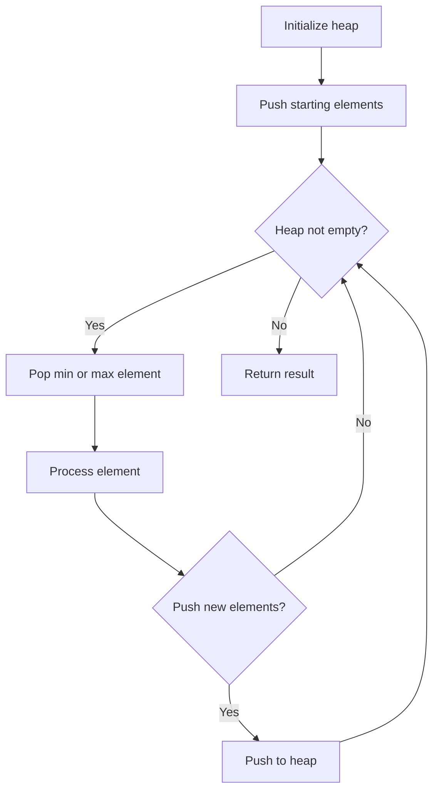
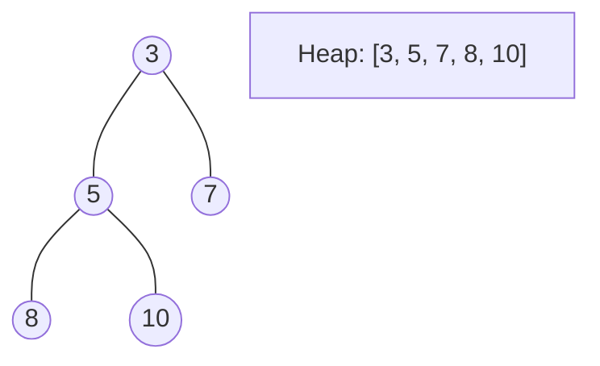
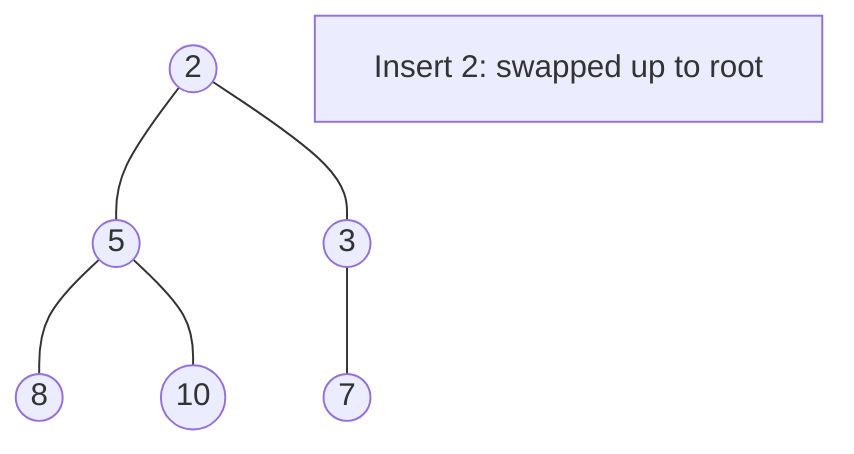
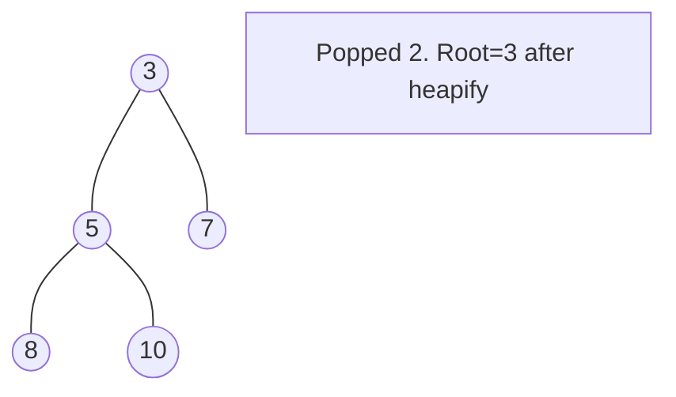

# Problem 1792: Maximum Average Pass Ratio

**Difficulty:** Medium  
**Tags:** Array, Greedy, Heap (Priority Queue)  
**Pattern:** Heap / Priority Queue  
**Link:** [leetcode.com/problems/maximum-average-pass-ratio](https://leetcode.com/problems/maximum-average-pass-ratio/)

## Description

There is a school that has classes of students and each class will be having a final exam. You are given a 2D integer array `classes`, where `classes[i] = [passi, totali]`. You know beforehand that in the `i^th` class, there are `totali` total students, but only `passi` number of students will pass the exam.

You are also given an integer `extraStudents`. There are another `extraStudents` brilliant students that are **guaranteed** to pass the exam of any class they are assigned to. You want to assign each of the `extraStudents` students to a class in a way that **maximizes** the **average** pass ratio across **all** the classes.

The **pass ratio** of a class is equal to the number of students of the class that will pass the exam divided by the total number of students of the class. The **average pass ratio** is the sum of pass ratios of all the classes divided by the number of the classes.

Return *the **maximum** possible average pass ratio after assigning the *`extraStudents`* students. *Answers within `10^-5` of the actual answer will be accepted.

 

Example 1:

```

**Input:** classes = [[1,2],[3,5],[2,2]], `extraStudents` = 2
**Output:** 0.78333
**Explanation:** You can assign the two extra students to the first class. The average pass ratio will be equal to (3/4 + 3/5 + 2/2) / 3 = 0.78333.

```

Example 2:

```

**Input:** classes = [[2,4],[3,9],[4,5],[2,10]], `extraStudents` = 4
**Output:** 0.53485

```

 

**Constraints:**

	- `1 <= classes.length <= 10^5`
	- `classes[i].length == 2`
	- `1 <= passi <= totali <= 10^5`
	- `1 <= extraStudents <= 10^5`

## Approach: Heap / Priority Queue

Use a min-heap or max-heap to efficiently access the smallest/largest element. Push elements and pop the top to process in priority order.

## Pseudocode

```
1. Initialize heap (min or max)
2. Push initial elements onto heap
3. While heap not empty and condition:
   a. Pop top element (min or max)
   b. Process element
   c. Push new elements if needed
4. Return result
```

## Algorithm Flow



## Visual State Transitions

**Heap Operations (Min-Heap):**

**Frame 1: Initial heap**


**Frame 2: Insert 2 - bubble up**


**Frame 3: Pop minimum (2) - heapify down**



## Complexity Analysis

- **Time:** O(n log n)
- **Space:** O(n)

## Solution (Python3)

```python
class Solution:
    def maxAverageRatio(self, classes: List[List[int]], extraStudents: int) -> float:
        # Heap/Priority Queue - O(n log k) time
        import heapq
        if not classes:
            return 0.0
        # Min heap (negate for max heap)
        heap = []
        for val in classes:
            heapq.heappush(heap, val)
            if len(heap) > (extraStudents if isinstance(extraStudents, int) else len(classes)):
                heapq.heappop(heap)
        return heap[0] if heap else 0.0
```

## Solution (C++)

```cpp
#include <queue>
#include <string>
#include <vector>
using namespace std;

class Solution {
public:
    double maxAverageRatio(vector<vector<int>>& classes, int extraStudents) {
        // Heap/Priority Queue - O(n log k) time
        priority_queue<int, vector<int>, greater<int>> pq;
        for (int val : classes) {
            pq.push(val);
            if ((int)pq.size() > extraStudents)
                pq.pop();
        }
        return pq.empty() ? 0.0 : pq.top();
    }
};
```
