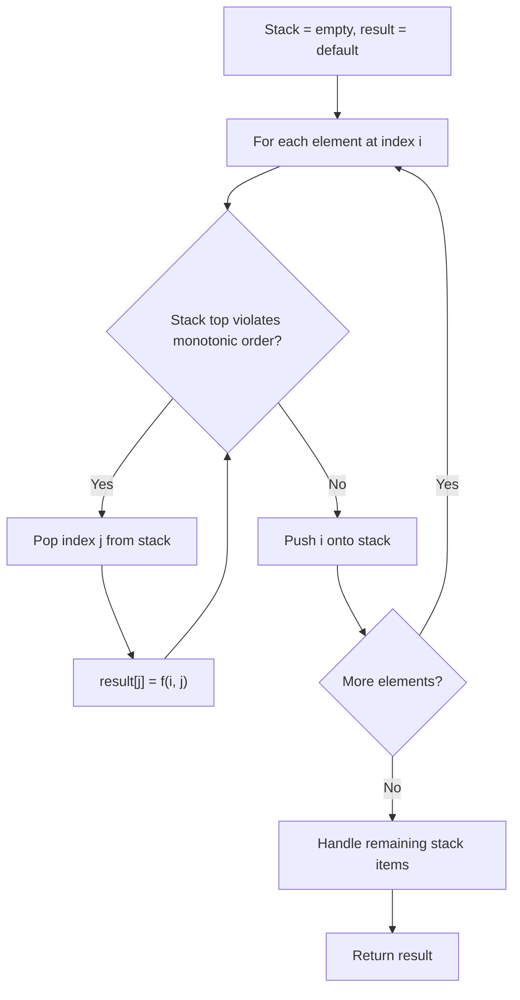
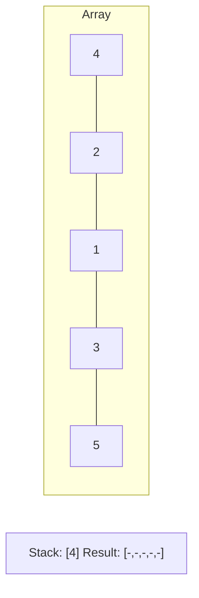
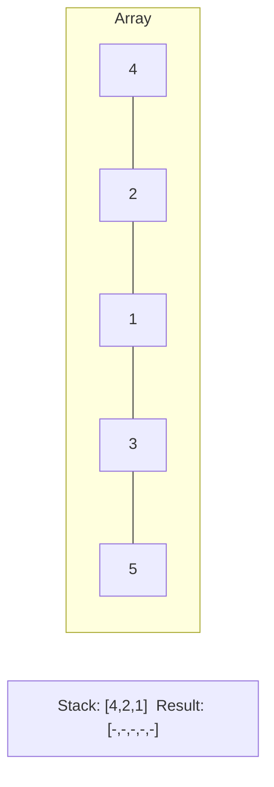
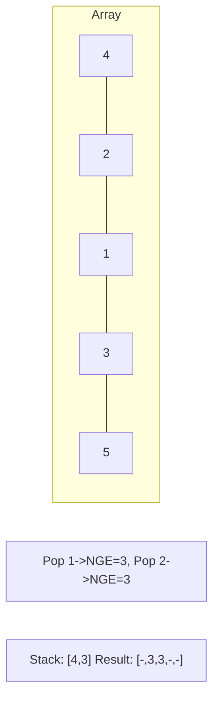
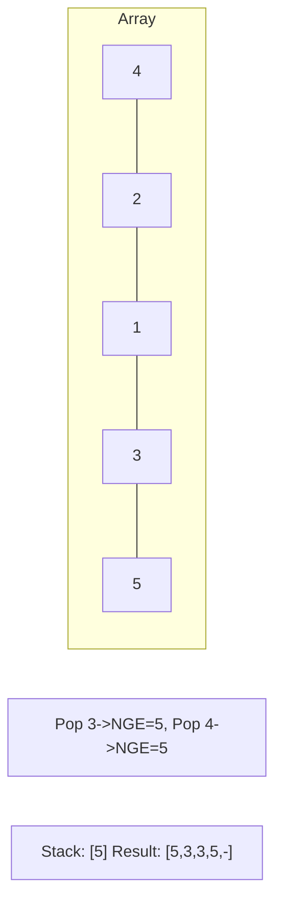

# Problem 1793: Maximum Score of a Good Subarray

**Difficulty:** Hard  
**Tags:** Array, Two Pointers, Binary Search, Stack, Monotonic Stack  
**Pattern:** Monotonic Stack  
**Link:** [leetcode.com/problems/maximum-score-of-a-good-subarray](https://leetcode.com/problems/maximum-score-of-a-good-subarray/)

## Description

You are given an array of integers `nums` **(0-indexed)** and an integer `k`.

The **score** of a subarray `(i, j)` is defined as `min(nums[i], nums[i+1], ..., nums[j]) * (j - i + 1)`. A **good** subarray is a subarray where `i <= k <= j`.

Return *the maximum possible **score** of a **good** subarray.*

 

Example 1:

```

**Input:** nums = [1,4,3,7,4,5], k = 3
**Output:** 15
**Explanation:** The optimal subarray is (1, 5) with a score of min(4,3,7,4,5) * (5-1+1) = 3 * 5 = 15. 

```

Example 2:

```

**Input:** nums = [5,5,4,5,4,1,1,1], k = 0
**Output:** 20
**Explanation:** The optimal subarray is (0, 4) with a score of min(5,5,4,5,4) * (4-0+1) = 4 * 5 = 20.

```

 

**Constraints:**

	- `1 <= nums.length <= 10^5`
	- `1 <= nums[i] <= 2 * 10^4`
	- `0 <= k < nums.length`

## Approach: Monotonic Stack

Maintain a stack where elements are always in monotonic order (increasing or decreasing). When a new element violates the monotonic property, pop elements and compute results (e.g., next greater/smaller element, spans, areas).

## Pseudocode

```
1. Initialize empty stack, result array
2. For each element (index i):
   a. While stack not empty and arr[i] breaks monotonic order:
      - Pop index j from stack
      - result[j] = compute(i, j)
   b. Push i onto stack
3. Handle remaining elements in stack
4. Return result
```

## Algorithm Flow



## Visual State Transitions

**Monotonic Stack (Next Greater Element):**

**Frame 1: Process first elements**


**Frame 2: Push smaller elements**


**Frame 3: Element 3 pops 1 and 2**


**Frame 4: Element 5 pops all**



## Complexity Analysis

- **Time:** O(n)
- **Space:** O(n)

## Solution (Python3)

```python
class Solution:
    def maximumScore(self, nums: List[int], k: int) -> int:
        # Monotonic stack - O(n) time, O(n) space
        n = len(nums)
        result = [0] * n
        stack = []  # indices
        for i in range(n):
            while stack and nums[i] > nums[stack[-1]]:
                idx = stack.pop()
                result[idx] = i - idx
            stack.append(i)
        return result
```

## Solution (C++)

```cpp
#include <stack>
#include <string>
#include <vector>
using namespace std;

class Solution {
public:
    int maximumScore(vector<int>& nums, int k) {
        // Monotonic stack - O(n) time, O(n) space
        int n = nums.size();
        vector<int> result(n, 0);
        stack<int> st;
        for (int i = 0; i < n; i++) {
            while (!st.empty() && nums[i] > nums[st.top()]) {
                int idx = st.top(); st.pop();
                result[idx] = i - idx;
            }
            st.push(i);
        }
        return result;
    }
};
```
