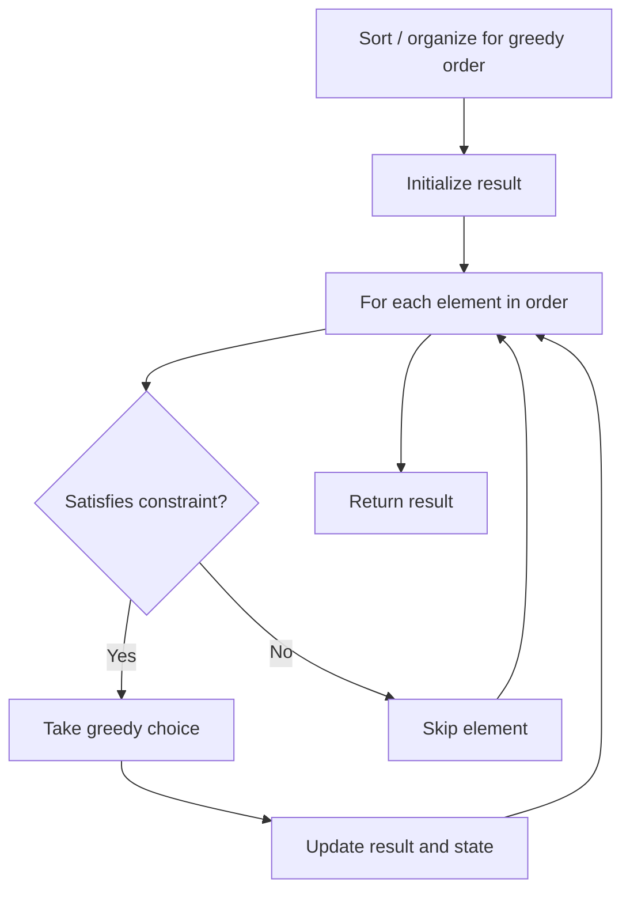

# Problem 1794: Count Pairs of Equal Substrings With Minimum Difference

**Difficulty:** Medium  
**Tags:** Hash Table, String, Greedy  
**Pattern:** Greedy  
**Link:** [leetcode.com/problems/count-pairs-of-equal-substrings-with-minimum-difference](https://leetcode.com/problems/count-pairs-of-equal-substrings-with-minimum-difference/)

## Description

*(Premium problem -- description requires LeetCode subscription)*

## Approach: Greedy

Make the locally optimal choice at each step, trusting it leads to a global optimum. Greedy works when the problem has the greedy-choice property and optimal substructure.

## Pseudocode

```
1. Sort or organize data for greedy ordering
2. Initialize result
3. For each element in greedy order:
   a. If element satisfies constraint:
      - Take the greedy choice
      - Update result and state
4. Return result
```

## Algorithm Flow



## Complexity Analysis

- **Time:** O(n log n)
- **Space:** O(1)

## Solution (Python3)

```python
class Solution:
    pass
```

## Solution (C++)

```cpp
class Solution {
public:
    // Design problem stub
};
```
