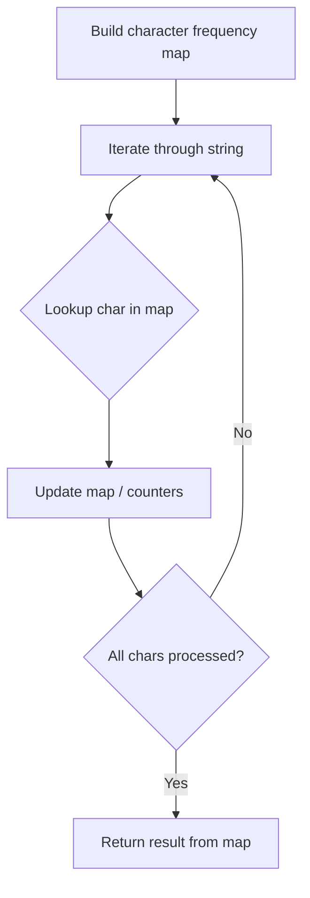

# Problem 1796: Second Largest Digit in a String

**Difficulty:** Easy  
**Tags:** Hash Table, String  
**Pattern:** Hash Map String Processing  
**Link:** [leetcode.com/problems/second-largest-digit-in-a-string](https://leetcode.com/problems/second-largest-digit-in-a-string/)

## Description

Given an alphanumeric string `s`, return *the **second largest** numerical digit that appears in *`s`*, or *`-1`* if it does not exist*.

An **alphanumeric**** **string is a string consisting of lowercase English letters and digits.

 

Example 1:

```

**Input:** s = "dfa12321afd"
**Output:** 2
**Explanation:** The digits that appear in s are [1, 2, 3]. The second largest digit is 2.

```

Example 2:

```

**Input:** s = "abc1111"
**Output:** -1
**Explanation:** The digits that appear in s are [1]. There is no second largest digit. 

```

 

**Constraints:**

	- `1 <= s.length <= 500`
	- `s` consists of only lowercase English letters and digits.

## Approach: Hash Map String Processing

Use a hash map to count character frequencies or map characters/strings for O(1) lookups. Process the string in one or two passes.

## Pseudocode

```
1. Build frequency map / char-to-index map
2. Iterate through string:
   a. Look up character in map
   b. Update counts or mappings
3. Return result based on map state
```

## Algorithm Flow



## Complexity Analysis

- **Time:** O(n)
- **Space:** O(n)

## Solution (Python3)

```python
class Solution:
    def secondHighest(self, s: str) -> int:
        # Hash map for string/character frequency - O(n) time
        freq = {}
        for ch in s:
            freq[ch] = freq.get(ch, 0) + 1
        # Process frequency map
        for ch, cnt in freq.items():
            if cnt == 1:
                return s.index(ch)
        return 0
```

## Solution (C++)

```cpp
#include <string>
#include <unordered_map>
#include <vector>
using namespace std;

class Solution {
public:
    int secondHighest(string& s) {
        // Hash map for string/character frequency - O(n) time
        unordered_map<char, int> freq;
        for (char ch : s) {
            freq[ch]++;
        }
        // Process frequency map
        for (int i = 0; i < s.size(); i++) {
            if (freq[s[i]] == 1) return i;
        }
        return 0;
    }
};
```
