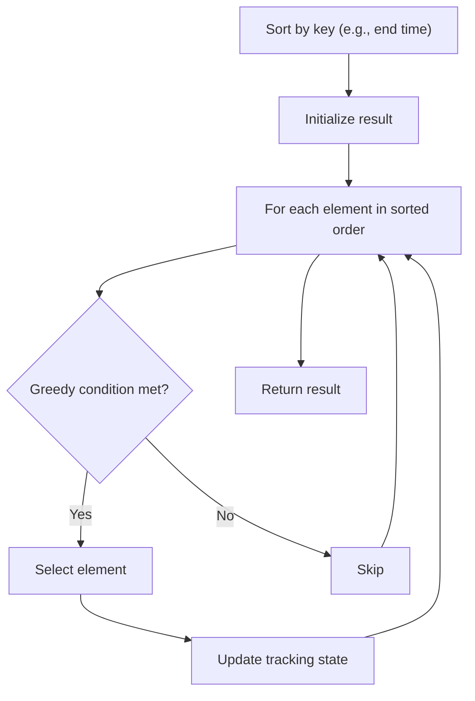

# Problem 1798: Maximum Number of Consecutive Values You Can Make

**Difficulty:** Medium  
**Tags:** Array, Greedy, Sorting  
**Pattern:** Greedy with Sorting  
**Link:** [leetcode.com/problems/maximum-number-of-consecutive-values-you-can-make](https://leetcode.com/problems/maximum-number-of-consecutive-values-you-can-make/)

## Description

You are given an integer array `coins` of length `n` which represents the `n` coins that you own. The value of the `i^th` coin is `coins[i]`. You can **make** some value `x` if you can choose some of your `n` coins such that their values sum up to `x`.

Return the *maximum number of consecutive integer values that you **can** **make** with your coins **starting** from and **including** *`0`.

Note that you may have multiple coins of the same value.

 

Example 1:

```

**Input:** coins = [1,3]
**Output:** 2
**Explanation: **You can make the following values:
- 0: take []
- 1: take [1]
You can make 2 consecutive integer values starting from 0.
```

Example 2:

```

**Input:** coins = [1,1,1,4]
**Output:** 8
**Explanation: **You can make the following values:
- 0: take []
- 1: take [1]
- 2: take [1,1]
- 3: take [1,1,1]
- 4: take [4]
- 5: take [4,1]
- 6: take [4,1,1]
- 7: take [4,1,1,1]
You can make 8 consecutive integer values starting from 0.
```

Example 3:

```

**Input:** coins = [1,4,10,3,1]
**Output:** 20
```

 

**Constraints:**

	- `coins.length == n`
	- `1 <= n <= 4 * 10^4`
	- `1 <= coins[i] <= 4 * 10^4`

## Approach: Greedy with Sorting

Sort the input by a key criterion, then greedily process elements in sorted order. The sorting ensures the greedy choice is always optimal.

## Pseudocode

```
1. Sort elements by key (start time, weight, etc.)
2. Initialize result, tracking variables
3. For each element in sorted order:
   a. Apply greedy selection rule
   b. Update result
4. Return result
```

## Algorithm Flow



## Complexity Analysis

- **Time:** O(n log n)
- **Space:** O(n)

## Solution (Python3)

```python
class Solution:
    def getMaximumConsecutive(self, coins: List[int]) -> int:
        # Sort + greedy - O(n log n) time
        coins.sort()
        result = 0
        curr_end = 0
        for item in coins:
            if isinstance(item, (list, tuple)):
                if item[0] >= curr_end:
                    result += 1
                    curr_end = item[1]
            else:
                result += 1
        return result
```

## Solution (C++)

```cpp
#include <algorithm>
#include <string>
#include <vector>
using namespace std;

class Solution {
public:
    int getMaximumConsecutive(vector<int>& coins) {
        // Sort + greedy - O(n log n) time
        sort(coins.begin(), coins.end());
        int result = 0, curr_end = 0;
        for (auto& item : coins) {
            result++;
        }
        return result;
    }
};
```
