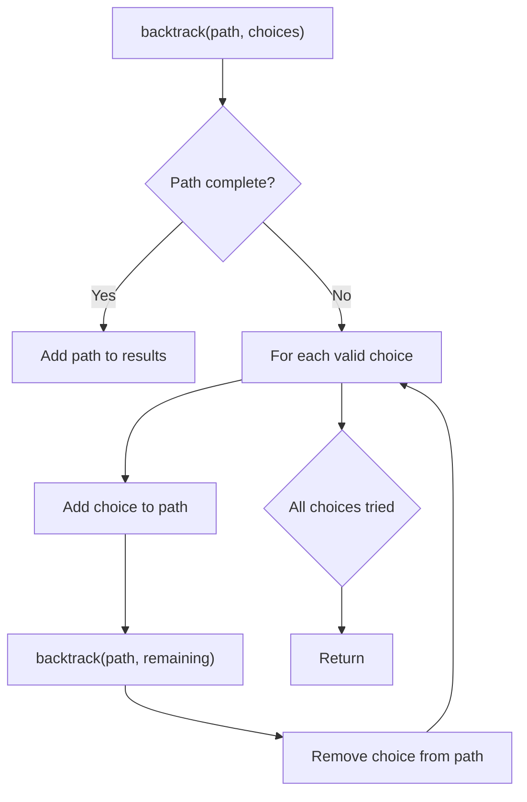
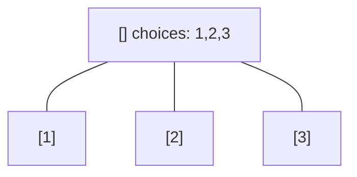
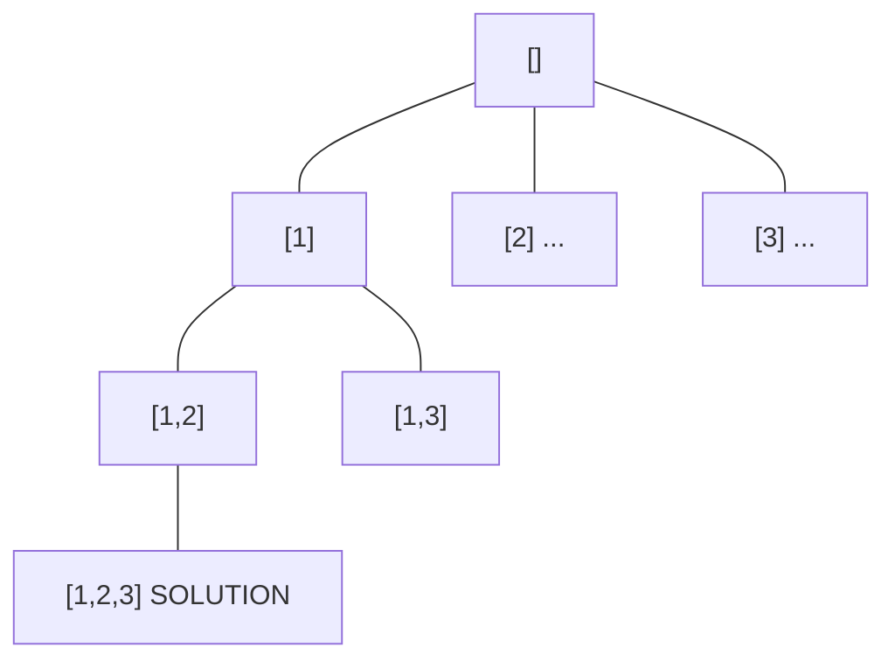
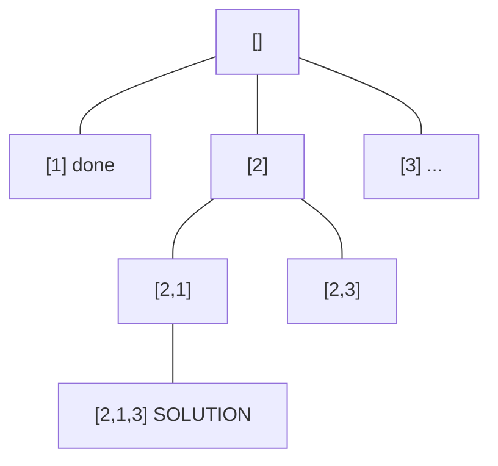
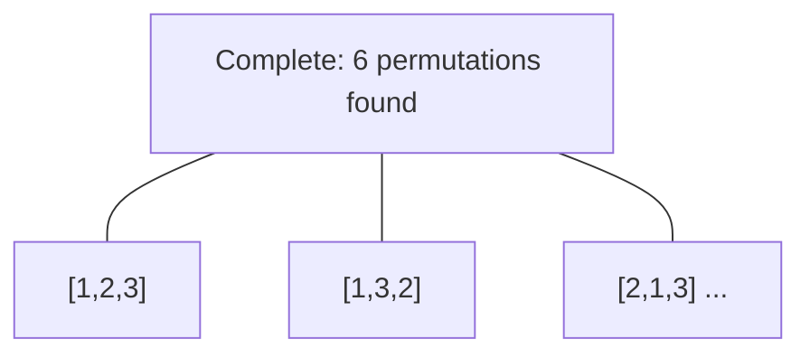

# Problem 1799: Maximize Score After N Operations

**Difficulty:** Hard  
**Tags:** Array, Math, Dynamic Programming, Backtracking, Bit Manipulation, Number Theory, Bitmask  
**Pattern:** Backtracking  
**Link:** [leetcode.com/problems/maximize-score-after-n-operations](https://leetcode.com/problems/maximize-score-after-n-operations/)

## Description

You are given `nums`, an array of positive integers of size `2 * n`. You must perform `n` operations on this array.

In the `i^th` operation **(1-indexed)**, you will:

	- Choose two elements, `x` and `y`.
	- Receive a score of `i * gcd(x, y)`.
	- Remove `x` and `y` from `nums`.

Return *the maximum score you can receive after performing *`n`* operations.*

The function `gcd(x, y)` is the greatest common divisor of `x` and `y`.

 

Example 1:

```

**Input:** nums = [1,2]
**Output:** 1
**Explanation:** The optimal choice of operations is:
(1 * gcd(1, 2)) = 1

```

Example 2:

```

**Input:** nums = [3,4,6,8]
**Output:** 11
**Explanation:** The optimal choice of operations is:
(1 * gcd(3, 6)) + (2 * gcd(4, 8)) = 3 + 8 = 11

```

Example 3:

```

**Input:** nums = [1,2,3,4,5,6]
**Output:** 14
**Explanation:** The optimal choice of operations is:
(1 * gcd(1, 5)) + (2 * gcd(2, 4)) + (3 * gcd(3, 6)) = 1 + 4 + 9 = 14

```

 

**Constraints:**

	- `1 <= n <= 7`
	- `nums.length == 2 * n`
	- `1 <= nums[i] <= 10^6`

## Approach: Backtracking

Explore all possible solutions by building candidates incrementally. At each step, make a choice and recurse. If the choice leads to a dead end, undo the choice (backtrack) and try the next option.

## Pseudocode

```
1. Define backtrack(path, choices):
   a. If path is a complete solution: add to results
   b. For each choice in choices:
      - If choice is valid:
        * Add choice to path
        * backtrack(path, remaining_choices)
        * Remove choice from path (backtrack)
2. Call backtrack([], all_choices)
```

## Algorithm Flow



## Visual State Transitions

**Backtracking Decision Tree:**

**Frame 1: Root - start with empty path**


**Frame 2: Explore branch [1]**


**Frame 3: Backtrack, explore [2]**


**Frame 4: All solutions found**



## Complexity Analysis

- **Time:** O(k^n) or O(n!)
- **Space:** O(n)

## Solution (Python3)

```python
class Solution:
    def maxScore(self, nums: List[int]) -> int:
        # Backtracking - O(2^n) or O(n!) time
        result = []
        
        def backtrack(path, start):
            result.append(path[:])
            for i in range(start, len(nums)):
                path.append(nums[i])
                backtrack(path, i + 1)
                path.pop()
        
        backtrack([], 0)
        return result
```

## Solution (C++)

```cpp
#include <functional>
#include <string>
#include <vector>
using namespace std;

class Solution {
public:
    int maxScore(vector<int>& nums) {
        // Backtracking - O(2^n) or O(n!) time
        vector<vector<int>> result;
        vector<int> path;
        function<void(int)> backtrack = [&](int start) {
            result.push_back(path);
            for (int i = start; i < (int)nums.size(); i++) {
                path.push_back(nums[i]);
                backtrack(i + 1);
                path.pop_back();
            }
        };
        backtrack(0);
        return result;
    }
};
```
