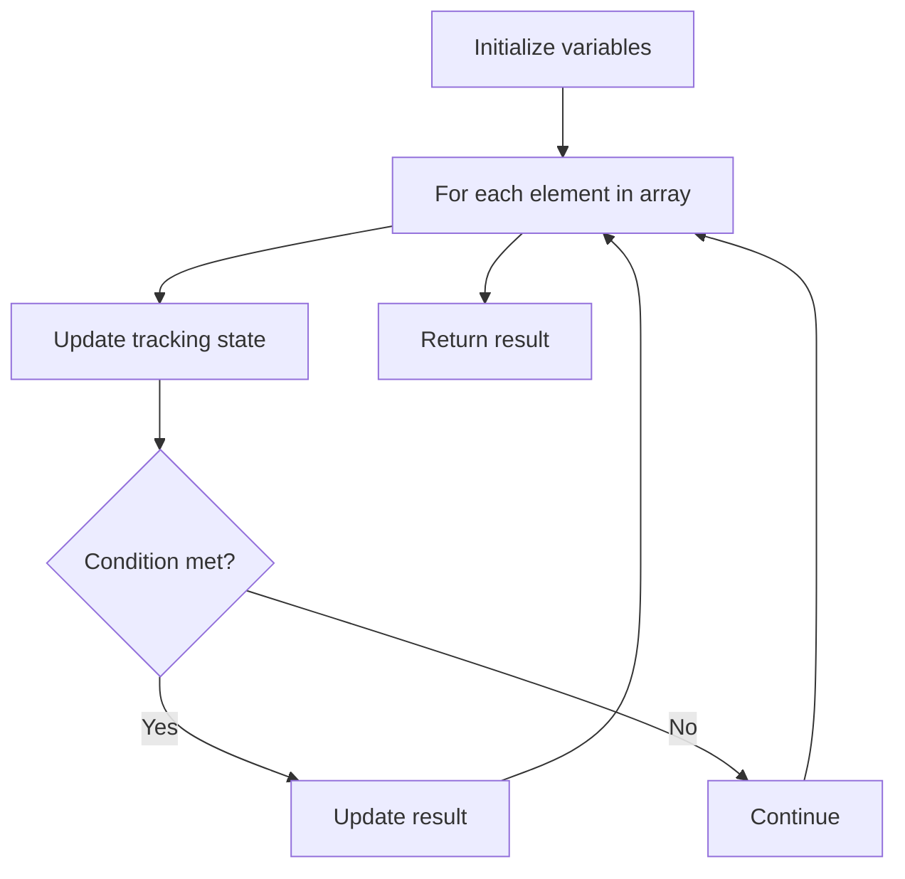

# Problem 1800: Maximum Ascending Subarray Sum

**Difficulty:** Easy  
**Tags:** Array  
**Pattern:** Array Processing  
**Link:** [leetcode.com/problems/maximum-ascending-subarray-sum](https://leetcode.com/problems/maximum-ascending-subarray-sum/)

## Description

Given an array of positive integers `nums`, return the **maximum** possible sum of an strictly increasing subarray in* *`nums`.

A subarray is defined as a contiguous sequence of numbers in an array.

 

Example 1:

```

**Input:** nums = [10,20,30,5,10,50]
**Output:** 65
**Explanation: **[5,10,50] is the ascending subarray with the maximum sum of 65.

```

Example 2:

```

**Input:** nums = [10,20,30,40,50]
**Output:** 150
**Explanation: **[10,20,30,40,50] is the ascending subarray with the maximum sum of 150.

```

Example 3:

```

**Input:** nums = [12,17,15,13,10,11,12]
**Output:** 33
**Explanation: **[10,11,12] is the ascending subarray with the maximum sum of 33.

```

 

**Constraints:**

	- `1 <= nums.length <= 100`
	- `1 <= nums[i] <= 100`

## Approach: Array Processing

Process the array with a linear scan, tracking state variables. Look for patterns: running maximum/minimum, counting, or transformations.

## Pseudocode

```
1. Initialize tracking variables
2. Iterate through array:
   a. Update tracking state
   b. Check conditions
   c. Update result
3. Return result
```

## Algorithm Flow



## Complexity Analysis

- **Time:** O(n)
- **Space:** O(1)

## Solution (Python3)

```python
class Solution:
    def maxAscendingSum(self, nums: List[int]) -> int:
        # Array processing - O(n) time
        result = 0
        for i in range(len(nums)):
            # Process element
            pass
        return result
```

## Solution (C++)

```cpp
#include <string>
#include <vector>
using namespace std;

class Solution {
public:
    int maxAscendingSum(vector<int>& nums) {
        // Array processing - O(n) time
        for (int i = 0; i < (int)nums.size(); i++) {
            // Process element
        }
        return 0;
    }
};
```
