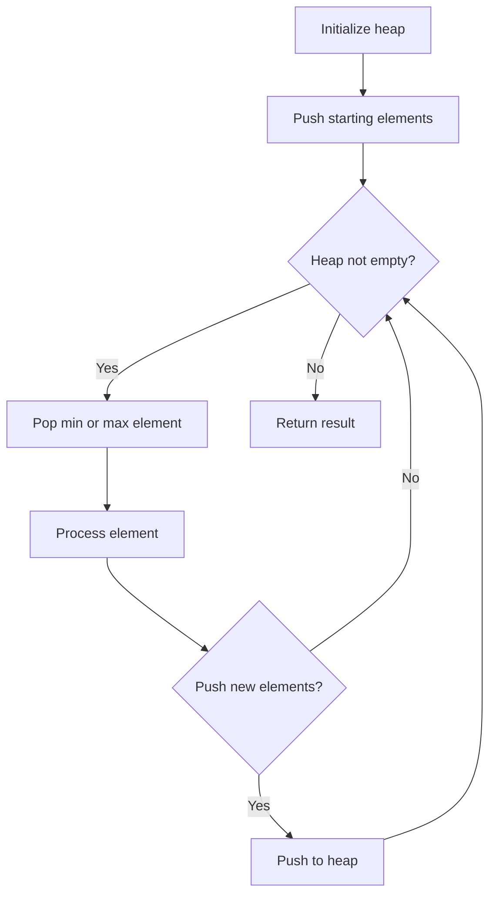
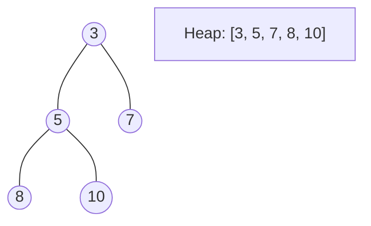
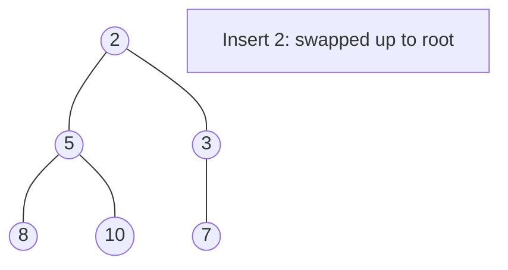
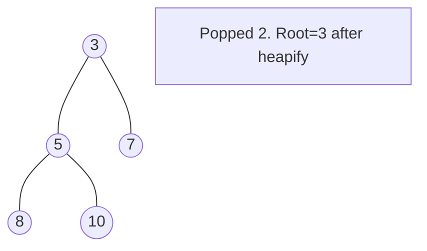

# Problem 1801: Number of Orders in the Backlog

**Difficulty:** Medium  
**Tags:** Array, Heap (Priority Queue), Simulation  
**Pattern:** Heap / Priority Queue  
**Link:** [leetcode.com/problems/number-of-orders-in-the-backlog](https://leetcode.com/problems/number-of-orders-in-the-backlog/)

## Description

You are given a 2D integer array `orders`, where each `orders[i] = [pricei, amounti, orderTypei]` denotes that `amounti` orders have been placed of type `orderTypei` at the price `pricei`. The `orderTypei` is:


	- `0` if it is a batch of `buy` orders, or
	- `1` if it is a batch of `sell` orders.


Note that `orders[i]` represents a batch of `amounti` independent orders with the same price and order type. All orders represented by `orders[i]` will be placed before all orders represented by `orders[i+1]` for all valid `i`.


There is a **backlog** that consists of orders that have not been executed. The backlog is initially empty. When an order is placed, the following happens:


	- If the order is a `buy` order, you look at the `sell` order with the **smallest** price in the backlog. If that `sell` order's price is **smaller than or equal to** the current `buy` order's price, they will match and be executed, and that `sell` order will be removed from the backlog. Else, the `buy` order is added to the backlog.
	- Vice versa, if the order is a `sell` order, you look at the `buy` order with the **largest** price in the backlog. If that `buy` order's price is **larger than or equal to** the current `sell` order's price, they will match and be executed, and that `buy` order will be removed from the backlog. Else, the `sell` order is added to the backlog.


Return *the total **amount** of orders in the backlog after placing all the orders from the input*. Since this number can be large, return it **modulo** `10^9 + 7`.


 

Example 1:


```

**Input:** orders = [[10,5,0],[15,2,1],[25,1,1],[30,4,0]]
**Output:** 6
**Explanation:** Here is what happens with the orders:
- 5 orders of type buy with price 10 are placed. There are no sell orders, so the 5 orders are added to the backlog.
- 2 orders of type sell with price 15 are placed. There are no buy orders with prices larger than or equal to 15, so the 2 orders are added to the backlog.
- 1 order of type sell with price 25 is placed. There are no buy orders with prices larger than or equal to 25 in the backlog, so this order is added to the backlog.
- 4 orders of type buy with price 30 are placed. The first 2 orders are matched with the 2 sell orders of the least price, which is 15 and these 2 sell orders are removed from the backlog. The 3rd order is matched with the sell order of the least price, which is 25 and this sell order is removed from the backlog. Then, there are no more sell orders in the backlog, so the 4th order is added to the backlog.
Finally, the backlog has 5 buy orders with price 10, and 1 buy order with price 30. So the total number of orders in the backlog is 6.

```


Example 2:


```

**Input:** orders = [[7,1000000000,1],[15,3,0],[5,999999995,0],[5,1,1]]
**Output:** 999999984
**Explanation:** Here is what happens with the orders:
- 109 orders of type sell with price 7 are placed. There are no buy orders, so the 109 orders are added to the backlog.
- 3 orders of type buy with price 15 are placed. They are matched with the 3 sell orders with the least price which is 7, and those 3 sell orders are removed from the backlog.
- 999999995 orders of type buy with price 5 are placed. The least price of a sell order is 7, so the 999999995 orders are added to the backlog.
- 1 order of type sell with price 5 is placed. It is matched with the buy order of the highest price, which is 5, and that buy order is removed from the backlog.
Finally, the backlog has (1000000000-3) sell orders with price 7, and (999999995-1) buy orders with price 5. So the total number of orders = 1999999991, which is equal to 999999984 % (109 + 7).

```


 

**Constraints:**


	- `1 <= orders.length <= 10^5`
	- `orders[i].length == 3`
	- `1 <= pricei, amounti <= 10^9`
	- `orderTypei` is either `0` or `1`.

## Approach: Heap / Priority Queue

Use a min-heap or max-heap to efficiently access the smallest/largest element. Push elements and pop the top to process in priority order.

## Pseudocode

```
1. Initialize heap (min or max)
2. Push initial elements onto heap
3. While heap not empty and condition:
   a. Pop top element (min or max)
   b. Process element
   c. Push new elements if needed
4. Return result
```

## Algorithm Flow



## Visual State Transitions

**Heap Operations (Min-Heap):**

**Frame 1: Initial heap**


**Frame 2: Insert 2 - bubble up**


**Frame 3: Pop minimum (2) - heapify down**



## Complexity Analysis

- **Time:** O(n log n)
- **Space:** O(n)

## Solution (Python3)

```python
class Solution:
    def getNumberOfBacklogOrders(self, orders: List[List[int]]) -> int:
        # Heap/Priority Queue - O(n log k) time
        import heapq
        if not orders:
            return 0
        # Min heap (negate for max heap)
        heap = []
        for val in orders:
            heapq.heappush(heap, val)
            if len(heap) > (orders if isinstance(orders, int) else len(orders)):
                heapq.heappop(heap)
        return heap[0] if heap else 0
```

## Solution (C++)

```cpp
#include <queue>
#include <string>
#include <vector>
using namespace std;

class Solution {
public:
    int getNumberOfBacklogOrders(vector<vector<int>>& orders) {
        // Heap/Priority Queue - O(n log k) time
        priority_queue<int, vector<int>, greater<int>> pq;
        for (int val : orders) {
            pq.push(val);
            if ((int)pq.size() > orders)
                pq.pop();
        }
        return pq.empty() ? 0 : pq.top();
    }
};
```
