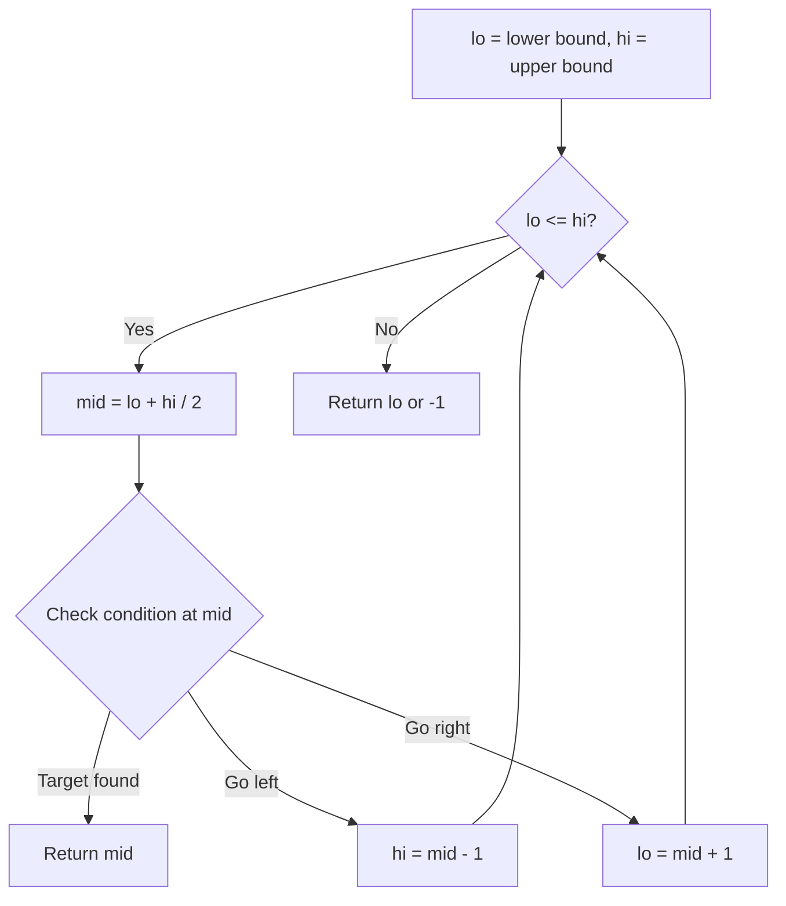
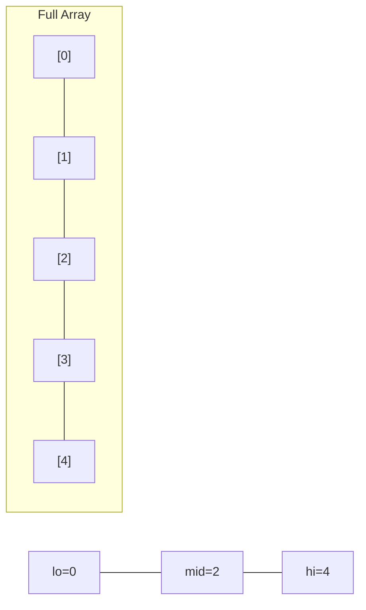
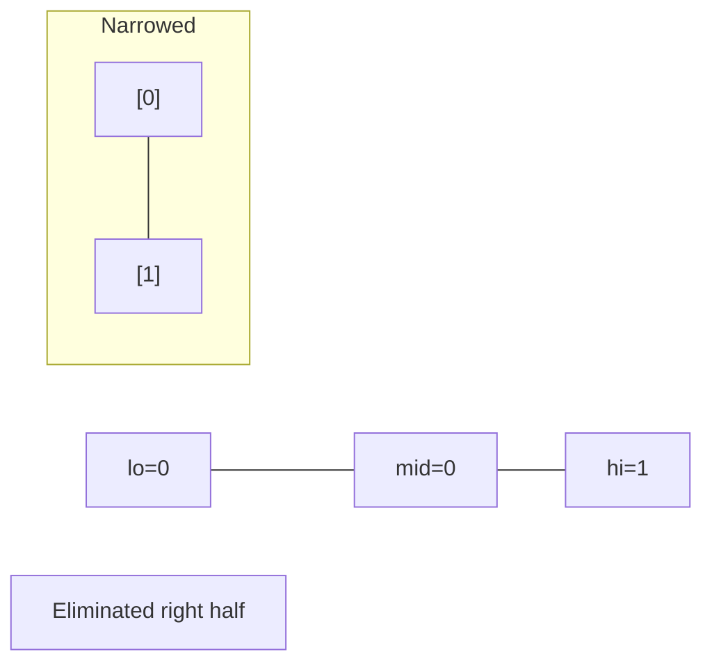
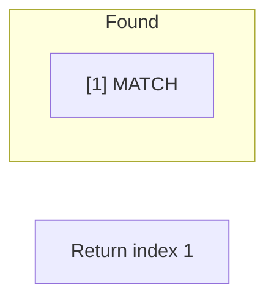

# Problem 1802: Maximum Value at a Given Index in a Bounded Array

**Difficulty:** Medium  
**Tags:** Math, Binary Search, Greedy  
**Pattern:** Binary Search  
**Link:** [leetcode.com/problems/maximum-value-at-a-given-index-in-a-bounded-array](https://leetcode.com/problems/maximum-value-at-a-given-index-in-a-bounded-array/)

## Description

You are given three positive integers: `n`, `index`, and `maxSum`. You want to construct an array `nums` (**0-indexed**)** **that satisfies the following conditions:

	- `nums.length == n`
	- `nums[i]` is a **positive** integer where `0 <= i < n`.
	- `abs(nums[i] - nums[i+1]) <= 1` where `0 <= i < n-1`.
	- The sum of all the elements of `nums` does not exceed `maxSum`.
	- `nums[index]` is **maximized**.

Return `nums[index]`* of the constructed array*.

Note that `abs(x)` equals `x` if `x >= 0`, and `-x` otherwise.

 

Example 1:

```

**Input:** n = 4, index = 2,  maxSum = 6
**Output:** 2
**Explanation:** nums = [1,2,**2**,1] is one array that satisfies all the conditions.
There are no arrays that satisfy all the conditions and have nums[2] == 3, so 2 is the maximum nums[2].

```

Example 2:

```

**Input:** n = 6, index = 1,  maxSum = 10
**Output:** 3

```

 

**Constraints:**

	- `1 <= n <= maxSum <= 10^9`
	- `0 <= index < n`

## Approach: Binary Search

Use binary search to halve the search space each iteration. Define the search range [lo, hi], compute mid, and decide which half to keep based on the problem's monotonic condition.

## Pseudocode

```
1. lo = lower_bound, hi = upper_bound
2. While lo <= hi (or lo < hi):
   a. mid = (lo + hi) // 2
   b. If condition(mid) is satisfied: record answer, search left half
   c. Else: search right half
3. Return answer
```

## Algorithm Flow



## Visual State Transitions

**Binary Search Step-by-Step:**

**Frame 1: Initial search space**


**Frame 2: Compare mid, narrow search**


**Frame 3: Found target**



## Complexity Analysis

- **Time:** O(log n)
- **Space:** O(1)

## Solution (Python3)

```python
class Solution:
    def maxValue(self, n: int, index: int, maxSum: int) -> int:
        # Binary search - O(log n) time, O(1) space
        lo, hi = 0, len(n) - 1
        while lo <= hi:
            mid = lo + (hi - lo) // 2
            if n[mid] == index:
                return mid
            elif n[mid] < index:
                lo = mid + 1
            else:
                hi = mid - 1
        return 0
```

## Solution (C++)

```cpp
#include <string>
#include <vector>
using namespace std;

class Solution {
public:
    int maxValue(int n, int index, int maxSum) {
        // Binary search - O(log n) time, O(1) space
        int lo = 0, hi = n.size() - 1;
        while (lo <= hi) {
            int mid = lo + (hi - lo) / 2;
            if (n[mid] == index) {
                return mid;
            } else if (n[mid] < index) {
                lo = mid + 1;
            } else {
                hi = mid - 1;
            }
        }
        return 0;
    }
};
```
