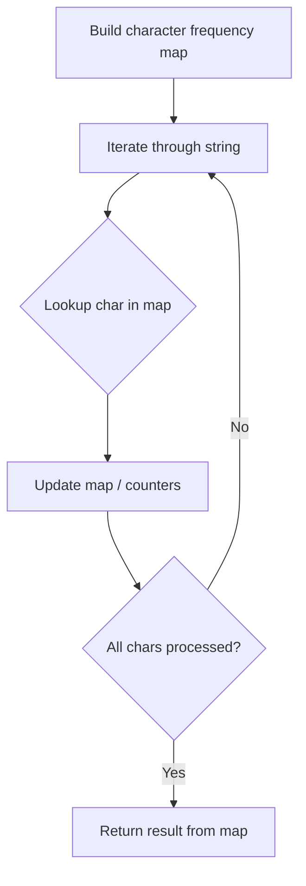

# Problem 1805: Number of Different Integers in a String

**Difficulty:** Easy  
**Tags:** Hash Table, String  
**Pattern:** Hash Map String Processing  
**Link:** [leetcode.com/problems/number-of-different-integers-in-a-string](https://leetcode.com/problems/number-of-different-integers-in-a-string/)

## Description

You are given a string `word` that consists of digits and lowercase English letters.

You will replace every non-digit character with a space. For example, `"a123bc34d8ef34"` will become `" 123  34 8  34"`. Notice that you are left with some integers that are separated by at least one space: `"123"`, `"34"`, `"8"`, and `"34"`.

Return *the number of **different** integers after performing the replacement operations on *`word`.

Two integers are considered different if their decimal representations **without any leading zeros** are different.

 

Example 1:

```

**Input:** word = "a123bc34d8ef34"
**Output:** 3
**Explanation: **The three different integers are "123", "34", and "8". Notice that "34" is only counted once.

```

Example 2:

```

**Input:** word = "leet1234code234"
**Output:** 2

```

Example 3:

```

**Input:** word = "a1b01c001"
**Output:** 1
**Explanation: **The three integers "1", "01", and "001" all represent the same integer because
the leading zeros are ignored when comparing their decimal values.

```

 

**Constraints:**

	- `1 <= word.length <= 1000`
	- `word` consists of digits and lowercase English letters.

## Approach: Hash Map String Processing

Use a hash map to count character frequencies or map characters/strings for O(1) lookups. Process the string in one or two passes.

## Pseudocode

```
1. Build frequency map / char-to-index map
2. Iterate through string:
   a. Look up character in map
   b. Update counts or mappings
3. Return result based on map state
```

## Algorithm Flow



## Complexity Analysis

- **Time:** O(n)
- **Space:** O(n)

## Solution (Python3)

```python
class Solution:
    def numDifferentIntegers(self, word: str) -> int:
        # Hash map for string/character frequency - O(n) time
        freq = {}
        for ch in word:
            freq[ch] = freq.get(ch, 0) + 1
        # Process frequency map
        for ch, cnt in freq.items():
            if cnt == 1:
                return word.index(ch)
        return 0
```

## Solution (C++)

```cpp
#include <string>
#include <unordered_map>
#include <vector>
using namespace std;

class Solution {
public:
    int numDifferentIntegers(string& word) {
        // Hash map for string/character frequency - O(n) time
        unordered_map<char, int> freq;
        for (char ch : word) {
            freq[ch]++;
        }
        // Process frequency map
        for (int i = 0; i < word.size(); i++) {
            if (freq[word[i]] == 1) return i;
        }
        return 0;
    }
};
```
