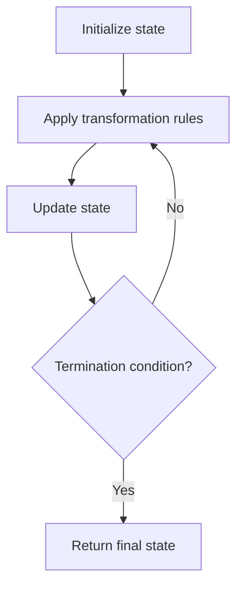

# Problem 1806: Minimum Number of Operations to Reinitialize a Permutation

**Difficulty:** Medium  
**Tags:** Array, Math, Simulation  
**Pattern:** Simulation  
**Link:** [leetcode.com/problems/minimum-number-of-operations-to-reinitialize-a-permutation](https://leetcode.com/problems/minimum-number-of-operations-to-reinitialize-a-permutation/)

## Description

You are given an **even** integer `n`​​​​​​. You initially have a permutation `perm` of size `n`​​ where `perm[i] == i`​ **(0-indexed)**​​​​.

In one operation, you will create a new array `arr`, and for each `i`:

	- If `i % 2 == 0`, then `arr[i] = perm[i / 2]`.
	- If `i % 2 == 1`, then `arr[i] = perm[n / 2 + (i - 1) / 2]`.

You will then assign `arr`​​​​ to `perm`.

Return *the minimum **non-zero** number of operations you need to perform on *`perm`* to return the permutation to its initial value.*

 

Example 1:

```

**Input:** n = 2
**Output:** 1
**Explanation:** perm = [0,1] initially.
After the 1st operation, perm = [0,1]
So it takes only 1 operation.

```

Example 2:

```

**Input:** n = 4
**Output:** 2
**Explanation:** perm = [0,1,2,3] initially.
After the 1st operation, perm = [0,2,1,3]
After the 2nd operation, perm = [0,1,2,3]
So it takes only 2 operations.

```

Example 3:

```

**Input:** n = 6
**Output:** 4

```

 

**Constraints:**

	- `2 <= n <= 1000`
	- `n`​​​​​​ is even.

## Approach: Simulation

Simulate the process described in the problem step by step. Follow the rules exactly, tracking state at each step.

## Pseudocode

```
1. Initialize state (grid, pointers, counters)
2. For each step / iteration:
   a. Apply the transformation rules
   b. Update state
   c. Check termination condition
3. Return final state or result
```

## Algorithm Flow



## Complexity Analysis

- **Time:** O(n) or O(n * k)
- **Space:** O(n)

## Solution (Python3)

```python
class Solution:
    def reinitializePermutation(self, n: int) -> int:
        # Simulation approach - follow the rules step by step
        result = 0
        for i in range(len(n) if isinstance(n, list) else n):
            # Simulate each step
            pass
        return result
```

## Solution (C++)

```cpp
#include <string>
#include <vector>
using namespace std;

class Solution {
public:
    int reinitializePermutation(int n) {
        // Simulation approach
        int n = n.size();
        for (int i = 0; i < n; i++) {
            // Simulate each step
        }
        return 0;
    }
};
```
