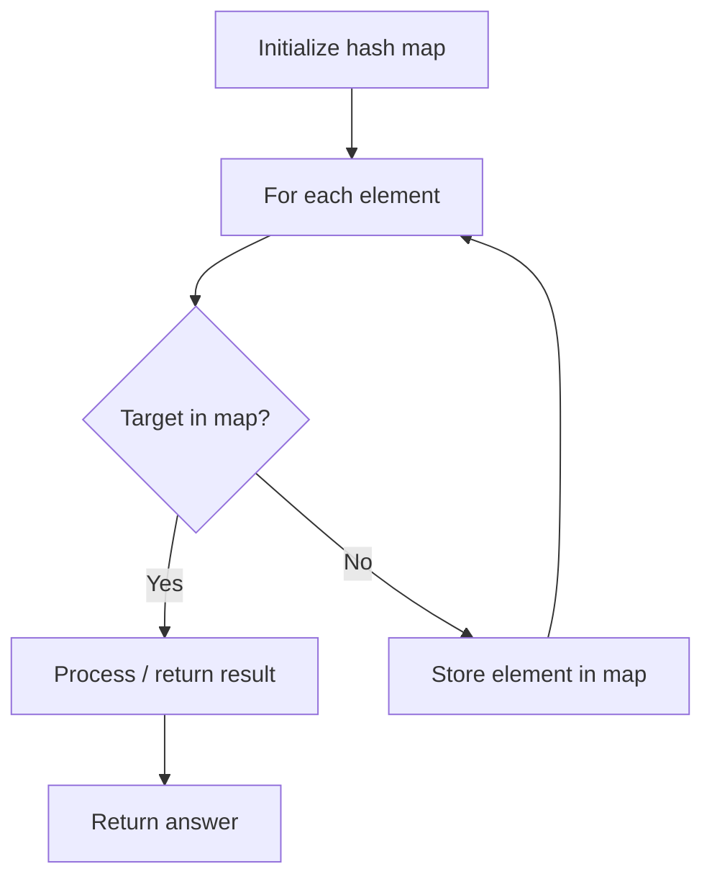

# Problem 1807: Evaluate the Bracket Pairs of a String

**Difficulty:** Medium  
**Tags:** Array, Hash Table, String  
**Pattern:** Hash Map Lookup  
**Link:** [leetcode.com/problems/evaluate-the-bracket-pairs-of-a-string](https://leetcode.com/problems/evaluate-the-bracket-pairs-of-a-string/)

## Description

You are given a string `s` that contains some bracket pairs, with each pair containing a **non-empty** key.

	- For example, in the string `"(name)is(age)yearsold"`, there are **two** bracket pairs that contain the keys `"name"` and `"age"`.

You know the values of a wide range of keys. This is represented by a 2D string array `knowledge` where each `knowledge[i] = [keyi, valuei]` indicates that key `keyi` has a value of `valuei`.

You are tasked to evaluate **all** of the bracket pairs. When you evaluate a bracket pair that contains some key `keyi`, you will:

	- Replace `keyi` and the bracket pair with the key's corresponding `valuei`.
	- If you do not know the value of the key, you will replace `keyi` and the bracket pair with a question mark `"?"` (without the quotation marks).

Each key will appear at most once in your `knowledge`. There will not be any nested brackets in `s`.

Return *the resulting string after evaluating **all** of the bracket pairs.*

 

Example 1:

```

**Input:** s = "(name)is(age)yearsold", knowledge = [["name","bob"],["age","two"]]
**Output:** "bobistwoyearsold"
**Explanation:**
The key "name" has a value of "bob", so replace "(name)" with "bob".
The key "age" has a value of "two", so replace "(age)" with "two".

```

Example 2:

```

**Input:** s = "hi(name)", knowledge = [["a","b"]]
**Output:** "hi?"
**Explanation:** As you do not know the value of the key "name", replace "(name)" with "?".

```

Example 3:

```

**Input:** s = "(a)(a)(a)aaa", knowledge = [["a","yes"]]
**Output:** "yesyesyesaaa"
**Explanation:** The same key can appear multiple times.
The key "a" has a value of "yes", so replace all occurrences of "(a)" with "yes".
Notice that the "a"s not in a bracket pair are not evaluated.

```

 

**Constraints:**

	- `1 <= s.length <= 10^5`
	- `0 <= knowledge.length <= 10^5`
	- `knowledge[i].length == 2`
	- `1 <= keyi.length, valuei.length <= 10`
	- `s` consists of lowercase English letters and round brackets `'('` and `')'`.
	- Every open bracket `'('` in `s` will have a corresponding close bracket `')'`.
	- The key in each bracket pair of `s` will be non-empty.
	- There will not be any nested bracket pairs in `s`.
	- `keyi` and `valuei` consist of lowercase English letters.
	- Each `keyi` in `knowledge` is unique.

## Approach: Hash Map Lookup

Use a hash map (dictionary) to store elements for O(1) lookup. Iterate through the input, checking membership or counting frequencies in the map.

## Pseudocode

```
1. Initialize hash map
2. Iterate through elements:
   a. Check if target/complement exists in map
   b. If found: process result
   c. Otherwise: store element in map
3. Return result
```

## Algorithm Flow



## Complexity Analysis

- **Time:** O(n)
- **Space:** O(n)

## Solution (Python3)

```python
class Solution:
    def evaluate(self, s: str, knowledge: List[List[str]]) -> str:
        # Hash map approach - O(n) time, O(n) space
        seen = {}
        for i, val in enumerate(s):
            complement = knowledge - val
            if complement in seen:
                return [seen[complement], i]
            seen[val] = i
        return ""
```

## Solution (C++)

```cpp
#include <string>
#include <unordered_map>
#include <vector>
using namespace std;

class Solution {
public:
    string evaluate(string& s, vector<vector<string>>& knowledge) {
        // Hash map approach - O(n) time, O(n) space
        unordered_map<int, int> seen;
        for (int i = 0; i < s.size(); i++) {
            int complement = knowledge - s[i];
            if (seen.count(complement)) {
                return {seen[complement], i};
            }
            seen[s[i]] = i;
        }
        return "";
    }
};
```
