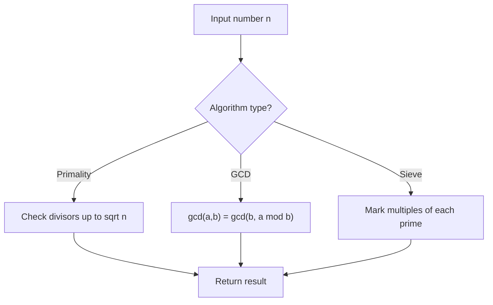

# Problem 1808: Maximize Number of Nice Divisors

**Difficulty:** Hard  
**Tags:** Math, Recursion, Number Theory  
**Pattern:** Number Theory  
**Link:** [leetcode.com/problems/maximize-number-of-nice-divisors](https://leetcode.com/problems/maximize-number-of-nice-divisors/)

## Description

You are given a positive integer `primeFactors`. You are asked to construct a positive integer `n` that satisfies the following conditions:


  - The number of prime factors of `n` (not necessarily distinct) is **at most** `primeFactors`.
  - The number of nice divisors of `n` is maximized. Note that a divisor of `n` is **nice** if it is divisible by every prime factor of `n`. For example, if `n = 12`, then its prime factors are `[2,2,3]`, then `6` and `12` are nice divisors, while `3` and `4` are not.


Return *the number of nice divisors of* `n`. Since that number can be too large, return it **modulo** `10^9 + 7`.


Note that a prime number is a natural number greater than `1` that is not a product of two smaller natural numbers. The prime factors of a number `n` is a list of prime numbers such that their product equals `n`.


 

Example 1:


```

**Input:** primeFactors = 5
**Output:** 6
**Explanation:** 200 is a valid value of n.
It has 5 prime factors: [2,2,2,5,5], and it has 6 nice divisors: [10,20,40,50,100,200].
There is not other value of n that has at most 5 prime factors and more nice divisors.

```


Example 2:


```

**Input:** primeFactors = 8
**Output:** 18

```


 

**Constraints:**


	- `1 <= primeFactors <= 10^9`

## Approach: Number Theory

Apply number theory: prime checking, factorization, GCD, modular exponentiation, sieve of Eratosthenes, or Euler's totient.

## Pseudocode

```
1. Apply number-theoretic algorithm:
   - Sieve for primes up to n
   - GCD via Euclidean algorithm
   - Modular exponentiation
2. Process results
3. Return answer
```

## Algorithm Flow



## Complexity Analysis

- **Time:** O(sqrt(n)) or O(n log log n)
- **Space:** O(n)

## Solution (Python3)

```python
class Solution:
    def maxNiceDivisors(self, primeFactors: int) -> int:
        # Number theory approach
        def gcd(a, b):
            while b:
                a, b = b, a % b
            return a
        
        result = primeFactors[0] if isinstance(primeFactors, list) else primeFactors
        if isinstance(primeFactors, list):
            for val in primeFactors[1:]:
                result = gcd(result, val)
        return result
```

## Solution (C++)

```cpp
#include <string>
#include <vector>
using namespace std;

class Solution {
public:
    int maxNiceDivisors(int primeFactors) {
        // Number theory approach
        auto gcd_func = [](int a, int b) -> int {
            while (b) { int t = b; b = a % b; a = t; }
            return a;
        };
        int result = primeFactors[0];
        for (int i = 1; i < (int)primeFactors.size(); i++) {
            result = gcd_func(result, primeFactors[i]);
        }
        return result;
    }
};
```
