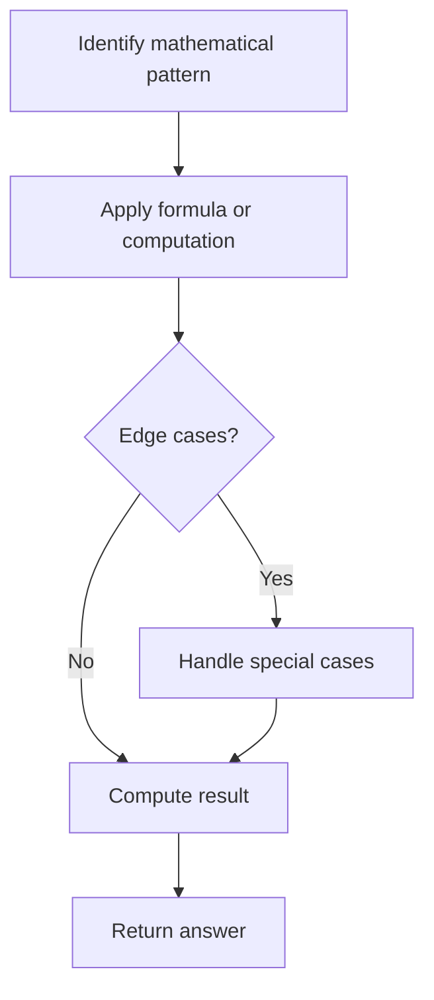

# Problem 1812: Determine Color of a Chessboard Square

**Difficulty:** Easy  
**Tags:** Math, String  
**Pattern:** Math  
**Link:** [leetcode.com/problems/determine-color-of-a-chessboard-square](https://leetcode.com/problems/determine-color-of-a-chessboard-square/)

## Description

You are given `coordinates`, a string that represents the coordinates of a square of the chessboard. Below is a chessboard for your reference.

Return `true`* if the square is white, and *`false`* if the square is black*.

The coordinate will always represent a valid chessboard square. The coordinate will always have the letter first, and the number second.

 

Example 1:

```

**Input:** coordinates = "a1"
**Output:** false
**Explanation:** From the chessboard above, the square with coordinates "a1" is black, so return false.

```

Example 2:

```

**Input:** coordinates = "h3"
**Output:** true
**Explanation:** From the chessboard above, the square with coordinates "h3" is white, so return true.

```

Example 3:

```

**Input:** coordinates = "c7"
**Output:** false

```

 

**Constraints:**

	- `coordinates.length == 2`
	- `'a' <= coordinates[0] <= 'h'`
	- `'1' <= coordinates[1] <= '8'`

## Approach: Math

Apply mathematical properties, formulas, or number-theoretic concepts. Look for patterns, modular arithmetic, or closed-form solutions.

## Pseudocode

```
1. Identify the mathematical pattern or formula
2. Apply computation:
   - Modular arithmetic for large numbers
   - GCD/LCM for divisibility
   - Sieve for primes
3. Handle edge cases
4. Return result
```

## Algorithm Flow



## Complexity Analysis

- **Time:** O(n) or O(sqrt(n))
- **Space:** O(1)

## Solution (Python3)

```python
class Solution:
    def squareIsWhite(self, coordinates: str) -> bool:
        # Mathematical approach
        result = 0
        x = coordinates
        while x != 0:
            result = result * 10 + x % 10
            x //= 10 if isinstance(x, int) else 1
        return result
```

## Solution (C++)

```cpp
#include <string>
#include <vector>
using namespace std;

class Solution {
public:
    bool squareIsWhite(string& coordinates) {
        // Mathematical approach
        long long result = 0;
        int x = coordinates;
        while (x != 0) {
            result = result * 10 + x % 10;
            x /= 10;
        }
        return (int)result;
    }
};
```
