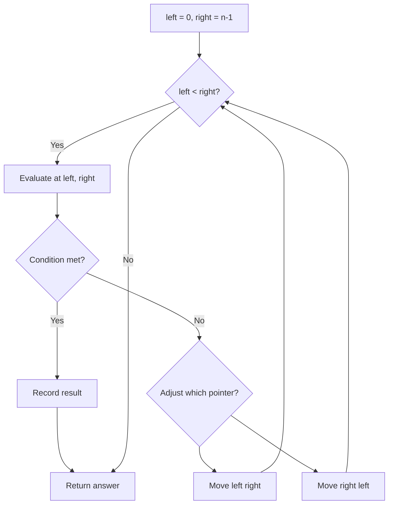
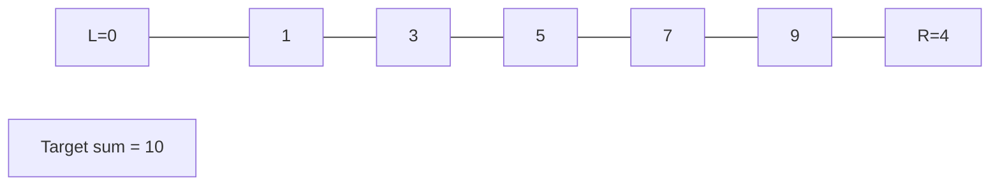
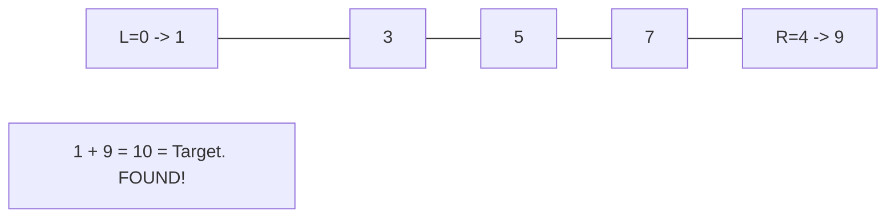

# Problem 1813: Sentence Similarity III

**Difficulty:** Medium  
**Tags:** Array, Two Pointers, String  
**Pattern:** Two Pointers  
**Link:** [leetcode.com/problems/sentence-similarity-iii](https://leetcode.com/problems/sentence-similarity-iii/)

## Description

You are given two strings `sentence1` and `sentence2`, each representing a **sentence** composed of words. A sentence is a list of **words** that are separated by a **single** space with no leading or trailing spaces. Each word consists of only uppercase and lowercase English characters.

Two sentences `s1` and `s2` are considered **similar** if it is possible to insert an arbitrary sentence (*possibly empty*) inside one of these sentences such that the two sentences become equal. **Note** that the inserted sentence must be separated from existing words by spaces.

For example,

	- `s1 = "Hello Jane"` and `s2 = "Hello my name is Jane"` can be made equal by inserting `"my name is"` between `"Hello"` and `"Jane"` in s1.
	- `s1 = "Frog cool"` and `s2 = "Frogs are cool"` are **not** similar, since although there is a sentence `"s are"` inserted into `s1`, it is not separated from `"Frog"` by a space.

Given two sentences `sentence1` and `sentence2`, return **true** if `sentence1` and `sentence2` are **similar**. Otherwise, return **false**.

 

Example 1:

**Input:** sentence1 = "My name is Haley", sentence2 = "My Haley"

**Output:** true

**Explanation:**

`sentence2` can be turned to `sentence1` by inserting "name is" between "My" and "Haley".

Example 2:

**Input:** sentence1 = "of", sentence2 = "A lot of words"

**Output:** false

**Explanation:**

No single sentence can be inserted inside one of the sentences to make it equal to the other.

Example 3:

**Input:** sentence1 = "Eating right now", sentence2 = "Eating"

**Output:** true

**Explanation:**

`sentence2` can be turned to `sentence1` by inserting "right now" at the end of the sentence.

 

**Constraints:**

	- `1 <= sentence1.length, sentence2.length <= 100`
	- `sentence1` and `sentence2` consist of lowercase and uppercase English letters and spaces.
	- The words in `sentence1` and `sentence2` are separated by a single space.

## Approach: Two Pointers

Use two pointers moving through the data structure. Depending on the problem, pointers may move toward each other (converging), in the same direction (fast/slow), or independently.

## Pseudocode

```
1. Initialize left = 0, right = n-1 (or two independent pointers)
2. While pointers haven't crossed:
   a. Evaluate condition at pointer positions
   b. Move left pointer right or right pointer left
3. Return result
```

## Algorithm Flow



## Visual State Transitions

**Two Pointer Convergence:**

**Frame 1: Initialize pointers**


**Frame 2: Sum = 1+9 = 10, found!**



## Complexity Analysis

- **Time:** O(n)
- **Space:** O(1)

## Solution (Python3)

```python
class Solution:
    def areSentencesSimilar(self, sentence1: str, sentence2: str) -> bool:
        # Two pointer approach - O(n) time, O(1) space
        left, right = 0, len(sentence1) - 1
        while left < right:
            curr = sentence1[left] + sentence1[right]
            if curr == sentence2:
                return [left, right]
            elif curr < sentence2:
                left += 1
            else:
                right -= 1
        return False
```

## Solution (C++)

```cpp
#include <string>
#include <vector>
using namespace std;

class Solution {
public:
    bool areSentencesSimilar(string& sentence1, string& sentence2) {
        // Two pointer approach - O(n) time, O(1) space
        int left = 0, right = sentence1.size() - 1;
        while (left < right) {
            int curr = sentence1[left] + sentence1[right];
            if (curr == sentence2) {
                return {left, right};
            } else if (curr < sentence2) {
                left++;
            } else {
                right--;
            }
        }
        return false;
    }
};
```
