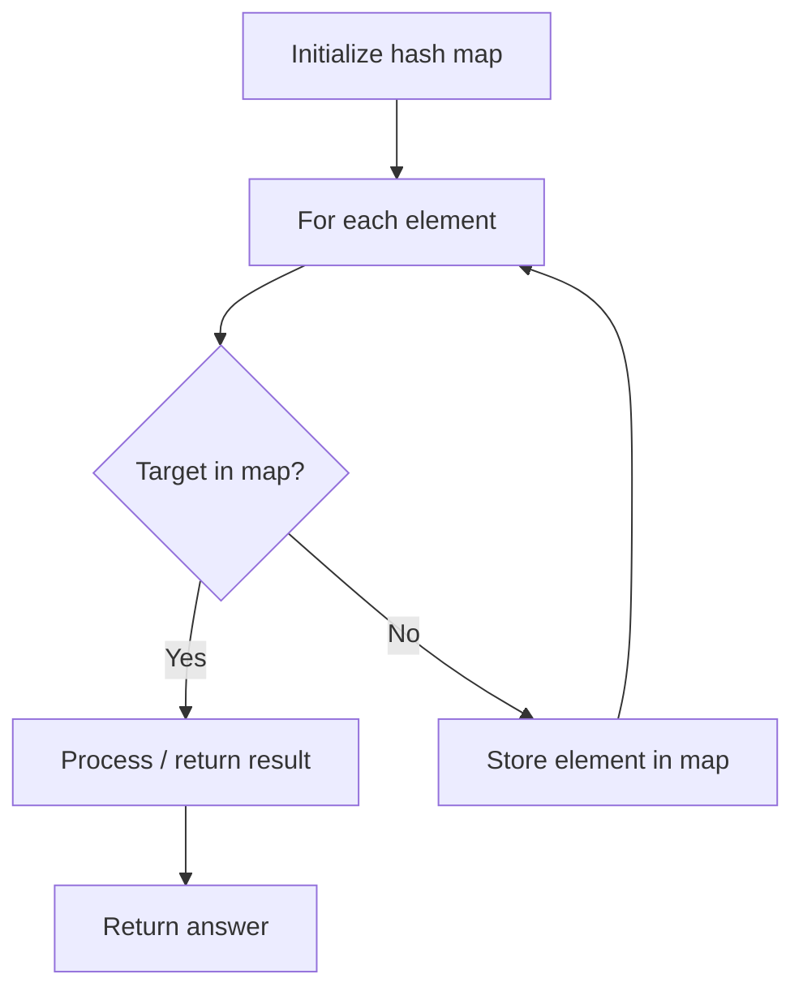

# Problem 1814: Count Nice Pairs in an Array

**Difficulty:** Medium  
**Tags:** Array, Hash Table, Math, Counting  
**Pattern:** Hash Map Lookup  
**Link:** [leetcode.com/problems/count-nice-pairs-in-an-array](https://leetcode.com/problems/count-nice-pairs-in-an-array/)

## Description

You are given an array `nums` that consists of non-negative integers. Let us define `rev(x)` as the reverse of the non-negative integer `x`. For example, `rev(123) = 321`, and `rev(120) = 21`. A pair of indices `(i, j)` is **nice** if it satisfies all of the following conditions:

	- `0 <= i < j < nums.length`
	- `nums[i] + rev(nums[j]) == nums[j] + rev(nums[i])`

Return *the number of nice pairs of indices*. Since that number can be too large, return it **modulo** `10^9 + 7`.

 

Example 1:

```

**Input:** nums = [42,11,1,97]
**Output:** 2
**Explanation:** The two pairs are:
 - (0,3) : 42 + rev(97) = 42 + 79 = 121, 97 + rev(42) = 97 + 24 = 121.
 - (1,2) : 11 + rev(1) = 11 + 1 = 12, 1 + rev(11) = 1 + 11 = 12.

```

Example 2:

```

**Input:** nums = [13,10,35,24,76]
**Output:** 4

```

 

**Constraints:**

	- `1 <= nums.length <= 10^5`
	- `0 <= nums[i] <= 10^9`

## Approach: Hash Map Lookup

Use a hash map (dictionary) to store elements for O(1) lookup. Iterate through the input, checking membership or counting frequencies in the map.

## Pseudocode

```
1. Initialize hash map
2. Iterate through elements:
   a. Check if target/complement exists in map
   b. If found: process result
   c. Otherwise: store element in map
3. Return result
```

## Algorithm Flow



## Complexity Analysis

- **Time:** O(n)
- **Space:** O(n)

## Solution (Python3)

```python
class Solution:
    def countNicePairs(self, nums: List[int]) -> int:
        # Hash map approach - O(n) time, O(n) space
        seen = {}
        for i, val in enumerate(nums):
            complement = nums - val
            if complement in seen:
                return [seen[complement], i]
            seen[val] = i
        return 0
```

## Solution (C++)

```cpp
#include <string>
#include <unordered_map>
#include <vector>
using namespace std;

class Solution {
public:
    int countNicePairs(vector<int>& nums) {
        // Hash map approach - O(n) time, O(n) space
        unordered_map<int, int> seen;
        for (int i = 0; i < nums.size(); i++) {
            int complement = nums - nums[i];
            if (seen.count(complement)) {
                return {seen[complement], i};
            }
            seen[nums[i]] = i;
        }
        return 0;
    }
};
```
